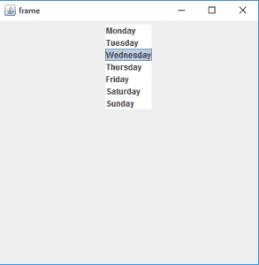
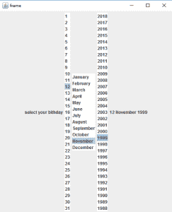

# Java Swing | JList 带示例

> 原文:[https://www . geesforgeks . org/Java-swing-jlist-with-examples/](https://www.geeksforgeeks.org/java-swing-jlist-with-examples/)

JList 是 Java Swing 包的一部分。JList 是一个显示一组对象并允许用户选择一个或多个项目的组件。JList 继承了 JComponent 类。JList 是一种显示向量数组的简单方法。
**捷豹路虎的建造商为:**

1.  **JList()** :创建一个空的空白列表
2.  **JList(E [ ] l)** :用数组的元素创建一个新列表。
3.  **JList(列表模型 d)** :用指定的列表模型创建一个新列表
4.  **JList(Vector l)** :用向量的元素创建一个新列表

**常用的方法有:**

<figure class="table">

| 方法 | 说明 |
| --- | --- |
| **getSelectedIndex（）** | 返回列表中选定项目的索引 |
| get selected value() | 返回列表元素的选定值 |
| **setSelectedIndex（int i）** | 将列表的选定索引设置为 I |
| **设置选择背景(c 色)** | 设置列表的背景颜色 |
| **设置选择地面(c 色)** | 更改列表的前景色 |
| **setListData(E [ ] l)** | 将列表的元素改为 l 的元素。 |
| **setVisibleRowCount(int v)** | 更改 visibleRowCount 属性 |
| **设置选择的值(对象 a，布尔值)** | 从列表中选择指定的对象。 |
| **set elections(int[]I)** | 将所选内容更改为给定数组指定的一组索引。 |
| **setListData(矢量 l)** | 从指定的向量构造只读列表模型。 |
| **七布局方向(int l)** | 定义列表的方向 |
| **setFixedCellWidth(int w)** | 将列表的单元格宽度更改为作为参数传递的值。 |
| **setFixedCellHeight(int h)** | 将列表的单元格高度更改为作为参数传递的值。 |
| **is elected index(int I)** | 如果选择了指定的索引，则返回 true，否则返回 false。 |
| **索引色(int i)** | 返回列表坐标系中指定项目的原点。 |
| **贫民区文字(鼠标事件 e)** | 返回用于给定事件的工具提示文本。 |
| **getSelectedValuesList()** | 返回所有选定项目的列表。 |
| **getselectionedices()** | 按递增顺序返回所有选定索引的数组 |
| **get Islamic index()** | 返回最小的选定单元格索引，如果所选内容为空，则返回-1。 |
| **get axselection index()** | 返回最大的选定单元格索引，如果所选内容为空，则返回-1。 |
| **获取列表选择听筒 （）** | 返回列表的侦听器 |
| **getLastVisibleIndex（）** | 返回当前可见的最大列表索引。 |
| **getDragEnabled（）** | 返回是否启用自动拖动处理 |
| addlistselectionlistener(listselectionlistener l) | 将列表选择列表添加到列表中 |

</figure>

**以下程序将说明 JLists**
**1 的使用。程序创建一个简单的 JList**

## Java 语言(一种计算机语言，尤用于创建网站)

```java
// java Program to create a simple JList
import java.awt.event.*;
import java.awt.*;
import javax.swing.*;
class solve extends JFrame
{

    //frame
    static JFrame f;

    //lists
    static JList b;

    //main class
    public static void main(String[] args)
    {
        //create a new frame
        f = new JFrame("frame");

        //create a object
        solve s=new solve();

        //create a panel
        JPanel p =new JPanel();

        //create a new label
        JLabel l= new JLabel("select the day of the week");

        //String array to store weekdays
        String week[]= { "Monday","Tuesday","Wednesday",
                         "Thursday","Friday","Saturday","Sunday"};

        //create list
        b= new JList(week);

        //set a selected index
        b.setSelectedIndex(2);

        //add list to panel
        p.add(b);

        f.add(p);

        //set the size of frame
        f.setSize(400,400);

        f.show();
    }

}
```

**输出:**



**2。程序创建一个列表并添加项目监听器到其中(程序使用列表选择你的生日)。**

## Java 语言(一种计算机语言，尤用于创建网站)

```java
// java Program to create a list and add itemListener to it
// (program to select your birthday using lists) .
import javax.swing.event.*;
import java.awt.*;
import javax.swing.*;
class solve extends JFrame implements ListSelectionListener
{

    //frame
    static JFrame f;

    //lists
    static JList b,b1,b2;

    //label
    static JLabel l1;

    //main class
    public static void main(String[] args)
    {
        //create a new frame
        f = new JFrame("frame");

        //create a object
        solve s=new solve();

        //create a panel
        JPanel p =new JPanel();

        //create a new label
        JLabel l= new JLabel("select your birthday");
        l1= new JLabel();

        //String array to store weekdays
        String month[]= { "January", "February", "March",
        "April", "May", "June", "July", "August",
        "September", "October", "November", "December"};

        //create a array for months and year
        String date[]=new String[31],year[]=new String[31];

        //add month number and year to list
        for(int i=0;i<31;i++)
        {
            date[i]=""+(int)(i+1);
            year[i]=""+(int)(2018-i);
        }

        //create lists
        b= new JList(date);
        b1= new JList(month);
        b2= new JList(year);

        //set a selected index
        b.setSelectedIndex(2);
        b1.setSelectedIndex(1);
        b2.setSelectedIndex(2);

        l1.setText(b.getSelectedValue()+" "+b1.getSelectedValue()
                              +" "+b2.getSelectedValue());

        //add item listener
        b.addListSelectionListener(s);
        b1.addListSelectionListener(s);
        b2.addListSelectionListener(s);

        //add list to panel
        p.add(l);
        p.add(b);
        p.add(b1);
        p.add(b2);
        p.add(l1);

        f.add(p);

        //set the size of frame
        f.setSize(500,600);

        f.show();
    }
    public void valueChanged(ListSelectionEvent e)
    {
        //set the text of the label to the selected value of lists
        l1.setText(b.getSelectedValue()+" "+b1.getSelectedValue()
                              +" "+b2.getSelectedValue());

    }

}
```

**输出:**



**注意:以上程序可能无法在在线编译器中运行，请使用离线 IDE**