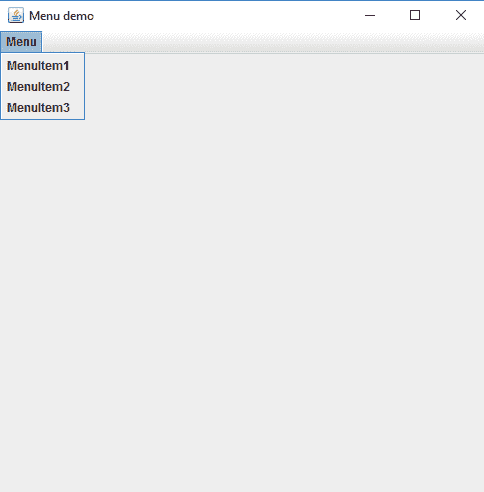
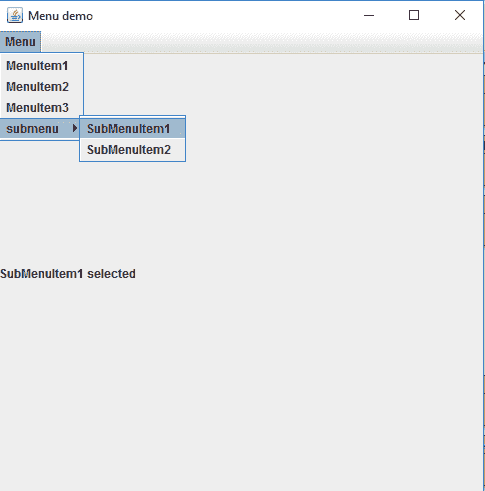

# Java swing \名称栏

> [https://www.geeksforgeeks.org/java-swing-jmenubar/](https://www.geeksforgeeks.org/java-swing-jmenubar/)

JMenuBar、JMenu 和 jmenuments 是 Java Swing 包的一部分。JMenuBar 是菜单栏的一个实现。JMenuBar 包含一个或多个 JMenu 对象，当选择 JMenu 对象时，它们会显示一个弹出窗口，显示一个或多个 JMenuItems。
JMenu 基本上代表一个菜单。它包含几个对象。它还可能包含 JMenu 对象(或子菜单)。

**施工人员:**

1.  **JMenuBar() :** 创建新的菜单栏。
2.  **JMenu() :** 创建一个没有文本的新菜单。
3.  **JMenu(字符串名称):**用指定的名称创建新菜单。
4.  **JMenu(字符串名称，布尔值 b) :** 用指定的名称创建一个新菜单，布尔值
    指定它是否为可撕下菜单。可撕掉的菜单可以被打开并从其父菜单栏或菜单中拖出来。

**常用方法:**

1.  **添加(JMenu c) :** 向菜单栏添加菜单。将对象添加到菜单栏。
2.  **添加(成分 c) :** 在 JMenu 的末尾添加成分
3.  **添加(组件 c，int 索引):**将组件添加到 JMenu 的指定索引中
4.  **添加(JMenuItem menuItem) :** 将菜单项添加到菜单的末尾。
5.  **添加(字符串):**用指定的字符串创建一个菜单项，并将其附加到菜单的末尾。
6.  **getItem(int index) :** 返回给定索引处的指定 menuitem

**以下程序将说明 JMenuBar** 的使用

**1。制作菜单栏并添加菜单项的程序**

```java
// Java program to construct 
// Menu bar to add menu items
import java.awt.*;
import javax.swing.*;
import java.awt.event.*;
public class menu extends JFrame {
    // menubar
    static JMenuBar mb;

    // JMenu
    static JMenu x;

    // Menu items
    static JMenuItem m1, m2, m3;

    // create a frame
    static JFrame f;

    public static void main()
    {

        // create a frame
        f = new JFrame("Menu demo");

        // create a menubar
        mb = new JMenuBar();

        // create a menu
        x = new JMenu("Menu");

        // create menuitems
        m1 = new JMenuItem("MenuItem1");
        m2 = new JMenuItem("MenuItem2");
        m3 = new JMenuItem("MenuItem3");

        // add menu items to menu
        x.add(m1);
        x.add(m2);
        x.add(m3);

        // add menu to menu bar
        mb.add(x);

        // add menubar to frame
        f.setJMenuBar(mb);

        // set the size of the frame
        f.setSize(500, 500);
        f.setVisible(true);
    }
}
```

**输出:**


**2。程序添加一个菜单栏，添加菜单项，子菜单项，也添加动作监听器到菜单项**

```java
// Java program Program to add a menubar
// and add menuitems, submenu items and also add
// ActionListener to menu items
import java.awt.*;
import javax.swing.*;
import java.awt.event.*;
public class menu1 extends JFrame implements ActionListener {
    // menubar
    static JMenuBar mb;

    // JMenu
    static JMenu x, x1;

    // Menu items
    static JMenuItem m1, m2, m3, s1, s2;

    // create a frame
    static JFrame f;

    // a label
    static JLabel l;

    // main class
    public static void main()
    {
        // create an object of the class
        menu1 m = new menu1();

        // create a frame
        f = new JFrame("Menu demo");

        // create a label
        l = new JLabel("no task ");

        // create a menubar
        mb = new JMenuBar();

        // create a menu
        x = new JMenu("Menu");
        x1 = new JMenu("submenu");

        // create menuitems
        m1 = new JMenuItem("MenuItem1");
        m2 = new JMenuItem("MenuItem2");
        m3 = new JMenuItem("MenuItem3");
        s1 = new JMenuItem("SubMenuItem1");
        s2 = new JMenuItem("SubMenuItem2");

        // add ActionListener to menuItems
        m1.addActionListener(m);
        m2.addActionListener(m);
        m3.addActionListener(m);
        s1.addActionListener(m);
        s2.addActionListener(m);

        // add menu items to menu
        x.add(m1);
        x.add(m2);
        x.add(m3);
        x1.add(s1);
        x1.add(s2);

        // add submenu
        x.add(x1);

        // add menu to menu bar
        mb.add(x);

        // add menubar to frame
        f.setJMenuBar(mb);

        // add label
        f.add(l);

        // set the size of the frame
        f.setSize(500, 500);
        f.setVisible(true);
    }
    public void actionPerformed(ActionEvent e)
    {
        String s = e.getActionCommand();

        // set the label to the menuItem that is selected
        l.setText(s + " selected");
    }
}
```

**输出:** 

**注意:**以下程序可能无法在联机编译器中运行，请使用脱机 IDE。