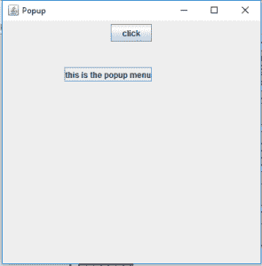
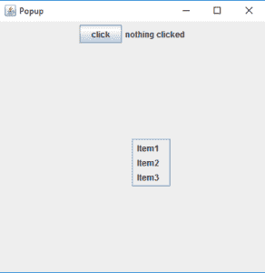
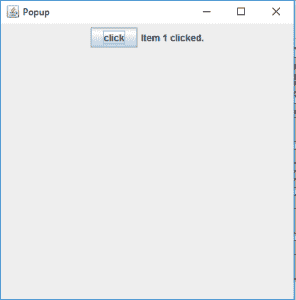

# Java 摇摆| jpoppmenu

> 哎哎哎::1230【https://www . geeksforgeeks . org/Java-swing-jpoppmenu/

JPopupMenu 是 javax.swing 包的一个类。它是 PopupMenu 的一个实现。JPopupMenu 生成一个小窗口，弹出并显示一系列选项。JPopupMenu 可用于在容器内的任何位置生成一个小窗口。
**类的构造函数有:**

1.  **JPopupMenu()** :创建一个空名称的弹出菜单

2.  **JPopupMenu(字符串名称)**:创建带有指定标题的弹出菜单。

**JPopupMenu 常用的方法有:**

1.  **add(jmenitem MenuItem)**:将 menu item 添加到弹出菜单中。

2.  **添加字符串**:将字符串添加到弹出菜单中。

3.  **String getLabel()** :获取弹出菜单的标签。

4.  **boolean is Visible()** :返回 JPopup 菜单是否可见。

5.  **设置标签(字符串)**:设置弹出菜单的标签。

6.  **设置位置(int x，int y)** :将弹出菜单的位置设置为给定的坐标

7.  **设置大小(整数宽度，整数高度)**:设置弹出窗口的大小，给出高度和宽度

8.  **设置可见(布尔 b)** :设置弹出菜单的可见性，如果 true 作为参数传递，则可见，反之亦然。

9.  **显示(组件 c，int x，int y)** :显示组件 c 内 x，y 位置的弹出菜单

**1。程序显示一个简单的弹出菜单**

## Java 语言(一种计算机语言，尤用于创建网站)

```java
// Java program to show a simple popup menu
import java.awt.*;
import java.awt.event.*;
import javax.swing.*;
class Popup extends JFrame implements ActionListener {

    // java button
    static JButton b;

    // java frame
    static JFrame f;

    // popup menu
    static JPopupMenu pm;

    // default constructor
    Popup()
    {
    }

    // main class
    public static void main(String[] args)
    {
        // create a frame
        f = new JFrame("Popup");

        // set the size of the frame
        f.setSize(400, 400);

        // close the frame when close button is pressed
        f.setDefaultCloseOperation(JFrame.EXIT_ON_CLOSE);

        // create anew panel
        JPanel p = new JPanel();

        // create an object of mouse class
        Popup pop = new Popup();

        // create a button
        b = new JButton("click");

        // addActionListener
        b.addActionListener(pop);
        p.add(b);
        f.add(p);
        f.show();
    }

    // when the button is clicked
    public void actionPerformed(ActionEvent e)
    {
        String s = e.getActionCommand();
        if (s.equals("click")) {
            // create a popup menu
            pm = new JPopupMenu("Message");

            // create a label
            JLabel l = new JLabel("this is the popup menu");

            // add the label to the popup
            pm.add(l);

            // add the popup to the frame
            pm.show(f, 100, 100);
        }
    }
}
```

**输出:**



**2。程序向它显示一个弹出菜单和菜单项**

## Java 语言(一种计算机语言，尤用于创建网站)

```java
// Java program to show a popup menu
// and menu items to it
import java.awt.*;
import java.awt.event.*;
import javax.swing.*;
class Popup extends JFrame implements ActionListener {

    // java button
    static JButton b;

    // java frame
    static JFrame f;

    // popup menu
    static JPopupMenu pm;

    // JLabel
    JLabel l;

    // default constructor
    Popup()
    {
    }

    // main class
    public static void main(String[] args)
    {
        // create a frame
        f = new JFrame("Popup");

        // set the size of the frame
        f.setSize(400, 400);

        // close the frame when close button is pressed
        f.setDefaultCloseOperation(JFrame.EXIT_ON_CLOSE);

        // create anew panel
        JPanel p = new JPanel();

        // create an object of mouse class
        Popup pop = new Popup();

        // create a button
        b = new JButton("click");

        // addActionListener
        b.addActionListener(pop);

        // create a popup menu
        pm = new JPopupMenu("Message");

        // create menuItems
        JMenuItem m1 = new JMenuItem("Item1");
        JMenuItem m2 = new JMenuItem("Item2");
        JMenuItem m3 = new JMenuItem("Item3");

        // create a Jlabel
        JLabel l = new JLabel("nothing clicked");

        // add menuitems to popup menu
        pm.add(m1);
        pm.add(m2);
        pm.add(m3);

        // addActionListener
        m1.addActionListener(new ActionListener() {
            public void actionPerformed(ActionEvent e)
            {
                l.setText("Item 1 clicked.");
            }
        });

        m2.addActionListener(new ActionListener() {
            public void actionPerformed(ActionEvent e)
            {
                l.setText("Item 2 clicked.");
            }
        });

        m3.addActionListener(new ActionListener() {
            public void actionPerformed(ActionEvent e)
            {
                l.setText("Item 3 clicked.");
            }
        });

        // add button and label to frame
        p.add(b);
        p.add(l);

        f.add(p);
        f.show();
    }

    // when the button is clicked
    public void actionPerformed(ActionEvent e)
    {
        String s = e.getActionCommand();
        if (s.equals("click")) {

            // add the popup to the frame
            pm.show(f, 200, 200);
        }
    }
}
```

**输出:**





**注意:**这些代码可能无法在在线 IDE 中运行，请使用离线编译器