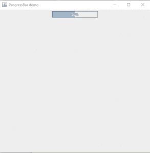
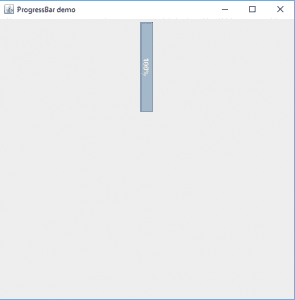
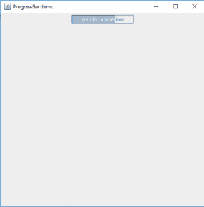
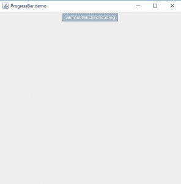
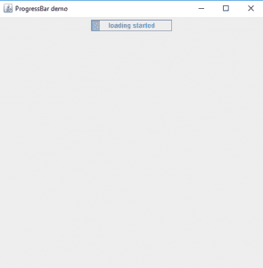

# Java 摇摆| jprogressbar】

> 原文:[https://www.geeksforgeeks.org/java-swing-jprogressbar/](https://www.geeksforgeeks.org/java-swing-jprogressbar/)

JProgressBar 是 Java Swing 包的一部分。JProgressBar 直观地显示某些指定任务的进度。JProgressBar 显示指定任务的完成百分比。当任务完成时，进度条会填满。除了显示任务完成的百分比，它还可以显示一些文字。
**JProgressBar 的构造函数:**

1.  **JProgressBar()** :创建一个进度条，进度条上没有文字；
2.  **JProgressBar(int orientation)**:创建具有指定方向的进度条。if SwingConstants。垂直作为参数传递时，会创建一个垂直进度条。水平作为参数传递，创建水平进度条。
3.  **JProgressBar(int min，int max)** :创建具有指定最小值和最大值的进度条。
4.  **JProgressBar(int orientation，int min，int max)** :创建具有指定最小值和最大值以及指定方向的进度条。垂直作为参数传递时，会创建一个垂直进度条。水平作为参数传递，创建水平进度条。

**JProgressBar 常用的方法有:**

1.  **int getMaximum() :** 返回进度条的最大值。
2.  **int getMinimum()** :返回进度条的最小值。
3.  **String getString()** :获取进度条当前值的字符串表示。
4.  **void setMaximum(int n)** :将进度条的最大值设置为值 n。
5.  **void setMinimum(int n)** :将进度条的最小值设置为值 n。
6.  **void setValue(int n)** :将进度条的当前值设置为 n 值。
7.  **空设置字符串**:将进度字符串的值设置为字符串

**1。程序创建一个简单的进度条**

## Java 语言(一种计算机语言，尤用于创建网站)

```java
// Java Program to create a
// simple progress bar
import java.awt.*;
import javax.swing.*;
import java.awt.event.*;
public class progress extends JFrame {

    // create a frame
    static JFrame f;

    static JProgressBar b;

    public static void main()
    {

        // create a frame
        f = new JFrame("ProgressBar demo");

        // create a panel
        JPanel p = new JPanel();

        // create a progressbar
        b = new JProgressBar();

        // set initial value
        b.setValue(0);

        b.setStringPainted(true);

        // add progressbar
        p.add(b);

        // add panel
        f.add(p);

        // set the size of the frame
        f.setSize(500, 500);
        f.setVisible(true);

        fill();
    }

    // function to increase progress
    public static void fill()
    {
        int i = 0;
        try {
            while (i <= 100) {
                // fill the menu bar
                b.setValue(i + 10);

                // delay the thread
                Thread.sleep(1000);
                i += 20;
            }
        }
        catch (Exception e) {
        }
    }
}
```

**输出:**T2】



**2。程序创建一个垂直进度条**

## Java 语言(一种计算机语言，尤用于创建网站)

```java
// Java program to create a
// vertical progress bar
import java.awt.*;
import javax.swing.*;
import java.awt.event.*;
public class progress extends JFrame {

    // create a frame
    static JFrame f;

    static JProgressBar b;

    public static void main()
    {

        // create a frame
        f = new JFrame("ProgressBar demo");

        // create a panel
        JPanel p = new JPanel();

        // create a progressbar
        b = new JProgressBar(SwingConstants.VERTICAL);

        // set initial value
        b.setValue(0);

        b.setStringPainted(true);

        // add progressbar
        p.add(b);

        // add panel
        f.add(p);

        // set the size of the frame
        f.setSize(500, 500);
        f.setVisible(true);

        fill();
    }

    // function to increase progress
    public static void fill()
    {
        int i = 0;
        try {
            while (i <= 100) {
                // fill the menu bar
                b.setValue(i + 10);

                // delay the thread
                Thread.sleep(1000);
                i += 20;
            }
        }
        catch (Exception e) {
        }
    }
}
```

**输出:**T2】



**3。将特定字符串设置到进度条**
的程序

## Java 语言(一种计算机语言，尤用于创建网站)

```java
// Java Program to set specific
// string to progressbar
import java.awt.*;
import javax.swing.*;
import java.awt.event.*;
public class progress extends JFrame {

    // create a frame
    static JFrame f;

    static JProgressBar b;

    public static void main()
    {

        // create a frame
        f = new JFrame("ProgressBar demo");

        // create a panel
        JPanel p = new JPanel();

        // create a progressbar
        b = new JProgressBar();

        // set initial value
        b.setValue(0);

        b.setStringPainted(true);

        // add progressbar
        p.add(b);

        // add panel
        f.add(p);

        // set the size of the frame
        f.setSize(500, 500);
        f.setVisible(true);

        fill();
    }

    // function to increase progress
    public static void fill()
    {
        int i = 0;
        try {
            while (i <= 100) {
                // set text according to the level to which the bar is filled
                if (i > 30 && i < 70)
                    b.setString("wait for sometime");
                else if (i > 70)
                    b.setString("almost finished loading");
                else
                    b.setString("loading started");

                // fill the menu bar
                b.setValue(i + 10);

                // delay the thread
                Thread.sleep(3000);
                i += 20;
            }
        }
        catch (Exception e) {
        }
    }
}
```

**输出:**T2】







**注意:**以上程序不会在在线编译器中运行请使用离线 IDE