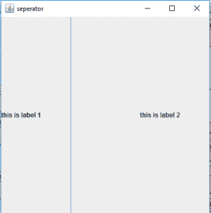
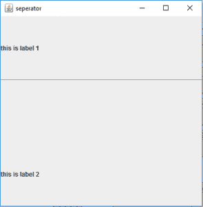
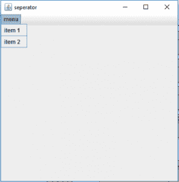

# Java Swing | JSeparator 带示例

> 原文:[https://www . geesforgeks . org/Java-swing-jseparator-with-examples/](https://www.geeksforgeeks.org/java-swing-jseparator-with-examples/)

JSeparator 是 Java Swing 框架的一部分。它用于在两个组件之间创建分界线。更具体地说，它主要用于在 JMenu 中的菜单项之间创建分界线。在 JMenu 或 JPopupMenu 中，add separator 函数也可以用来创建分隔符。

**该类的建造师为**:

1.  **分隔符()**:创建新的水平分隔符。
2.  **JSeparator(int o)** :以指定的水平或垂直方向创建新的分隔符。

**常用方法**:

<figure class="table">

| 方法 | 说明 |
| --- | --- |
| **扇形化(int o)** | 设置分隔符的方向。 |
| **getOrientation()** | 返回分隔符的方向。 |
| **添加分隔符()** | 在 JMenu 或 JPopupMenu 中添加分隔符。 |

</figure>

**下面的程序将说明 jseparator**的使用

**1。创建垂直分隔符**的程序:在这个程序中，我们创建了一个名为 f 的框架，标题为“分隔符”(框架是其他组件的容器)。我们创建一个面板来保存标签和分隔符。我们将分隔符的方向设置为垂直(使用 setOrientation(SwingConstants。垂直)并将分隔符和标签添加到面板(使用 add()函数)并将面板添加到框架。我们为 1 行 0 列的面板设置网格布局(使用新的网格布局(400，400))。我们使用 setSize(400，400)将帧的大小设置为 400，400。我们使用 show()函数来显示框架。

## Java 语言(一种计算机语言，尤用于创建网站)

```
// java Program to create a vertical separator
import java.awt.*;
import javax.swing.*;
class separator extends JFrame
{
    // constructor for the class
    separator()
    {
    }

    // main class
    public static void main(String args[])
    {
        // create a frame
        JFrame f = new JFrame("separator");

        // create a panel
        JPanel p =new JPanel();

        // create a label
        JLabel l = new JLabel("this is label 1");
        JLabel l1 = new JLabel("this is label 2");

        // create a separator
        JSeparator s = new JSeparator();

        // set layout as vertical
        s.setOrientation(SwingConstants.VERTICAL);

        p.add(l);
        p.add(s);
        p.add(l1);

        // set layout
        p.setLayout(new GridLayout(1,0));

        f.add(p);

        // show the frame
        f.setSize(400,400);
        f.show();
    }
}
```

**输出**:



**2。创建水平分隔符**的程序:在这个程序中，我们创建了一个名为 f 的框架，标题为“分隔符”(框架是其他组件的容器)。我们创建一个面板来保存标签和分隔符。我们将分隔符的方向设置为水平(使用 setOrientation(SwingConstants。水平)并将分隔符和标签添加到面板(使用 add()函数)并将面板添加到框架。我们为 0 行 1 列的面板设置网格布局(使用新的网格布局(400，400))。我们使用 setSize(400，400)将帧的大小设置为 400，400。我们使用 show()函数来显示框架。

## Java 语言(一种计算机语言，尤用于创建网站)

```
// java Program to create a HORIZONTAL separator
import java.awt.*;
import javax.swing.*;
class separator_1 extends JFrame
{
    // constructor for the class
    separator_1()
    {
    }

    // main class
    public static void main(String args[])
    {
        // create a frame
        JFrame f = new JFrame("separator");

        // create a panel
        JPanel p =new JPanel();

        // create a label
        JLabel l = new JLabel("this is label 1");
        JLabel l1 = new JLabel("this is label 2");

        // create a separator
        JSeparator s = new JSeparator();

        // set layout as vertical
        s.setOrientation(SwingConstants.HORIZONTAL);

        p.add(l);
        p.add(s);
        p.add(l1);

        // set layout
        p.setLayout(new GridLayout(0,1));

        f.add(p);

        // show the frame
        f.setSize(400,400);
        f.show();
    }
}
```

**输出**:



**3。使用 addSeparator 函数**创建一个分隔符的程序:在这个程序中，我们创建了一个名为 f 的框架，标题为“分隔符”(框架是其他组件的容器)。为了说明添加分隔符功能的使用，我们将创建一个 JMenuBar *mb* 。然后创建一个 JMenu 来保存菜单项。我们将创建两个 JMenuItems，并通过使用 addSeparator()函数在它们之间添加一个分隔符。我们将分别使用 add()和 addMenuBar()函数将菜单添加到 menubar，并将 menubar 添加到框架。我们使用 setSize(400，400)将帧的大小设置为 400，400。我们使用 show()函数来显示框架。

## Java 语言(一种计算机语言，尤用于创建网站)

```
// java Program to create a separator
// using addSeparator function
import java.awt.*;
import javax.swing.*;
class separator extends JFrame
{
    // constructor for the class
    separator()
    {
    }

    // main class
    public static void main(String args[])
    {
        // create a frame
        JFrame f = new JFrame("separator");

        // create a menubar
        JMenuBar mb =new JMenuBar();

        // create a menu
        JMenu m = new JMenu("menu");

        // create menuitems
        JMenuItem m1= new JMenuItem("item 1");
        JMenuItem m2= new JMenuItem("item 2");

        // add menuitems
        m.add(m1);
        m.addSeparator();
        m.add(m2);

        // add menu
        mb.add(m);

        f.setJMenuBar(mb);

        // show the frame
        f.setSize(400,400);
        f.show();
    }
}
```

**输出** :

