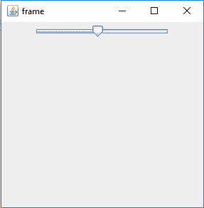
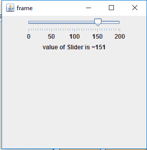
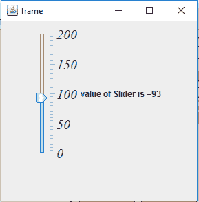

# Java 摇摆| JSlider

> 哎哎哎:# t0]https://www . geeksforgeeks . org/Java-swing-jslider/

JSlider 是 Java Swing 包的一部分。JSlider 是 Slider 的一个实现。组件允许用户通过在限定值内滑动旋钮来选择值。滑块可以显示主要刻度线以及两个主要刻度线之间的次要刻度线。旋钮只能定位在这些点上。
**类的构造函数有:**

1.  JSlider():创建一个新的滑块，其水平方向以及最大值和最小值分别为 100 和 0，滑块值设置为 50。
2.  JSlider(bounddrangemodel b):创建一个具有水平方向和指定边界范围模型的新 Slider。
3.  JSlider(int o):创建一个指定方向的新滑块，最大值和最小值分别为 100 和 0，滑块值设置为 50。
4.  JSlider(int min，int max):创建一个新的滑块，指定水平方向和最大值和最小值，并将滑块值设置为最大值和最小值的平均值。
5.  JSlider(int min，int max，int value):创建一个具有水平方向和最大值、最小值以及指定滑块值的新滑块。
6.  JSlider(int o，int min，int max，int value):用指定的方向和最大值、最小值以及滑块值创建一个新的滑块。

**常用功能**

1.  设置方向(int n):将滑块的方向设置为指定值

2.  设置值(int v):将滑块的值设置为指定值

3.  设定记号(布尔值 b):布尔值决定记号是否画在滑块上

4.  setPaintTrack(布尔值 b):布尔值决定轨迹是否画在滑块上

5.  setMajotickSpacing(int n):设置主要刻度的间距。

6.  setminortickspace(int n):设置次要刻度的间距。

7.  设置字体(字体 f):设置滑块的文本字体

8.  设置最大值(int m):设置滑块的最大值

9.  设置最小值(int m):设置滑块的最小值

10.  updateUI():将 UI 属性重置为当前外观的值。

11.  设置值调整(布尔值 b):将模型的值调整属性设置为布尔值 b。

12.  设置用户界面对象，实现这个组件的外观。

13.  setSnapToTicks(布尔值 b):如果传递 true，则滑块位置被放置到最近的刻度。

14.  setModel(bounddrangemodel n):设置处理滑块三个基本属性的 bounddrangemodel:最小值、最大值、值。

15.  setLabelTable(字典 l):用于指定将在任何给定值绘制什么标签。

16.  setInverted(布尔值 b):如果传递 true，则滑块被设置为 Inverted。

17.  imageUpdate(Image img，int s，int x，int y，int w，int h):当图像发生变化时，重新绘制组件。

18.  设置范围(int extent):设置旋钮“覆盖”的范围大小。

19.  移除变更监听器:从滑块中移除变更监听器。

20.  getModel():返回处理滑块三个基本属性:最小值、最大值、值的 BoundedRangeModel。

21.  getSnapToTicks():如果旋钮(及其代表的数据值)解析到用户放置旋钮的位置旁边最近的刻度线，则返回 true。

22.  getUI():获取为该组件实现 L&F 的 UI 对象。

23.  getPaintTrack():返回轨迹是否被绘制。

24.  getPaintTicks():返回 Ticks 是否被绘制

25.  getPaintLabels():返回标签是否着色

26.  getOrientation():返回组件的方向。

27.  getMinorTickSpacing():返回次要刻度间距

28.  getMinimum():返回最小值

29.  getMaximum():返回最大值

30.  getMajorTickSpacing():返回主要刻度间距。

31.  add ChangeListener(ChangeListener l):向滑块添加一个 ChangeListener。\

32.  createChangeListener():为组件创建一个更改侦听器
33.  setUI(SliderUI ui):设置呈现此组件的外观对象。

34.  getUI():返回呈现此组件的外观对象。

35.  paramString():返回此 JSlider 的字符串表示形式。

36.  getUIClassID():返回呈现此组件的外观类的名称。

37.  getAccessibleContext():获取与此 JSlider 关联的 AccessibleContext。

**以下程序将说明 JSlider**
**1 的使用。程序创建一个简单的 JSlider**

## Java 语言(一种计算机语言，尤用于创建网站)

```java
// java Program to create a simple JSlider
import javax.swing.event.*;
import java.awt.*;
import javax.swing.*;
class solve extends JFrame {

    // frame
    static JFrame f;

    // slider
    static JSlider b;

    // main class
    public static void main(String[] args)
    {
        // create a new frame
        f = new JFrame("frame");

        // create a object
        solve s = new solve();

        // create a panel
        JPanel p = new JPanel();

        // create a slider
        b = new JSlider();

        // add slider to panel
        p.add(b);

        f.add(p);

        // set the size of frame
        f.setSize(300, 300);

        f.show();
    }
}
```

**输出:**



**2。程序，以创建一个滑块与最小值和最大值，主要和次要刻度绘制。**

## Java 语言(一种计算机语言，尤用于创建网站)

```java
// java Program to create a slider with min and
// max value and major and minor ticks painted.
import javax.swing.event.*;
import java.awt.*;
import javax.swing.*;
class solve extends JFrame implements ChangeListener {

    // frame
    static JFrame f;

    // slider
    static JSlider b;

    // label
    static JLabel l;

    // main class
    public static void main(String[] args)
    {
        // create a new frame
        f = new JFrame("frame");

        // create a object
        solve s = new solve();

        // create label
        l = new JLabel();

        // create a panel
        JPanel p = new JPanel();

        // create a slider
        b = new JSlider(0, 200, 120);

        // paint the ticks and tracks
        b.setPaintTrack(true);
        b.setPaintTicks(true);
        b.setPaintLabels(true);

        // set spacing
        b.setMajorTickSpacing(50);
        b.setMinorTickSpacing(5);

        // setChangeListener
        b.addChangeListener(s);

        // add slider to panel
        p.add(b);
        p.add(l);

        f.add(p);

        // set the text of label
        l.setText("value of Slider is =" + b.getValue());

        // set the size of frame
        f.setSize(300, 300);

        f.show();
    }

    // if JSlider value is changed
    public void stateChanged(ChangeEvent e)
    {
        l.setText("value of Slider is =" + b.getValue());
    }
}
```

**输出:**



**3。程序创建一个垂直滑块，绘制最小和最大值以及主要和次要刻度，并设置滑块的字体。**

## Java 语言(一种计算机语言，尤用于创建网站)

```java
// java Program to create a vertical slider with
// min and max value and major and minor ticks
// painted and set the font of the slider.
import javax.swing.event.*;
import java.awt.*;
import javax.swing.*;
class solve extends JFrame implements ChangeListener {

    // frame
    static JFrame f;

    // slider
    static JSlider b;

    // label
    static JLabel l;

    // main class
    public static void main(String[] args)
    {
        // create a new frame
        f = new JFrame("frame");

        // create a object
        solve s = new solve();

        // create label
        l = new JLabel();

        // create a panel
        JPanel p = new JPanel();

        // create a slider
        b = new JSlider(0, 200, 120);

        // paint the ticks and tracks
        b.setPaintTrack(true);
        b.setPaintTicks(true);
        b.setPaintLabels(true);

        // set spacing
        b.setMajorTickSpacing(50);
        b.setMinorTickSpacing(5);

        // setChangeListener
        b.addChangeListener(s);

        // set orientation of slider
        b.setOrientation(SwingConstants.VERTICAL);

        // set Font for the slider
        b.setFont(new Font("Serif", Font.ITALIC, 20));

        // add slider to panel
        p.add(b);
        p.add(l);

        f.add(p);

        // set the text of label
        l.setText("value of Slider is =" + b.getValue());

        // set the size of frame
        f.setSize(300, 300);

        f.show();
    }

    // if JSlider value is changed
    public void stateChanged(ChangeEvent e)
    {
        l.setText("value of Slider is =" + b.getValue());
    }
}
```

**输出:**



**注意:以上程序可能无法在在线编译器中运行，请使用离线 IDE**