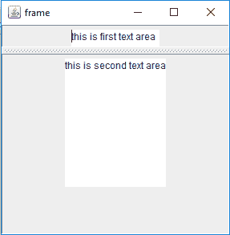
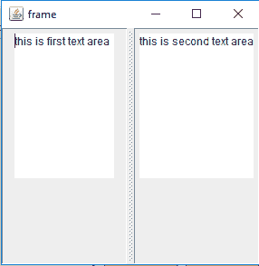
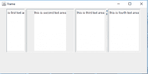

# Java Swing | JSplitPane 带示例

> 原文:[https://www . geesforgeks . org/Java-swing-jsplitpane-examples/](https://www.geeksforgeeks.org/java-swing-jsplitpane-examples/)

JSplitPane 是 Java Swing 的一部分。JSplitPane 仅用于划分两个组件。JSplitPane 用于调整组件的大小。通过使用 JSplitPane，用户可以手动调整组件的大小，直到最小。JSplitPane 可以有两种类型，一种是垂直的，一种是水平的

**JSplitPane 的建造师为:**

1.  **JSplitPane()** :创建一个新的水平方向的拆分窗格
2.  **JSplitPane(int o)** :创建一个新的分割窗格，其中提到了方向。
3.  **JSplitPane(int o，boolean r)** :创建一个新的分割窗格，其中提到了方向和重绘样式。
4.  **JSplitPane(int o，boolean r，Component l，Component r)** :创建一个新的拆分窗格，其中提到了方向、重绘样式和左右组件。
5.  **JSplitPane(int o，Component l，Component r)** :创建一个新的拆分窗格，其中提到了方向和左右组件。

**JSplitPane 常用功能有:**

1.  **getOrientation()** :返回拆分窗格的方向
2.  **getRightComponent()** :返回 splitpane 的右边组件
3.  **getTopComponent()** :返回 splitpane 的顶部组件
4.  **isContinuousLayout()** :返回连续布局属性
5.  **getBottomComponent()** :返回 splitpane 的底部组件
6.  **设置右侧组件(组件 c)** :拆分窗格的右侧组件设置为 c
7.  **设置左侧组件(组件 c)** :拆分窗格的左侧组件设置为 c
8.  **设置组件(组件 c)** :拆分窗格的顶部组件设置为 c
9.  **设置底部组件(组件 c)** :拆分窗格的底部组件设置为 c
10.  **设置 ui(splitpaneiu ui)**:设置渲染此组件的观感对象。
11.  **setResizeWeight(双 v)** :指定拆分窗格大小变化时如何分配额外空间。
12.  **设置 oneTouchExpandable(布尔值 n)** :设置 oneTouchExpandable 属性的值，该属性为 true 时提供一个用户界面小部件，可以在单击时折叠或展开组件
13.  **设置分割线位置(int l)** :设置分割线的位置。
14.  **设置分割线大小(int n)** :设置分割线的大小。
15.  **设置最后一个分割线位置(int n)** :设置分割线的最后一个位置。
16.  **设置分隔符位置(双 p)** :将分隔符位置设置为 JSplitPane 大小的百分比。
17.  **设置 ContinuousLayout(布尔值 n)** :设置 continuousLayout 属性的值，对于要连续重新显示的子组件，该值必须为真。
18.  **移除(int index)** :移除指定索引处的组件。
19.  **移除(组件 c)** :从窗格中移除子组件。
20.  **isOneTouchExpandable()** :返回 oneTouchExpandable 属性。
21.  **isContinuousLayout()** :返回 ContinuousLayout 属性。
22.  **getminimudividerdlocation()**:返回分割线的最小位置。
23.  **getmaximumdividerdlocation()**:返回分割线的最大位置。
24.  **getDividerSize()** :返回分割线的大小。
25.  **getdividerdlocation()**:返回传递给 setDividerLocation 的最后一个值。
26.  **添加组件(组件 c，对象 co，int i)** :将指定的组件添加到该拆分窗格中。
27.  setUI(SplitPaneUI ui):设置呈现此组件的外观对象。
28.  **getUI()** :返回渲染此组件的观感对象。
29.  paramString():返回此 JSplitPane 的字符串表示形式。
30.  **getUIClassID()** :返回渲染此组件的外观类的名称。
31.  **getAccessibleContext()** :获取与此 JSplitPane 关联的 AccessibleContext。

**以下程序将说明 JSplitPane**
**1 的使用。程序创建一个水平的 JSplitPane 来分隔两个文本区域**

```java
// Java Program to create a horizontal JSplitPane 
// to separate two text areas
import javax.swing.event.*;
import java.awt.*;
import javax.swing.*;
class solve extends JFrame {

    // frame
    static JFrame f;

    // text areas
    static JTextArea t1, t2;

    // main class
    public static void main(String[] args)
    {
        // create a new frame
        f = new JFrame("frame");

        // create a object
        solve s = new solve();

        // create a panel
        JPanel p1 = new JPanel();
        JPanel p = new JPanel();

        // create text areas
        t1 = new JTextArea(10, 10);
        t2 = new JTextArea(10, 10);

        // set texts
        t1.setText("this is first text area");
        t2.setText("this is second text area");

        // add text area to panel
        p1.add(t1);
        p.add(t2);

        // create a splitpane
        JSplitPane sl = new JSplitPane(SwingConstants.HORIZONTAL, p1, p);

        // add panel
        f.add(sl);

        // set the size of frame
        f.setSize(300, 300);

        f.show();
    }
}
```

**输出:**


**2。创建垂直 JSplitPane 来分隔两个文本区域的程序**

```java
// Java Program  to create a vertical 
// JSplitPane to separate two text areas
import javax.swing.event.*;
import java.awt.*;
import javax.swing.*;
class solve extends JFrame {

    // frame
    static JFrame f;

    // text areas
    static JTextArea t1, t2;

    // main class
    public static void main(String[] args)
    {
        // create a new frame
        f = new JFrame("frame");

        // create a object
        solve s = new solve();

        // create a panel
        JPanel p1 = new JPanel();
        JPanel p = new JPanel();

        // create text areas
        t1 = new JTextArea(10, 10);
        t2 = new JTextArea(10, 10);

        // set texts
        t1.setText("this is first text area");
        t2.setText("this is second text area");

        // add text area to panel
        p1.add(t1);
        p.add(t2);

        // create a splitpane
        JSplitPane sl = new JSplitPane(SwingConstants.VERTICAL, p1, p);

        // set Orientation for slider
        sl.setOrientation(SwingConstants.VERTICAL);

        // add panel
        f.add(sl);

        // set the size of frame
        f.setSize(300, 300);

        f.show();
    }
}
```

**输出:**


**2。Java 程序创建嵌套 JSplitPane，其中一个是一触可扩展**

```java
// Java Program to create nested JSplitPane, 
// one of them is one Touch Expandable
import javax.swing.event.*;
import java.awt.*;
import javax.swing.*;
class solve extends JFrame {

    // frame
    static JFrame f;

    // text areas
    static JTextArea t1, t2, t3, t4;

    // main class
    public static void main(String[] args)
    {
        // create a new frame
        f = new JFrame("frame");

        // create a object
        solve s = new solve();

        // create a panel
        JPanel p1 = new JPanel();
        JPanel p = new JPanel();
        JPanel p2 = new JPanel();
        JPanel p3 = new JPanel();

        // create text areas
        t1 = new JTextArea(10, 10);
        t2 = new JTextArea(10, 10);
        t3 = new JTextArea(10, 10);
        t4 = new JTextArea(10, 10);

        // set texts
        t1.setText("this is first text area");
        t2.setText("this is second text area");
        t3.setText("this is third text area");
        t4.setText("this is fourth text area");

        // add text area to panel
        p1.add(t1);
        p.add(t2);
        p2.add(t3);
        p3.add(t4);

        // create a splitpane
        JSplitPane sl = new JSplitPane(SwingConstants.VERTICAL, p1, p);
        JSplitPane s2 = new JSplitPane(SwingConstants.VERTICAL, p2, p3);

        // set Orientation for slider
        sl.setOrientation(SwingConstants.VERTICAL);
        s2.setOrientation(SwingConstants.VERTICAL);

        s2.setOneTouchExpandable(true);

        // set divider location
        sl.setDividerLocation(70);

        // set Layout for frame
        f.setLayout(new FlowLayout());

        // add panel
        f.add(sl);
        f.add(s2);

        // set the size of frame
        f.setSize(600, 300);

        f.show();
    }
}
```

**输出:**


注意:上述程序可能无法在联机编译器中运行，请使用脱机 IDE