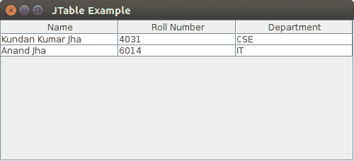

# Java Swing | JTable

> 原文:[https://www.geeksforgeeks.org/java-swing-jtable/](https://www.geeksforgeeks.org/java-swing-jtable/)

JTable 类是 Java Swing Package 的一部分，通常用于显示或编辑既有行又有列的二维数据。它类似于电子表格。这以表格形式排列数据。
**JTable**中的构造函数:

1.  **JTable():** 表格是用空单元格创建的。
2.  **JTable(int row，int cols):** 创建一个大小为 rows * cols 的表格。
3.  **JTable(对象[][]数据，对象[]列):**使用指定的名称创建一个表，其中[]列定义了列名。

**JTable**中的功能:

1.  **添加列(TableColumn[]列):**在 JTable 的末尾添加一列。
2.  **clearSelection() :** 选择所有选中的行和列。
3.  **编辑单元格 At(int row，int col) :** 如果给定的索引有效且相应的单元格可编辑，则以编程方式编辑列号列和行号行的交叉单元格。
4.  **设置值 At(对象值，int 行，int 列):**为 JTable 中的位置行，列设置单元格值为“值”。

下面是说明 JTable 各种方法的程序:

## Java 语言(一种计算机语言，尤用于创建网站)

```
// Packages to import
import javax.swing.JFrame;
import javax.swing.JScrollPane;
import javax.swing.JTable;

public class JTableExamples {
    // frame
    JFrame f;
    // Table
    JTable j;

    // Constructor
    JTableExamples()
    {
        // Frame initialization
        f = new JFrame();

        // Frame Title
        f.setTitle("JTable Example");

        // Data to be displayed in the JTable
        String[][] data = {
            { "Kundan Kumar Jha", "4031", "CSE" },
            { "Anand Jha", "6014", "IT" }
        };

        // Column Names
        String[] columnNames = { "Name", "Roll Number", "Department" };

        // Initializing the JTable
        j = new JTable(data, columnNames);
        j.setBounds(30, 40, 200, 300);

        // adding it to JScrollPane
        JScrollPane sp = new JScrollPane(j);
        f.add(sp);
        // Frame Size
        f.setSize(500, 200);
        // Frame Visible = true
        f.setVisible(true);
    }

    // Driver  method
    public static void main(String[] args)
    {
        new JTableExamples();
    }
}
```

**输出**:

