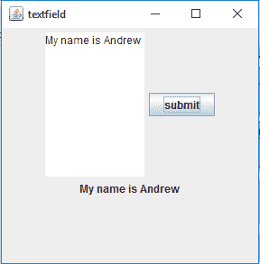
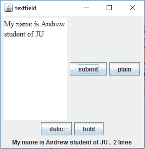
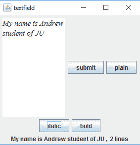
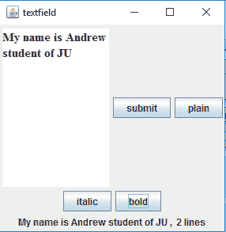

# Java 摇摆| JTextArea

> 哎哎哎:# t0]https://www . geeksforgeeks . org/Java-swing-jtextarea/

JTextArea 是 java Swing 包的一部分。它表示显示文本的多行区域。它用于编辑文本。
JTextArea 继承了 JComponent 类。JTextArea 中的文本可以设置为不同的可用字体，并可以附加到新文本中。文本区域可以根据用户的需要进行定制。

**JTextArea 的构造函数为:**

1.  **JTextArea() :** 构造一个新的空白文本区域。
2.  **JTextArea(字符串 s) :** 用给定的初始文本构建一个新的文本区域。
3.  **JTextArea(int row，int column) :** 用给定的行数和列数构造一个新的文本区域。
4.  **JTextArea(String s，int row，int column) :** 用给定数量的行和列以及给定的初始文本构建一个新的文本区域。

**常用方法:**

1.  **追加(字符串 s) :** 将给定字符串追加到文本区域的文本中。
2.  **getLineCount() :** 获取文本区域的文本行数。
3.  **设置字体(字体 f) :** 将文本区域的字体设置为给定的字体。
4.  **设置列数(int c) :** 将文本区域的列数设置为给定的整数。
5.  **设置行数(int r) :** 将文本区域的行数设置为给定的整数。
6.  **getColumns() :** 获取文本区域的列数。
7.  **getRows() :** 获取文本区域的行数。

**1。程序创建一个简单的 JTextArea**

```java
// Java Program to create a simple JTextArea
import java.awt.event.*;
import java.awt.*;
import javax.swing.*;
class text extends JFrame implements ActionListener {

    // JFrame
    static JFrame f;

    // JButton
    static JButton b;

    // label to display text
    static JLabel l;

    // text area
    static JTextArea jt;

    // default constructor
    text()
    {
    }

    // main class
    public static void main(String[] args)
    {
        // create a new frame to store text field and button
        f = new JFrame("textfield");

        // create a label to display text
        l = new JLabel("nothing entered");

        // create a new button
        b = new JButton("submit");

        // create a object of the text class
        text te = new text();

        // addActionListener to button
        b.addActionListener(te);

        // create a text area, specifying the rows and columns
        jt = new JTextArea(10, 10);

        JPanel p = new JPanel();

        // add the text area and button to panel
        p.add(jt);
        p.add(b);
        p.add(l);

        f.add(p);
        // set the size of frame
        f.setSize(300, 300);

        f.show();
    }

    // if the button is pressed
    public void actionPerformed(ActionEvent e)
    {
        String s = e.getActionCommand();
        if (s.equals("submit")) {
            // set the text of the label to the text of the field
            l.setText(jt.getText());
        }
    }
}
```

**输出:**

**2。程序创建一个 JTextArea，并设置一个初始文本和添加按钮来改变文本区域的字体。**

```java
// Java Program Program to create a JTextArea and
// set a initial text and add buttons to change
// the font of text area.
import java.awt.event.*;
import java.awt.*;
import javax.swing.*;
class text11 extends JFrame implements ActionListener {

    // JFrame
    static JFrame f;

    // JButton
    static JButton b, b1, b2, b3;

    // label to display text
    static JLabel l, l1;

    // text area
    static JTextArea jt;

    // default constructor
    text11()
    {
    }

    // main class
    public static void main(String[] args)
    {
        // create a new frame to store text field and button
        f = new JFrame("textfield");

        // create a label to display text
        l = new JLabel("nothing entered");
        l1 = new JLabel("0 lines");

        // create a new buttons
        b = new JButton("submit");
        b1 = new JButton("plain");
        b2 = new JButton("italic");
        b3 = new JButton("bold");

        // create a object of the text class
        text11 te = new text11();

        // addActionListener to button
        b.addActionListener(te);
        b1.addActionListener(te);
        b2.addActionListener(te);
        b3.addActionListener(te);

        // create a text area, specifying the rows and columns
        jt = new JTextArea("please write something ", 10, 10);

        JPanel p = new JPanel();

        // add the text area and button to panel
        p.add(jt);
        p.add(b);
        p.add(b1);
        p.add(b2);
        p.add(b3);
        p.add(l);
        p.add(l1);

        f.add(p);
        // set the size of frame
        f.setSize(300, 300);

        f.show();
    }

    // if the button is pressed
    public void actionPerformed(ActionEvent e)
    {
        String s = e.getActionCommand();
        if (s.equals("submit")) {
            // set the text of the label to the text of the field
            l.setText(jt.getText() + ", ");
            l1.setText(jt.getLineCount() + " lines");
        }
        else if (s.equals("bold")) {

            // set bold font
            Font f = new Font("Serif", Font.BOLD, 15);
            jt.setFont(f);
        }
        else if (s.equals("italic")) {
            // set italic font
            Font f = new Font("Serif", Font.ITALIC, 15);
            jt.setFont(f);
        }
        else if (s.equals("plain")) {
            // set plain font
            Font f = new Font("Serif", Font.PLAIN, 15);
            jt.setFont(f);
        }
    }
}
```

**输出:**





**注意:以下程序可能无法在在线编译器中运行，请使用离线 IDE**