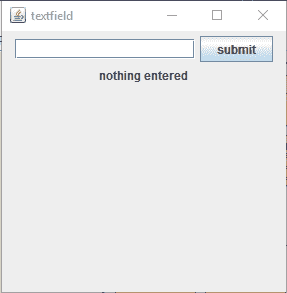
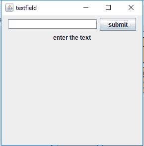
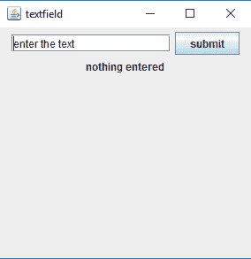
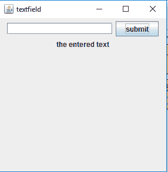
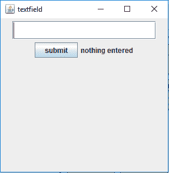
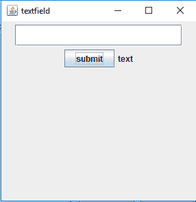
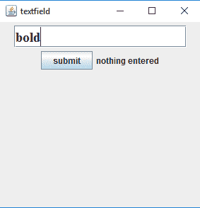

# Java swing | jtextfield

> 哎哎哎:# t0]https://www . geeksforgeeks . org/Java-swing-jtextfield/

JTextField 是 javax.swing 包的一部分。类 JTextField 是一个允许编辑单行文本的组件。JTextField 继承了 JTextComponent 类，并使用接口 SwingConstants。
该类的构造函数为:

1.  **JTextField()** :创建新文本字段的构造函数
2.  **JTextField(int columns)** :创建具有指定列数的新空 TextField 的构造函数。
3.  **JTextField(String text)** :创建一个用给定字符串初始化的新空文本字段的构造函数。
4.  **JTextField(String text，int columns)** :用给定的字符串和指定的列数创建新的空 TextField 的构造函数。
5.  **JTextField(Document doc，String text，int columns)** :创建使用给定文本存储模型和给定列数的 TextField 的构造函数。

**JTextField 的方法有:**

1.  **设置列数(int n)** :设置文本字段的列数。
2.  **设置字体(Font f)** :设置文本字段显示的文本字体。
3.  **添加动作侦听器(动作侦听器 l)** :为文本字段设置一个动作侦听器。
4.  **int getColumns()** :获取 textfield 中的列数。

下面是实现 JTextField 的程序。
**1。程序创建一个有一定列数的空白文本字段。**

## Java 语言(一种计算机语言，尤用于创建网站)

```
// Java program to create a blank text
// field of definite number of columns.
import java.awt.event.*;
import javax.swing.*;
class text extends JFrame implements ActionListener {
    // JTextField
    static JTextField t;

    // JFrame
    static JFrame f;

    // JButton
    static JButton b;

    // label to display text
    static JLabel l;

    // default constructor
    text()
    {
    }

    // main class
    public static void main(String[] args)
    {
        // create a new frame to store text field and button
        f = new JFrame("textfield");

        // create a label to display text
        l = new JLabel("nothing entered");

        // create a new button
        b = new JButton("submit");

        // create a object of the text class
        text te = new text();

        // addActionListener to button
        b.addActionListener(te);

        // create a object of JTextField with 16 columns
        t = new JTextField(16);

        // create a panel to add buttons and textfield
        JPanel p = new JPanel();

        // add buttons and textfield to panel
        p.add(t);
        p.add(b);
        p.add(l);

        // add panel to frame
        f.add(p);

        // set the size of frame
        f.setSize(300, 300);

        f.show();
    }

    // if the button is pressed
    public void actionPerformed(ActionEvent e)
    {
        String s = e.getActionCommand();
        if (s.equals("submit")) {
            // set the text of the label to the text of the field
            l.setText(t.getText());

            // set the text of field to blank
            t.setText("  ");
        }
    }
}
```

**输出:**





**2。用给定的初始文本和给定的列数创建空白文本字段的程序**

## Java 语言(一种计算机语言，尤用于创建网站)

```
// Java program to create a blank text field with a
// given initial text and given number of columns
import java.awt.event.*;
import javax.swing.*;
class text extends JFrame implements ActionListener {
    // JTextField
    static JTextField t;

    // JFrame
    static JFrame f;

    // JButton
    static JButton b;

    // label to display text
    static JLabel l;

    // default constructor
    text()
    {
    }

    // main class
    public static void main(String[] args)
    {
        // create a new frame to store text field and button
        f = new JFrame("textfield");

        // create a label to display text
        l = new JLabel("nothing entered");

        // create a new button
        b = new JButton("submit");

        // create a object of the text class
        text te = new text();

        // addActionListener to button
        b.addActionListener(te);

        // create a object of JTextField with 16 columns and a given initial text
        t = new JTextField("enter the text", 16);

        // create a panel to add buttons and textfield
        JPanel p = new JPanel();

        // add buttons and textfield to panel
        p.add(t);
        p.add(b);
        p.add(l);

        // add panel to frame
        f.add(p);

        // set the size of frame
        f.setSize(300, 300);

        f.show();
    }

    // if the button is pressed
    public void actionPerformed(ActionEvent e)
    {
        String s = e.getActionCommand();
        if (s.equals("submit")) {
            // set the text of the label to the text of the field
            l.setText(t.getText());

            // set the text of field to blank
            t.setText("  ");
        }
    }
}
```

**输出:**





**3。创建空白文本字段并设置 BOLD 字体类型的程序**

## Java 语言(一种计算机语言，尤用于创建网站)

```
// Java program to create a blank text field and set BOLD font type
import java.awt.event.*;
import java.awt.*;
import javax.swing.*;
class text extends JFrame implements ActionListener {
    // JTextField
    static JTextField t;

    // JFrame
    static JFrame f;

    // JButton
    static JButton b;

    // label to display text
    static JLabel l;

    // default constructor
    text()
    {
    }

    // main class
    public static void main(String[] args)
    {
        // create a new frame to store text field and button
        f = new JFrame("textfield");

        // create a label to display text
        l = new JLabel("nothing entered");

        // create a new button
        b = new JButton("submit");

        // create a object of the text class
        text te = new text();

        // addActionListener to button
        b.addActionListener(te);

        // create a object of JTextField with 16 columns
        t = new JTextField(16);

        // create an object of font type
        Font fo = new Font("Serif", Font.BOLD, 20);

        // set the font of the textfield
        t.setFont(fo);

        // create a panel to add buttons and textfield
        JPanel p = new JPanel();

        // add buttons and textfield to panel
        p.add(t);
        p.add(b);
        p.add(l);

        // add panel to frame
        f.add(p);

        // set the size of frame
        f.setSize(300, 300);

        f.show();
    }

    // if the button is pressed
    public void actionPerformed(ActionEvent e)
    {
        String s = e.getActionCommand();
        if (s.equals("submit")) {
            // set the text of the label to the text of the field
            l.setText(t.getText());

            // set the text of field to blank
            t.setText("  ");
        }
    }
}
```

**输出:**







**注意:**上述程序可能无法在使用离线 IDE 的在线编译器中运行。textfield 的初始文本、字体和列数是任意的，程序员可以根据自己的需要进行更改。