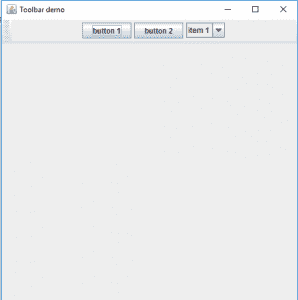
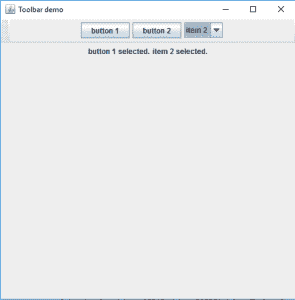
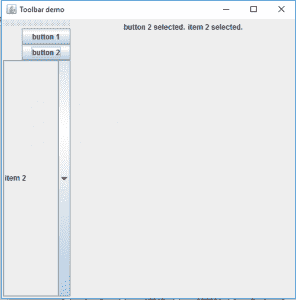

# Java 摇摆| JToolBar

> 原文:[https://www.geeksforgeeks.org/java-swing-jtoolbar/](https://www.geeksforgeeks.org/java-swing-jtoolbar/)

JToolBar 是 Java Swing 包的一部分。JToolBar 是工具栏的一种实现。JToolBar 是一组常用的组件，如按钮或下拉菜单。
用户可以将工具栏拖动到不同的位置

**类的构造函数有:**

1.  JToolBar():创建一个水平方向的新工具栏
2.  创建一个指定方向的新工具栏
3.  创建一个具有指定名称的新工具栏
4.  JToolBar(String n，int o):创建一个具有指定名称和方向的新工具栏。

**常用方法:**

1.  addSeparator():将分隔符添加到工具栏的末尾
2.  setFloatable(布尔值 b):如果传递 true，则工具栏可以被拖动到其他位置，否则不可以。
3.  设置布局(LayoutManager m):设置工具栏的布局
4.  设置方向:设置工具栏的方向
5.  添加(组件 c):向工具栏添加组件
6.  getMargin():返回工具栏的边距
7.  设置边距(Insets m):将工具栏的边距设置为给定的 Insets
8.  getOrientation():返回工具栏的方向
9.  updateUI():来自 UIFactory 的通知，表示外观和感觉已经改变。
10.  设置渲染这个组件的外观对象。
11.  设置翻转(布尔值 b):将此工具的翻转状态设置为布尔值 b。
12.  setFloatable(布尔 b):布尔 b 决定工具栏的位置是否可以改变
13.  setBorderPainted(布尔值 b):决定是否应该绘制边框。
14.  画笔命令:绘制工具栏的边框
15.  isRollover():返回翻转状态。
16.  isFloatable():返回可浮动属性。
17.  isBorderPainted():返回边框是否被绘制
18.  返回指定组件的索引。
19.  getComponentAtIndex(int i):返回指定索引处的组件。
20.  添加分隔符(维度大小):追加指定维度的分隔符。
21.  addSeparator():追加默认大小的分隔符。
22.  add(动作 a):在指定的动作之后添加一个新的 JButton。
23.  paramString():返回此 JToolBar 的字符串表示形式。
24.  getUIClassID():返回呈现此组件的外观类的名称。
25.  getAccessibleContext():获取与此 JToolBar 关联的 AccessibleContext。

**以下程序将说明工具栏的使用。**
**1。程序创建一个简单的工具栏，并添加按钮和组合框。**

## Java 语言(一种计算机语言，尤用于创建网站)

```
// Java Program to create a simple toolbar and add buttons and combobox to it.
import java.awt.*;
import javax.swing.*;
import java.awt.event.*;
public class Tool extends JFrame {
    // toolbar
    static JToolBar tb;

    // buttons
    static JButton b1, b2;

    // create a frame
    static JFrame f;

    // create a combo box
    static JComboBox x;

    public static void main()
    {

        // create a frame
        f = new JFrame("Toolbar demo");

        // set layout for frame
        f.setLayout(new BorderLayout());

        // create a toolbar
        tb = new JToolBar();

        // create a panel
        JPanel p = new JPanel();

        // create a combobox
        x = new JComboBox(new String[] { "item 1", "item 2", "item 3" });

        // create new buttons
        b1 = new JButton("button 1");
        b2 = new JButton("button 2");

        // add buttons
        p.add(b1);
        p.add(b2);

        // add menu to menu bar
        p.add(x);

        tb.add(p);

        // add toolbar to frame
        f.add(tb, BorderLayout.NORTH);

        // set the size of the frame
        f.setSize(500, 500);
        f.setVisible(true);
    }
}
```

**输出:**



**2。程序创建一个工具栏，并将动作监听器添加到其组件中。**

## Java 语言(一种计算机语言，尤用于创建网站)

```
// Java Program to create a toolbar and add action listener to its components .
import java.awt.*;
import javax.swing.*;
import java.awt.event.*;
public class Tool extends JFrame implements ActionListener, ItemListener {
    // toolbar
    static JToolBar tb;

    // buttons
    static JButton b1, b2;

    // create a frame
    static JFrame f;

    // create a combo box
    static JComboBox x;

    // create a label
    static JLabel l, l1;

    public static void main()
    {
        // create a object of class
        Tool to = new Tool();

        // create a label
        l = new JLabel("nothing selected");
        l1 = new JLabel("nothing selected");

        // create a frame
        f = new JFrame("Toolbar demo");

        // set layout for frame
        f.setLayout(new BorderLayout());

        // create a toolbar
        tb = new JToolBar();

        // create a panel
        JPanel p = new JPanel();

        // create a combobox
        x = new JComboBox(new String[] { "item 1", "item 2", "item 3" });

        // add actionListener
        x.addItemListener(to);

        // create new buttons
        b1 = new JButton("button 1");
        b2 = new JButton("button 2");

        // add ActionListener to it
        b1.addActionListener(to);
        b2.addActionListener(to);

        // add buttons
        p.add(b1);
        p.add(b2);

        // add menu to menu bar
        p.add(x);

        tb.add(p);

        // create a panel
        JPanel p1 = new JPanel();

        p1.add(l);
        p1.add(l1);

        // add toolbar to frame
        f.add(tb, BorderLayout.NORTH);
        f.add(p1, BorderLayout.CENTER);

        // set the size of the frame
        f.setSize(500, 500);
        f.setVisible(true);
    }

    // if button is pressed
    public void actionPerformed(ActionEvent e)
    {
        l.setText(e.getActionCommand() + " selected.");
    }

    // if combo box is selected
    public void itemStateChanged(ItemEvent e)
    {
        l1.setText(x.getSelectedItem() + " selected.");
    }
}
```

**输出:**



**3。程序创建一个垂直工具栏，并将动作监听器添加到其组件中。**

## Java 语言(一种计算机语言，尤用于创建网站)

```
import java.awt.*;
import javax.swing.*;
import java.awt.event.*;
public class Tool extends JFrame implements ActionListener, ItemListener {
    // toolbar
    static JToolBar tb;

    // buttons
    static JButton b1, b2;

    // create a frame
    static JFrame f;

    // create a combo box
    static JComboBox x;

    // create a label
    static JLabel l, l1;

    public static void main()
    {
        // create a object of class
        Tool to = new Tool();

        // create a label
        l = new JLabel("nothing selected");
        l1 = new JLabel("nothing selected");

        // create a frame
        f = new JFrame("Toolbar demo");

        // set layout for frame
        f.setLayout(new BorderLayout());

        // create a toolbar
        tb = new JToolBar("toolbar");

        // set orientation
        tb.setOrientation(SwingConstants.VERTICAL);

        // create a panel
        JPanel p = new JPanel();

        // set layout
        p.setLayout(new BoxLayout(p, BoxLayout.Y_AXIS));

        // create a combobox
        x = new JComboBox(new String[] { "item 1", "item 2", "item 3" });

        // add actionListener
        x.addItemListener(to);

        // create new buttons
        b1 = new JButton("button 1");
        b2 = new JButton("button 2");

        // add ActionListener to it
        b1.addActionListener(to);
        b2.addActionListener(to);

        // add buttons
        p.add(b1);
        p.add(b2);

        // add menu to menu bar
        p.add(x);

        tb.add(p);

        // create a panel
        JPanel p1 = new JPanel();

        p1.add(l);
        p1.add(l1);

        // add toolbar to frame
        f.add(tb, BorderLayout.WEST);
        f.add(p1, BorderLayout.CENTER);

        // set the size of the frame
        f.setSize(500, 500);
        f.setVisible(true);
    }

    // if button is pressed
    public void actionPerformed(ActionEvent e)
    {
        l.setText(e.getActionCommand() + " selected.");
    }

    // if combo box is selected
    public void itemStateChanged(ItemEvent e)
    {
        l1.setText(x.getSelectedItem() + " selected.");
    }
}
```

**输出:**



**注意:以下程序可能无法在在线编译器中运行，请使用离线 IDE**