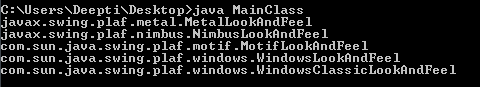

# Java Swing |观感

> 原文:[https://www.geeksforgeeks.org/java-swing-look-feel/](https://www.geeksforgeeks.org/java-swing-look-feel/)

Swing 是 Java 的 **GUI 小部件工具包**。它是一个为 Java 程序提供图形用户界面的应用编程接口。与 AWT 不同，Swing 组件是用 Java 编写的，因此与平台无关。Swing 提供了特定于平台的外观和感觉，还提供了可插拔外观和感觉选项，允许应用程序具有独立于底层平台的外观和感觉。
最初，Java Swing 中的颜色和其他设置选项非常少，这使得整个应用程序看起来既无聊又单调。随着 Java 框架的发展，引入了新的变化来改善用户界面，从而为开发人员提供了增强 Java Swing 应用程序外观的机会。

**“看”是指 GUI 小部件的外观，“感觉”是指小部件的行为方式**。
孙的 JRE 提供了以下 L & Fs:

1.  **crosslatformlookand feel:**这是在所有平台上看起来都一样的“Java L & F”也叫“Metal”。它是 Java API (javax.swing.plaf.metal)的一部分，是默认的。
2.  **SystemLookAndFeel:** 在这里，应用程序使用的 L & F 是它所运行的系统的默认值。系统 L & F 在运行时确定，应用程序要求系统返回适当的 L & F 的名称。
    对于 Linux 和 Solaris，如果安装了 GTK+ 2.2 或更高版本，系统 L&F 是“GTK+”，否则是“Motif”。对于 Windows，系统 L & F 为“Windows”。
3.  **Synth:** 用 XML 文件创建自己的外观的基础。
4.  **复用:**一种让 UI 方法同时委托给多个不同观感实现的方法。

我们可以使用 UIManager 直接从类路径加载 L&F 类。代码是这样的:

```
UIManager.setLookAndFeel("fully qualified name of look and feel");
```

例如，以下代码将应用程序外观更改为 Motif 外观:

```
UIManager.setLookAndFeel ("com.sun.java.swing.plaf.motif.MotifLookAndFeel");
```

```
// Java sample code to get the list of
// installed Look and Feel themes, here is a sample code:
import javax.swing.UIManager;

public class MainClass {    public static void main(String[] a)
    {
        UIManager.LookAndFeelInfo[] looks = UIManager.getInstalledLookAndFeels();
        for (UIManager.LookAndFeelInfo look : looks) {
            System.out.println(look.getClassName());
        }
    }
}
```



借助一个简单的计算器程序，我们将看到不同的外观主题:

1.  **CrossPlatformLookAndFeel:**

    ```
    // Java program to illustrate
    // CrossPlatformLookAndFeel
    import java.awt.*;
    import java.awt.event.*;
    import javax.swing.*;
    import javax.swing.UIManager;
    import javax.swing.JFrame;
    class Awt implements ActionListener {
        JFrame f;
        JButton addbut, subbut, mulbut, divbut, b5;
        JTextField t1, t2, t3;
        JLabel l, l1;
        Awt()
        {
            f = new JFrame("Cross Platform Look and Feel");
            t1 = new JTextField("             ");
            t2 = new JTextField("             ");
            t3 = new JTextField("             ");
            addbut = new JButton("Add");
            subbut = new JButton("Sub");
            mulbut = new JButton("Mul");
            divbut = new JButton("Div");
            l = new JLabel();
            l1 = new JLabel();
        }
        public void awt1()
        {
            f.setLayout(new GridLayout(3, 2));
            f.setVisible(true);
            f.add(t1);
            f.add(t2);
            f.add(t3);
            f.add(addbut);
            f.add(subbut);
            f.add(mulbut);
            f.add(divbut);
            f.add(l);
            f.add(l1);
            addbut.addActionListener(this);
            subbut.addActionListener(this);
            mulbut.addActionListener(this);
            divbut.addActionListener(this);
            f.pack();
        }
        public void actionPerformed(ActionEvent e)
        {
            String s = new String(e.getActionCommand());
            l.setText(s);
            if ((s).equals("Add")) {
                int a = Integer.parseInt(t1.getText());
                int b = Integer.parseInt(t2.getText());
                Integer c = a + b;
                t3.setText(c.toString());
            }
            else if ((s).equals("Sub")) {
                int a = Integer.parseInt(t1.getText());
                int b = Integer.parseInt(t2.getText());
                Integer c = a - b;
                t3.setText(c.toString());
            }
            else if ((s).equals("Mul")) {
                int a = Integer.parseInt(t1.getText());
                int b = Integer.parseInt(t2.getText());
                Integer c = a * b;
                t3.setText(c.toString());
            }
        }

        public static void main(String args[])
        {

            try {

                UIManager.setLookAndFeel(UIManager.getCrossPlatformLookAndFeelClassName());
            }
            catch (Exception e) {
                System.out.println("Look and Feel not set");
            }
            Awt a = new Awt();
            a.awt1();
        }
    }
    ```

    
    还可以使用 Look And Feel 的实际类名作为 UIManager.setLookAndFeel()的参数。例如:
    //设置跨平台 Java L & F(也叫“金属”)

    ```
    UIManager.setLookAndFeel("javax.swing.plaf.metal.MetalLookAndFeel");
    ```

2.  **MotifLookAndFeel:** Just change Line number 14 and 79 to:

    ```
     Line 14: f=new JFrame("Motif Look and Feel");
    Line 79: UIManager.setLookAndFeel("com.sun.java.swing.plaf.motif.MotifLookAndFeel");
    ```

    

3.  **SystemLookAndFeel:** Change Line number 14 and 79 to:

    ```
    Line 14: f=new JFrame("System Look and Feel");
    Line 79: UIManager.setLookAndFeel("com.sun.java.swing.plaf.windows.WindowsLookAndFeel");
    ```

    

4.  **WindowsClassicLookAndFeel:** Change Line number 14 and 79 to:

    ```
    Line 14: f=new JFrame("WindowsClassic Look and Feel");
    Line 79: UIManager.setLookAndFeel("com.sun.java.swing.plaf.windows.WindowsLookAndFeel");
    ```

    

5.  **NimbusLookAndFeel:** Change Line number 14 and 79 to:

    ```
    Line 14: f=new JFrame("Nimbus Look and Feel");
    Line 79: UIManager.setLookAndFeel("javax.swing.plaf.nimbus.NimbusLookAndFeel");
    ```

    

**使用命令行参数指定外观**

您可以通过在命令行使用-D 标志来设置 *swing.defaultlaf* 属性来指定外观和感觉。示例–
我们将运行上述代码，但不包括第 76 行，并执行以下命令:

```
java -Dswing.defaultlaf=com.sun.java.swing.plaf.gtk.GTKLookAndFeel Awt
```


**通过编辑 swing.properties 文件指定外观和感觉**

在这里我们将编辑 swing.properties 文件来设置 *swing.defaultlaf* 属性。该文件位于 lib 目录中。这里有一个例子-

```
swing.defaultlaf=com.sun.java.swing.plaf.windows.WindowsLookAndFeel
```

**主题**

引入主题是为了改变默认 Java 金属外观的颜色和字体。常数可以初始化为三个值之一:

*   默认金属
*   海洋
*   试验

有专业主题的选项，可以下载并在代码中使用。以下是可用的专业主题列表:

1.  物质
2.  海玻璃
3.  信息外观和感觉
4.  Pgs 外观和感觉
5.  Quaqua 外观和感觉
6.  奥亚哈
7.  液体外观和感觉
8.  JTattoo

参考文献:

1.  https://docs.oracle.com/javase/tutorial/uiswing/lookandfeel/plaf.html
2.  http://geeknizer.com/best-java-swing-look-and-feel-themes-professional-casual-top-10/