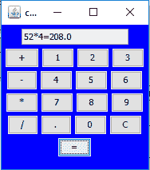

# Java Swing |简单计算器

> 原文:[https://www.geeksforgeeks.org/java-swing-simple-calculator/](https://www.geeksforgeeks.org/java-swing-simple-calculator/)

Java Swing 是一个面向 Java 的图形用户界面小部件工具包。Java Swing 是甲骨文 Java 基础类的一部分。Java Swing 是一个为 Java 程序提供图形用户界面元素的应用编程接口。创建 Swing 是为了提供比 Java AWT(抽象窗口工具包)更强大、更灵活的组件。
在本文中，我们将使用 Java Swing 组件来创建一个简单的计算器，它只有+、-、/、*操作。
**使用的方法:**

1.  **添加(组件 c)** :向容器中添加组件。
2.  **添加 ActionListener listener(ActionListener d)**:添加指定组件的 ActionListener
3.  **设置背景(颜色 c)** :设置指定容器的背景颜色
4.  **设置大小(int a，int b)** :将容器的大小设置为指定的尺寸。
5.  **设置文本(字符串)**:将标签的文本设置为 s
6.  **getText()** :返回标签的文本。

**Java 程序使用 java swing 元素创建一个带有 basic +、-、/、*的简单计算器。**

## Java 语言(一种计算机语言，尤用于创建网站)

```java
// Java program to create a simple calculator
// with basic +, -, /, * using java swing elements

import java.awt.event.*;
import javax.swing.*;
import java.awt.*;
class calculator extends JFrame implements ActionListener {
    // create a frame
    static JFrame f;

    // create a textfield
    static JTextField l;

    // store operator and operands
    String s0, s1, s2;

    // default constructor
    calculator()
    {
        s0 = s1 = s2 = "";
    }

    // main function
    public static void main(String args[])
    {
        // create a frame
        f = new JFrame("calculator");

        try {
            // set look and feel
            UIManager.setLookAndFeel(UIManager.getSystemLookAndFeelClassName());
        }
        catch (Exception e) {
            System.err.println(e.getMessage());
        }

        // create a object of class
        calculator c = new calculator();

        // create a textfield
        l = new JTextField(16);

        // set the textfield to non editable
        l.setEditable(false);

        // create number buttons and some operators
        JButton b0, b1, b2, b3, b4, b5, b6, b7, b8, b9, ba, bs, bd, bm, be, beq, beq1;

        // create number buttons
        b0 = new JButton("0");
        b1 = new JButton("1");
        b2 = new JButton("2");
        b3 = new JButton("3");
        b4 = new JButton("4");
        b5 = new JButton("5");
        b6 = new JButton("6");
        b7 = new JButton("7");
        b8 = new JButton("8");
        b9 = new JButton("9");

        // equals button
        beq1 = new JButton("=");

        // create operator buttons
        ba = new JButton("+");
        bs = new JButton("-");
        bd = new JButton("/");
        bm = new JButton("*");
        beq = new JButton("C");

        // create . button
        be = new JButton(".");

        // create a panel
        JPanel p = new JPanel();

        // add action listeners
        bm.addActionListener(c);
        bd.addActionListener(c);
        bs.addActionListener(c);
        ba.addActionListener(c);
        b9.addActionListener(c);
        b8.addActionListener(c);
        b7.addActionListener(c);
        b6.addActionListener(c);
        b5.addActionListener(c);
        b4.addActionListener(c);
        b3.addActionListener(c);
        b2.addActionListener(c);
        b1.addActionListener(c);
        b0.addActionListener(c);
        be.addActionListener(c);
        beq.addActionListener(c);
        beq1.addActionListener(c);

        // add elements to panel
        p.add(l);
        p.add(ba);
        p.add(b1);
        p.add(b2);
        p.add(b3);
        p.add(bs);
        p.add(b4);
        p.add(b5);
        p.add(b6);
        p.add(bm);
        p.add(b7);
        p.add(b8);
        p.add(b9);
        p.add(bd);
        p.add(be);
        p.add(b0);
        p.add(beq);
        p.add(beq1);

        // set Background of panel
        p.setBackground(Color.blue);

        // add panel to frame
        f.add(p);

        f.setSize(200, 220);
        f.show();
    }
    public void actionPerformed(ActionEvent e)
    {
        String s = e.getActionCommand();

        // if the value is a number
        if ((s.charAt(0) >= '0' && s.charAt(0) <= '9') || s.charAt(0) == '.') {
            // if operand is present then add to second no
            if (!s1.equals(""))
                s2 = s2 + s;
            else
                s0 = s0 + s;

            // set the value of text
            l.setText(s0 + s1 + s2);
        }
        else if (s.charAt(0) == 'C') {
            // clear the one letter
            s0 = s1 = s2 = "";

            // set the value of text
            l.setText(s0 + s1 + s2);
        }
        else if (s.charAt(0) == '=') {

            double te;

            // store the value in 1st
            if (s1.equals("+"))
                te = (Double.parseDouble(s0) + Double.parseDouble(s2));
            else if (s1.equals("-"))
                te = (Double.parseDouble(s0) - Double.parseDouble(s2));
            else if (s1.equals("/"))
                te = (Double.parseDouble(s0) / Double.parseDouble(s2));
            else
                te = (Double.parseDouble(s0) * Double.parseDouble(s2));

            // set the value of text
            l.setText(s0 + s1 + s2 + "=" + te);

            // convert it to string
            s0 = Double.toString(te);

            s1 = s2 = "";
        }
        else {
            // if there was no operand
            if (s1.equals("") || s2.equals(""))
                s1 = s;
            // else evaluate
            else {
                double te;

                // store the value in 1st
                if (s1.equals("+"))
                    te = (Double.parseDouble(s0) + Double.parseDouble(s2));
                else if (s1.equals("-"))
                    te = (Double.parseDouble(s0) - Double.parseDouble(s2));
                else if (s1.equals("/"))
                    te = (Double.parseDouble(s0) / Double.parseDouble(s2));
                else
                    te = (Double.parseDouble(s0) * Double.parseDouble(s2));

                // convert it to string
                s0 = Double.toString(te);

                // place the operator
                s1 = s;

                // make the operand blank
                s2 = "";
            }

            // set the value of text
            l.setText(s0 + s1 + s2);
        }
    }
}
```

**输出:**



<video class="wp-video-shortcode" id="video-200544-1" width="640" height="360" preload="metadata" controls=""><source type="video/mp4" src="https://media.geeksforgeeks.org/wp-content/uploads/upload.mp4?_=1">[https://media.geeksforgeeks.org/wp-content/uploads/upload.mp4](https://media.geeksforgeeks.org/wp-content/uploads/upload.mp4)</video>

**注意:该程序可能无法在联机编译器中运行，请使用脱机 IDE。**