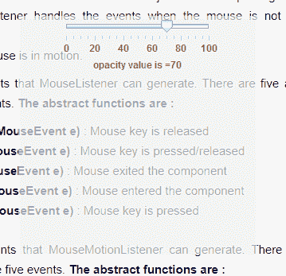
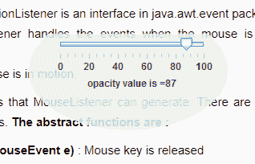

# Java Swing | Java 中半透明成型窗口

> 原文:[https://www . geesforgeks . org/Java-swing-半透明形-window-java/](https://www.geeksforgeeks.org/java-swing-translucent-shaped-window-java/)

Java 提供了不同的函数，通过这些函数我们可以控制窗口或框架的半透明性。为了控制框架的不透明度，一定不要装饰。框架的不透明度是对框架或组件的半透明性的度量。
在 Java 中，我们可以通过两种方式创建有形状的窗口，第一种是使用 awtutions，它是 com.sum.awt 包的一部分 awtutions 类有一个函数–setWindowShape(Window w，Shape s)，它设置窗口的形状，第二种是使用 setShape(Shape s)，它将窗口的形状设置为指定的形状。
在本文中，我们将讨论窗口的均匀半透明性。
**使用的方法:**

1.  **设置窗口形状(窗口 w，形状 s) :** 将窗口 w 的形状设置为指定的形状 s
2.  **设置形状:**将窗口的形状设置为指定的形状
3.  **设置透明度(浮动 f) :** 设置帧的不透明度值

**1。程序创建一个半透明的框架，并控制其半透明的帮助下，一个 JSlider**

## Java 语言(一种计算机语言，尤用于创建网站)

```java
// Java  program to create a
// translucent frame and control
// its translucency with
// the help of a JSlider
import javax.swing.event.*;
import java.awt.*;
import javax.swing.*;
class solveit extends JFrame implements ChangeListener {

    // frame
    static JFrame f;

    // slider
    static JSlider b;

    // label
    static JLabel l;

    // main class
    public static void main(String[] args)
    {
        // create a new frame
        f = new JFrame("translucent window");

        // create a object
        solveit s = new solveit();

        // create label
        l = new JLabel();

        // create a panel
        JPanel p = new JPanel();

        // create a slider
        b = new JSlider(0, 100, 100);

        // paint the ticks and tracks
        b.setPaintTrack(true);
        b.setPaintTicks(true);
        b.setPaintLabels(true);

        // set spacing
        b.setMajorTickSpacing(20);
        b.setMinorTickSpacing(5);

        // setChangeListener
        b.addChangeListener(s);

        // add slider to panel
        p.add(b);
        p.add(l);

        f.add(p);

        // set the text of label
        l.setText("Opacity value is =" + b.getValue());

        // set the size of frame
        f.setSize(300, 300);

        // decorated frame's opacity cant be set
        // so make the frame undecorated
        f.setUndecorated(true);

        // set opacity value for the window
        f.setOpacity(b.getValue() * 0.01f);

        f.setLocation(500, 300);

        f.show();
    }

    // if opacity value is changed
    public void stateChanged(ChangeEvent e)
    {
        l.setText("opacity value is =" + b.getValue());

        // set opacity value for the window
        f.setOpacity(b.getValue() * 0.01f);
    }
}
```

**输出:**



**2。程序创建一个成型的半透明窗口(使用 AWTUtilities)并使用滑块**
控制其半透明性

## Java 语言(一种计算机语言，尤用于创建网站)

```java
// Java Program to create a shaped translucent
// window (using AWTUtilities)and
// control its translucency using a slider
import javax.swing.event.*;
import java.awt.*;
import javax.swing.*;
import java.awt.geom.*;
import com.sun.awt.AWTUtilities;
class solveit extends JFrame implements ChangeListener {

    // frame
    static JFrame f;

    // slider
    static JSlider b;

    // label
    static JLabel l;

    // main class
    public static void main(String[] args)
    {
        // create a new frame
        f = new JFrame("translucent window");

        // create a object
        solveit s = new solveit();

        // create label
        l = new JLabel();

        // create a panel
        JPanel p = new JPanel();

        // create a slider
        b = new JSlider(0, 100, 100);

        // paint the ticks and tracks
        b.setPaintTrack(true);
        b.setPaintTicks(true);
        b.setPaintLabels(true);

        // set spacing
        b.setMajorTickSpacing(20);
        b.setMinorTickSpacing(5);

        // setChangeListener
        b.addChangeListener(s);

        // add slider to panel
        p.add(b);
        p.add(l);

        f.add(p);

        // set the text of label
        l.setText("Opacity value is =" + b.getValue());

        // set the size of frame
        f.setSize(300, 300);

        // decorated frame's opacity cant be set so make the frame undecorated
        f.setUndecorated(true);

        // set opacity value for the window
        f.setOpacity(b.getValue() * 0.01f);

        // set window shape using AWTUtilities class
        AWTUtilities.setWindowShape(f, new Ellipse2D.Float(20f, -30f, 250.0f, 150.0f));

        f.setLocation(500, 300);

        f.show();
    }

    // if opacity value is changed
    public void stateChanged(ChangeEvent e)
    {
        l.setText("opacity value is =" + b.getValue());

        // set opacity value for the window
        f.setOpacity(b.getValue() * 0.01f);
    }
}
```

**输出:**



**3。程序创建一个成型的半透明窗口(使用设置形状)并使用滑块**
控制其半透明性

## Java 语言(一种计算机语言，尤用于创建网站)

```java
// Program to create a shaped translucent
// window (using setShape)
// and control its translucency using a slider
import javax.swing.event.*;
import java.awt.*;
import javax.swing.*;
import java.awt.geom.*;
import com.sun.awt.AWTUtilities;
class solveit extends JFrame implements ChangeListener {

    // frame
    static JFrame f;

    // slider
    static JSlider b;

    // label
    static JLabel l;

    // main class
    public static void main(String[] args)
    {
        // create a new frame
        f = new JFrame("translucent window");

        // create a object
        solveit s = new solveit();

        // create label
        l = new JLabel();

        // create a panel
        JPanel p = new JPanel();

        // create a slider
        b = new JSlider(0, 100, 100);

        // paint the ticks and tracks
        b.setPaintTrack(true);
        b.setPaintTicks(true);
        b.setPaintLabels(true);

        // set spacing
        b.setMajorTickSpacing(20);
        b.setMinorTickSpacing(5);

        // setChangeListener
        b.addChangeListener(s);

        // add slider to panel
        p.add(b);
        p.add(l);

        f.add(p);

        // set the text of label
        l.setText("Opacity value is =" + b.getValue());

        // set the size of frame
        f.setSize(300, 300);

        // decorated frame's opacity cant be set so make the frame undecorated
        f.setUndecorated(true);

        // set opacity value for the window
        f.setOpacity(b.getValue() * 0.01f);

        // set window shape
        f.setShape(new Ellipse2D.Float(20f, -30f, 250.0f, 150.0f));

        f.setLocation(500, 300);

        f.show();
    }

    // if opacity value is changed
    public void stateChanged(ChangeEvent e)
    {
        l.setText("opacity value is =" + b.getValue());

        // set opacity value for the window
        f.setOpacity(b.getValue() * 0.01f);
    }
}
```

**输出:**


**注意:**上述程序可能无法在在线编译器中运行，请使用离线 IDE。建议使用最新版本的 java 运行上述程序，如果使用旧版本的 java，用户可能会遇到问题。