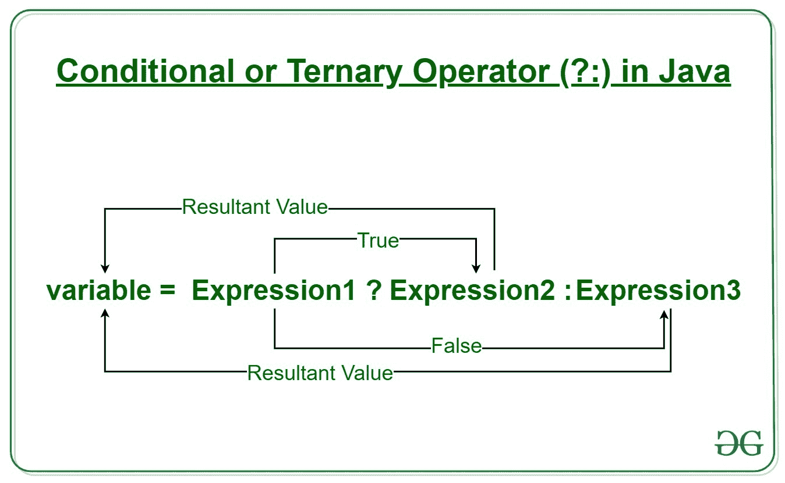
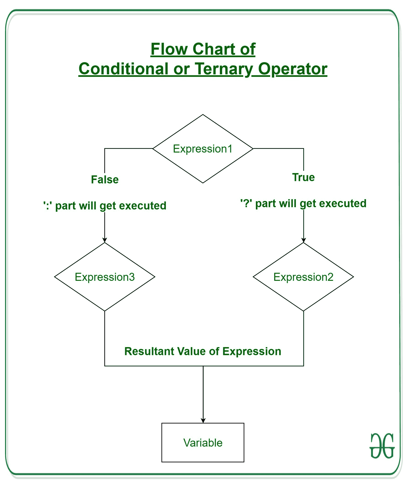

# Java 三进制运算符示例

> 原文:[https://www . geesforgeks . org/Java-三元运算符-带示例/](https://www.geeksforgeeks.org/java-ternary-operator-with-examples/)

[**运算符**](https://www.geeksforgeeks.org/operators-in-java/) 构成了任何编程语言的基本构件。Java 也提供了许多类型的运算符，可以根据需要使用它们来执行各种计算和功能，包括逻辑、算术、关系等。它们根据提供的功能进行分类。这里有几个类型:

1.  算术运算符
2.  一元运算符
3.  赋值运算符
4.  关系运算符
5.  逻辑运算符
6.  三元算子
7.  按位运算符
8.  移位运算符

本文解释了关于三进制运算符的所有需要知道的内容。

**三元运算符**

Java 三元运算符是唯一接受三个操作数的条件运算符。它是 if-then-else 语句的单行替代语句，在 Java 编程中大量使用。我们可以使用三元运算符来代替 if-else 条件，甚至可以使用嵌套的三元运算符来切换条件。尽管它遵循与 if-else 语句相同的算法，但条件运算符占用的空间更少，有助于以尽可能短的方式编写 if-else 语句。



**语法:**

```
variable = Expression1 ? Expression2: Expression3
```

If 的操作类似于 if-else 语句的操作，如*表达式 2* 如果*表达式 1* 为真，则执行*表达式 3* 。

```
if(Expression1)
{
    variable = Expression2;
}
else
{
    variable = Expression3;
}
```

**例:**

```
num1 = 10;
num2 = 20;

res=(num1>num2) ? (num1+num2):(num1-num2)

Since num1<num2, 
the second operation is performed
res = num1-num2 = -10
```

**三元运算流程图**



**例 1:**

## Java 语言(一种计算机语言，尤用于创建网站)

```
// Java program to find largest among two
// numbers using ternary operator

import java.io.*;

class Ternary {
    public static void main(String[] args)
    {

        // variable declaration
        int n1 = 5, n2 = 10, max;

        System.out.println("First num: " + n1);
        System.out.println("Second num: " + n2);

        // Largest among n1 and n2
        max = (n1 > n2) ? n1 : n2;

        // Print the largest number
        System.out.println("Maximum is = " + max);
    }
}
```

**Output:** 

```
First num: 5
Second num: 10
Maximum is = 10
```

**例 2:**

## Java 语言(一种计算机语言，尤用于创建网站)

```
// Java code to illustrate ternary operator

import java.io.*;

class Ternary {
    public static void main(String[] args)
    {

        // variable declaration
        int n1 = 5, n2 = 10, res;

        System.out.println("First num: " + n1);
        System.out.println("Second num: " + n2);

        // Performing ternary operation
        res = (n1 > n2) ? (n1 + n2) : (n1 - n2);

        // Print the largest number
        System.out.println("Result = " + res);
    }
}
```

**Output:** 

```
First num: 5
Second num: 10
Result = -5
```