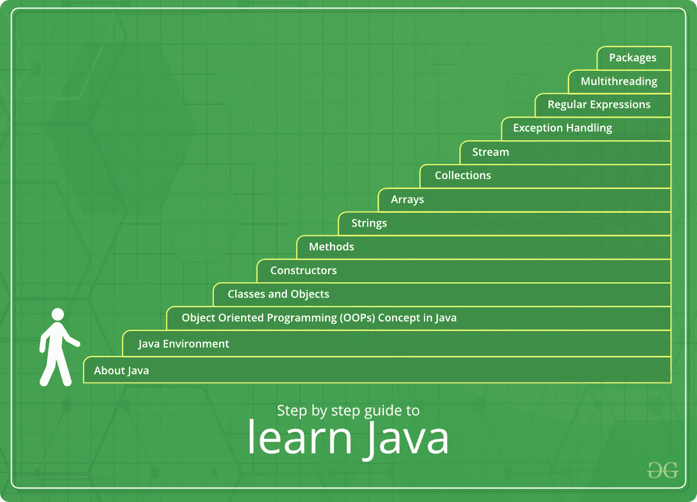

# Java 教程

> 原文:[https://www.geeksforgeeks.org/java-tutorial/](https://www.geeksforgeeks.org/java-tutorial/)

Java 是最流行、应用最广泛的编程语言和平台之一。平台是一种有助于开发和运行用任何编程语言编写的程序的环境。

Java 快速、可靠、安全。从桌面到网络应用，从科学超级计算机到游戏机，从手机到互联网，Java 被应用到每一个角落。

Java 很容易学习，语法简单易懂。它基于 C++(所以对懂 C++的程序员来说更容易)。Java 删除了许多令人困惑且很少使用的特性，例如显式指针、运算符重载等。Java 还负责内存管理，为此，它提供了一个自动垃圾收集器。这将自动收集未使用的对象。

# <u>Java 教程</u>

以下是如何开始使用 Java 并使自己精通它的完整指南。

1.  **[About Java](https://www.geeksforgeeks.org/java-how-to-start-learning-java/):** Before taking your step, the most important thing to do is to get the answer of all WHYs. Here it refers to the questions like WHAT IS JAVA, WHY IT IS POPULAR, WHAT ARE ITS FEATURES, etc etc. By digging into the mentioned article, you will not only learn the important things about Java but also you will understand how to start learning it.

    **在这里了解 Java:[如何开始学习 Java](https://www.geeksforgeeks.org/java-how-to-start-learning-java/)** 

2.  **[Java Environment](https://www.geeksforgeeks.org/jvm-works-jvm-architecture/):** To work on any programming language, one first needs to know about its environment. Environment refers to the circumstances where a programming language works and how that program works. Java runs on a JVM environment. Click on the mentioned article to know more about JVM, its architecture and how it works.

    **在这里了解 JVM:[JVM](https://www.geeksforgeeks.org/jvm-works-jvm-architecture/)
    T4】**

3.  **[Java Programming Basics](https://www.geeksforgeeks.org/java-programming-basics/):** To become proficient in any programming language, one Firstly needs to understand the basics of that language. Therefore, this article will give you in-depth knowledge of the basics of Java in a very simple format.

    通过阅读本文，您将了解到从如何设置 Java 环境到其编码细节的主题。

    **在这里了解 Java 编程基础知识: [Java 编程基础知识](https://www.geeksforgeeks.org/java-programming-basics/)
    T4】**

4.  **[Object Oriented Programming (OOPs) Concept in Java](https://www.geeksforgeeks.org/object-oriented-programming-oops-concept-in-java/):** Java is an object-oriented programming language. OOP makes the complete program simpler by dividing it into a number of objects. The objects can be used as a bridge to have data flow from one function to another. We can easily modify data and function as per the requirement. Hence learning about OOPs concepts makes a very important step in learning Java.

    **在此了解 Java 中的 OOPs 概念:[Java 中的面向对象编程(OOPs)概念](https://www.geeksforgeeks.org/object-oriented-programming-oops-concept-in-java/)** 

5.  **[Classes and Objects in Java](https://www.geeksforgeeks.org/classes-objects-java/):** Classes and Objects are basic concepts of Object Oriented Programming which revolve around the real-life entities and Java Programming. It means that to implement anything in Java, Classes and objects are made. This article will give you an insight about Classes and Objects and also help you relate it to the real world.

    **在这里了解 Java 中的类和对象:[Java 中的类和对象](https://www.geeksforgeeks.org/classes-objects-java/)
    T4】**

6.  **[Constructors in Java](https://www.geeksforgeeks.org/constructors-in-java/):** In Order to efficiently use Classes and Objects, one needs to know about the Constructors in Java. Constructors are used to initialize the object’s state. Like methods, a constructor also contains collection of statements(i.e. instructions) that are executed at time of Object creation.

    **在此了解 Java 中的构造函数:[Java 中的构造函数](https://www.geeksforgeeks.org/constructors-in-java/)
    T4】**

7.  **[Methods in Java](https://www.geeksforgeeks.org/methods-in-java/):** A method is a collection of statements that perform some specific task and return result to the caller. A method can perform some specific task without returning anything. Methods allow us to reuse the code without retyping the code. In Java, every method must be part of some class which is different from languages like C, C++ and Python. Methods are time savers and help us to reuse the code without retyping the code. This not only makes methods an important part of Java but also a must learn topic for learners.

    **在此了解 Java 中的方法:[Java 中的方法](https://www.geeksforgeeks.org/methods-in-java/)
    T4】**

8.  **[Strings in Java](https://www.geeksforgeeks.org/strings-in-java/):** Strings are defined as an array of characters. Java, unlike other programming languages, provides a very easy implementation of Strings which can be learnt even by a beginner. Hover over this mentioned article to learn in depth about the Strings in Java.

    **在此了解 Java 中的字符串:[Java 中的字符串](https://www.geeksforgeeks.org/strings-in-java/)
    T4】**

9.  **[Arrays in Java](https://www.geeksforgeeks.org/arrays-in-java/):** An array is a group of like-typed variables that are referred to by a common name. Arrays in Java work differently than they do in C/C++. To know more, refer the mentioned article.

    **在此了解 Java 中的数组:[Java 中的数组](https://www.geeksforgeeks.org/arrays-in-java/)
    T4】**

10.  **[Collections in Java](https://www.geeksforgeeks.org/collections-in-java-2/):** A Collection is a group of individual objects represented as a single unit. Java provides Collection Framework which defines several classes and interfaces to represent a group of objects as a single unit. Java Collection Framework is not the most important part in learning Data Structures and Algorithms, but also it is the most useful module in a programming language

    **在此了解 Java 中的收藏:[Java 中的收藏](https://www.geeksforgeeks.org/collections-in-java-2/)
    T4】**

11.  **[Generics in Java](https://www.geeksforgeeks.org/generics-in-java/):** Generics in Java is similar to templates in C++. The idea is to allow type (Integer, String, … etc and user-defined types) to be a parameter to methods, classes and interfaces. For example, classes like HashSet, ArrayList, HashMap, etc use generics very well. We can use them for any type. So not only Generics makes a very important asset in programming, but it also makes the backbone of writing efficient code as well.

    **在这里了解 Java 中的泛型:[Java 中的泛型](https://www.geeksforgeeks.org/generics-in-java/)
    T4】**

12.  **[Stream In Java](https://www.geeksforgeeks.org/stream-in-java/):** Introduced in Java 8, the Stream API is used to process collections of objects. A stream is a sequence of objects that support various methods which can be pipelined to produce the desired result. Though this was introduced later in Java, it has gained huge importance in the Java programming very quickly. To be able to work on data fluently in Java, one must learn about the Streams.

    **在此了解 Java 中的 Stream:[Java 中的 Stream](https://www.geeksforgeeks.org/stream-in-java/)
    T4】**

13.  **[Exceptions and Exception Handling in Java](https://www.geeksforgeeks.org/exceptions-in-java/):** Many a times in the learning of Java till now, you must have come across the word “EXCEPTION”. An exception is an unwanted or unexpected event, which occurs during the execution of a program i.e at run time, that disrupts the normal flow of the program’s instructions. So to develop a module that does not break, one has to learn how to handle exceptions.

    **在这里了解 Java 中的异常和异常处理:[Java 中的异常和异常处理](https://www.geeksforgeeks.org/exceptions-in-java/)
    T4】**

14.  **[Regular Expressions (ReGex) in Java](https://www.geeksforgeeks.org/regular-expressions-in-java/):** Though this word might seem new to you, Regular Expression is a very important part of Development. Regular Expressions or Regex (in short) is an API for defining String patterns that can be used for searching, manipulating and editing text. It is widely used to define a constraint on strings such as a password.

    **在这里了解正则表达式:[Java 中的正则表达式(ReGex)](https://www.geeksforgeeks.org/regular-expressions-in-java/)T3**

15.  **[Multithreading in Java](https://www.geeksforgeeks.org/multithreading-in-java/):** Multithreading is a Java feature that allows concurrent execution of two or more parts of a program for maximum utilization of CPU. Each part of such a program is called a thread. So, threads are light-weight processes within a process. Though this might seem difficult at first, its a very important part of concurrent programming in Java.

    **在此了解 Java 多线程:[Java 多线程](https://www.geeksforgeeks.org/multithreading-in-java/)
    T4】**

16.  **[File Handling in Java](https://www.geeksforgeeks.org/file-handling-in-java-with-crud-operations/):** Java too supports file handling and allows users to handle files i.e., to read and write files, along with many other file handling options, to operate on files. The concept of file handling has stretched over various other languages, but the implementation is either complicated or lengthy, but alike other concepts of Java, this concept here is also easy and short.

    **在这里了解 Java 中的文件处理:[Java 中的文件处理](https://www.geeksforgeeks.org/file-handling-in-java-with-crud-operations)
    T4】**

17.  **[Packages in Java](https://www.geeksforgeeks.org/packages-in-java/):** Package in Java is a mechanism to encapsulate a group of classes, sub packages and interfaces. In other words, a package in Java refers to a collection of classes, interfaces, abstract classes, and exceptions that will help in a module in Java programming.

    **在这里了解 Java 中的包:[Java 中的包](https://www.geeksforgeeks.org/packages-in-java/)
    T4】**