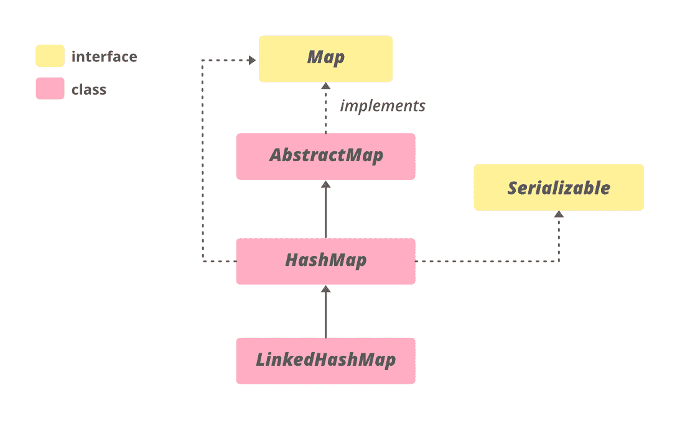
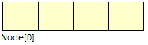

# Java 中的 HashMap，示例

> 原文:[https://www . geesforgeks . org/Java-util-hashmap-in-Java-with-examples/](https://www.geeksforgeeks.org/java-util-hashmap-in-java-with-examples/)

**HashMap < K，V >** 是从 Java 1.2 开始的 Java 集合的一部分。这个类可以在 **java.util** 包中找到。它提供了 Java 的 Map 接口的基本实现。它将数据存储在(键、值)对中，您可以通过另一种类型的索引(例如整数)来访问它们。一个对象用作另一个对象(值)的键(索引)。如果您尝试插入重复的键，它将替换相应键的元素。

**HashMap** 类似于 [HashTable](https://www.geeksforgeeks.org/hashtable-in-java/) ，但不同步。它也允许存储空键，但是应该只有一个空键对象，并且可以有任意数量的空值。这个类不保证地图的顺序。要使用这个类及其方法，需要导入 **java.util.HashMap** 包或其超类。

## Java 语言(一种计算机语言，尤用于创建网站)

```
// Java program to illustrate HashMap class of java.util
// package

// Importing HashMap class
import java.util.HashMap;

// Main class
public class GFG {

    // Main driver method
    public static void main(String[] args)
    {
        // Create an empty hash map by declaring object
        // of string and integer type
        HashMap<String, Integer> map = new HashMap<>();

        // Adding elements to the Map
        // using standard add() method
        map.put("vishal", 10);
        map.put("sachin", 30);
        map.put("vaibhav", 20);

        // Print size and content of the Map
        System.out.println("Size of map is:- "
                           + map.size());

        // Printing elements in object of Map
        System.out.println(map);

        // Checking if a key is present and if
        // present, print value by passing
        // random element
        if (map.containsKey("vishal")) {

            // Mapping
            Integer a = map.get("vishal");

            // Printing value fr the corresponding key
            System.out.println("value for key"
                               + " \"vishal\" is:- " + a);
        }
    }
}
```

**Output**

```
Size of map is:- 3
{vaibhav=20, vishal=10, sachin=30}
value for key "vishal" is:- 10
```

哈希表的层次结构如下:



**语法:**声明

```
public class HashMap<K,V> extends AbstractMap<K,V>
                          implements Map<K,V>, Cloneable, Serializable
```

**参数:**取两个参数即如下:

*   此地图维护的键的类型
*   映射值的类型

HashMap 实现**可序列化**、**可克隆**、[映射< K、V>T5】接口。HashMap 扩展**抽象图< K，V>T7】类。直接子类是**](https://www.geeksforgeeks.org/map-interface-java-examples/)**[链接哈希表](https://www.geeksforgeeks.org/linkedhashmap-class-java-examples/)、**打印者状态原因**。**

### HashMap 中的构造函数如下:

HashMap 提供了 4 个构造函数，每个构造函数的访问修饰符都是公共的，如下所示:

1.  HashMap()
2.  HashMap（int initialCapacity）
3.  HashMap（int initialCapacity， float loadFactor）
4.  **哈希图（地图）**

现在一个接一个地讨论上面的构造函数，同时借助干净的 java 程序实现同样的构造函数。

**构造函数 1:** HashMap()

它是默认构造函数，用于创建初始容量为 16、负载系数为 0.75 的 HashMap 实例。

**语法:**

```
HashMap<K, V> hm = new HashMap<K, V>();
```

**例**

## Java 语言(一种计算机语言，尤用于创建网站)

```
// Java program to Demonstrate the HashMap() constructor

// Importing bsiic required classes
import java.io.*;
import java.util.*;

// Main class
// To add elements to HashMap
class GFG {

    // Main driver method
    public static void main(String args[])
    {
        // No need to mention the
        // Generic type twice
        HashMap<Integer, String> hm1 = new HashMap<>();

        // Initialization of a HashMap using Generics
        HashMap<Integer, String> hm2
            = new HashMap<Integer, String>();

        // Adding elements using put method
        // Custom input elements
        hm1.put(1, "one");
        hm1.put(2, "two");
        hm1.put(3, "three");

        hm2.put(4, "four");
        hm2.put(5, "five");
        hm2.put(6, "six");

        // Print and display mapping of HashMap 1
        System.out.println("Mappings of HashMap hm1 are : "
                           + hm1);

        // Print and display mapping of HashMap 2
        System.out.println("Mapping of HashMap hm2 are : "
                           + hm2);
    }
}
```

**Output**

```
Mappings of HashMap hm1 are : {1=one, 2=two, 3=three}
Mapping of HashMap hm2 are : {4=four, 5=five, 6=six}
```

**构造函数 2:**HashMap(int initial capacity)

它创建了一个哈希表实例，其指定的初始容量和负载系数为0.75。

**语法:**

```
HashMap<K, V> hm = new HashMap<K, V>(int initialCapacity);
```

**例**

## Java 语言(一种计算机语言，尤用于创建网站)

```
// Java program to Demonstrate
// HashMap(int initialCapacity) Constructor

// Importing basic classes
import java.io.*;
import java.util.*;

// Main class
// To add elements to HashMap
class AddElementsToHashMap {

    // Main driver method
    public static void main(String args[])
    {
        // No need to mention the
        // Generic type twice
        HashMap<Integer, String> hm1 = new HashMap<>(10);

        // Initialization of a HashMap using Generics
        HashMap<Integer, String> hm2
            = new HashMap<Integer, String>(2);

        // Adding elements to object of HashMap
        // using put method

        // HashMap 1
        hm1.put(1, "one");
        hm1.put(2, "two");
        hm1.put(3, "three");

        // HashMap 2
        hm2.put(4, "four");
        hm2.put(5, "five");
        hm2.put(6, "six");

        // Printing elements of ahshMap 1
        System.out.println("Mappings of HashMap hm1 are : "
                           + hm1);

        // Printing elements of HashMap 2
        System.out.println("Mapping of HashMap hm2 are : "
                           + hm2);
    }
}
```

**Output**

```
Mappings of HashMap hm1 are : {1=one, 2=two, 3=three}
Mapping of HashMap hm2 are : {4=four, 5=five, 6=six}
```

**构造函数 3:**HashMap(int initial capacity，float loadFactor)

它创建一个具有指定初始容量和指定负载系数的 HashMap 实例。

**语法:**

```
HashMap<K, V> hm = new HashMap<K, V>(int initialCapacity, int  loadFactor);
```

**例**

## Java 语言(一种计算机语言，尤用于创建网站)

```
// Java program to Demonstrate
// HashMap(int initialCapacity,float loadFactor) Constructor

// Importing basic classes
import java.io.*;
import java.util.*;

// Main class
// To add elements to HashMap
class GFG {

    // Main driver method
    public static void main(String args[])
    {
        // No need to mention the generic type twice
        HashMap<Integer, String> hm1
            = new HashMap<>(5, 0.75f);

        // Initialization of a HashMap using Generics
        HashMap<Integer, String> hm2
            = new HashMap<Integer, String>(3, 0.5f);

        // Add Elements using put() method
        // Custom input elements
        hm1.put(1, "one");
        hm1.put(2, "two");
        hm1.put(3, "three");

        hm2.put(4, "four");
        hm2.put(5, "five");
        hm2.put(6, "six");

        // Print and display elements in object of hashMap 1
        System.out.println("Mappings of HashMap hm1 are : "
                           + hm1);

        // Print and display elements in object of hashMap 1
        System.out.println("Mapping of HashMap hm2 are : "
                           + hm2);
    }
}
```

**Output**

```
Mappings of HashMap hm1 are : {1=one, 2=two, 3=three}
Mapping of HashMap hm2 are : {4=four, 5=five, 6=six}
```

**4。HashMap(映射图):**它创建一个 HashMap 实例，其映射与指定的映射相同。

> HashMap <k v="">hm =新 HashMap <k v="">(地图地图)；</k></k>

## Java 语言(一种计算机语言，尤用于创建网站)

```
// Java program to demonstrate the
// HashMap(Map map) Constructor

import java.io.*;
import java.util.*;

class AddElementsToHashMap {
    public static void main(String args[])
    {
        // No need to mention the
        // Generic type twice
        Map<Integer, String> hm1 = new HashMap<>();

        // Add Elements using put method
        hm1.put(1, "one");
        hm1.put(2, "two");
        hm1.put(3, "three");

        // Initialization of a HashMap
        // using Generics
        HashMap<Integer, String> hm2
            = new HashMap<Integer, String>(hm1);

        System.out.println("Mappings of HashMap hm1 are : "
                           + hm1);

        System.out.println("Mapping of HashMap hm2 are : "
                           + hm2);
    }
}
```

**Output**

```
Mappings of HashMap hm1 are : {1=one, 2=two, 3=three}
Mapping of HashMap hm2 are : {1=one, 2=two, 3=three}
```

### 在哈希映射上执行各种操作

**1。添加元素:**为了给地图添加元素，我们可以使用 [put()](https://www.geeksforgeeks.org/hashmap-put-method-in-java/) 方法。但是，插入顺序不会保留在 Hashmap 中。在内部，对于每个元素，都会生成一个单独的哈希，并基于该哈希对元素进行索引，以提高效率。

## Java 语言(一种计算机语言，尤用于创建网站)

```
// Java program to add elements
// to the HashMap

import java.io.*;
import java.util.*;

class AddElementsToHashMap {
    public static void main(String args[])
    {
        // No need to mention the
        // Generic type twice
        HashMap<Integer, String> hm1 = new HashMap<>();

        // Initialization of a HashMap
        // using Generics
        HashMap<Integer, String> hm2
            = new HashMap<Integer, String>();

        // Add Elements using put method
        hm1.put(1, "Geeks");
        hm1.put(2, "For");
        hm1.put(3, "Geeks");

        hm2.put(1, "Geeks");
        hm2.put(2, "For");
        hm2.put(3, "Geeks");

        System.out.println("Mappings of HashMap hm1 are : "
                           + hm1);
        System.out.println("Mapping of HashMap hm2 are : "
                           + hm2);
    }
}
```

**Output**

```
Mappings of HashMap hm1 are : {1=Geeks, 2=For, 3=Geeks}
Mapping of HashMap hm2 are : {1=Geeks, 2=For, 3=Geeks}
```

**2。更改元素:**添加元素后如果我们想更改元素，可以通过 [put()](https://www.geeksforgeeks.org/hashmap-put-method-in-java/) 方法再次添加元素来完成。由于地图中的元素是使用关键字索引的，因此可以通过简单地插入我们希望更改的关键字的更新值来更改关键字的值。

## Java 语言(一种计算机语言，尤用于创建网站)

```
// Java program to change
// elements of HashMap

import java.io.*;
import java.util.*;
class ChangeElementsOfHashMap {
    public static void main(String args[])
    {

        // Initialization of a HashMap
        HashMap<Integer, String> hm
            = new HashMap<Integer, String>();

        // Change Value using put method
        hm.put(1, "Geeks");
        hm.put(2, "Geeks");
        hm.put(3, "Geeks");

        System.out.println("Initial Map " + hm);

        hm.put(2, "For");

        System.out.println("Updated Map " + hm);
    }
}
```

**Output**

```
Initial Map {1=Geeks, 2=Geeks, 3=Geeks}
Updated Map {1=Geeks, 2=For, 3=Geeks}
```

**3。移除元素:**为了从地图中移除元素，我们可以使用[移除()](https://www.geeksforgeeks.org/hashmap-remove-method-in-java/)方法。此方法获取键值，并从该映射中移除键的映射(如果它存在于该映射中)。

## Java 语言(一种计算机语言，尤用于创建网站)

```
// Java program to remove
// elements from HashMap

import java.io.*;
import java.util.*;
class RemoveElementsOfHashMap{
    public static void main(String args[])
    {
        // Initialization of a HashMap
        Map<Integer, String> hm
            = new HashMap<Integer, String>();

        // Add elements using put method
        hm.put(1, "Geeks");
        hm.put(2, "For");
        hm.put(3, "Geeks");
        hm.put(4, "For");

        // Initial HashMap
        System.out.println("Mappings of HashMap are : "
                           + hm);

        // remove element with a key
        // using remove method
        hm.remove(4);

        // Final HashMap
        System.out.println("Mappings after removal are : "
                           + hm);
    }
}
```

**Output**

```
Mappings of HashMap are : {1=Geeks, 2=For, 3=Geeks, 4=For}
Mappings after removal are : {1=Geeks, 2=For, 3=Geeks}
```

**4。HashMap 的遍历**

我们可以使用迭代器接口遍历集合框架的任何结构。由于迭代器处理一种类型的数据，我们使用 Entry < ? , ? >将两种不同的类型解析成兼容的格式。然后使用 next()方法打印 HashMap 的条目。

## Java 语言(一种计算机语言，尤用于创建网站)

```
// Java program to traversal a
// Java.util.HashMap

import java.util.HashMap;
import java.util.Map;

public class TraversalTheHashMap {
    public static void main(String[] args)
    {
        // initialize a HashMap
        HashMap<String, Integer> map = new HashMap<>();

        // Add elements using put method
        map.put("vishal", 10);
        map.put("sachin", 30);
        map.put("vaibhav", 20);

        // Iterate the map using
        // for-each loop
        for (Map.Entry<String, Integer> e : map.entrySet())
            System.out.println("Key: " + e.getKey()
                               + " Value: " + e.getValue());
    }
}
```

**Output**

```
Key: vaibhav Value: 20
Key: vishal Value: 10
Key: sachin Value: 30
```

### 哈希映射的重要特性

要访问一个值，必须知道它的键。哈希映射被称为哈希映射，因为它使用了一种叫做哈希的技术。[哈希](https://www.geeksforgeeks.org/hashing-set-1-introduction/)是一种将大字符串转换为代表相同字符串的小字符串的技术。较短的值有助于索引和更快的搜索。 [HashSet](https://www.geeksforgeeks.org/hashset-in-java/) 内部也使用 HashMap。
HashMap 的几个重要特性是:

*   HashMap 是 java.util 包的一部分。
*   HashMap 扩展了抽象类 AbstractMap，也提供了 Map 接口的不完整实现。
*   还实现了[可克隆](https://docs.oracle.com/javase/7/docs/api/java/lang/Cloneable.html)和[可序列化](https://docs.oracle.com/javase/7/docs/api/java/io/Serializable.html)接口。上述定义中的 k 和 V 分别代表键和值。
*   HashMap 不允许重复键，但允许重复值。这意味着一个键不能包含 1 个以上的值，但一个以上的键可以包含一个值。
*   HashMap 也允许空键，但只允许一次和多个空值。
*   这个类不保证地图的顺序；特别是，它不能保证订单会随着时间的推移而保持不变。它大致类似于哈希表，但不同步。

### **HashMap 的内部结构**

在内部，哈希映射包含一个节点数组，节点表示为一个包含 4 个字段的类:

1.  int hash
2.  k 键
3.  v 值
4.  节点下一个

可以看到，该节点包含对其自身对象的引用。所以这是一个链表。

**HashMap:**



**节点:**


### 哈希映射的性能

哈希映射的性能取决于两个参数，命名如下:

1.  初始容量
2.  负载系数

**1。初始容量**–它是 HashMap 创建时的容量(它是 HashMap 实例化时 HashMap 可以容纳的桶数)。在 java 中，它最初是 2^4=16，这意味着它可以容纳 16 个键值对。

**2。负载系数**–它是容量的百分比值，此后哈希映射的容量将会增加(它是桶的填充百分比，之后会进行重新灰化)。在 java 中，默认情况下为 0.75f，这意味着在填充 75%的容量后进行重新散列。

**3。阈值**–它是负载系数和初始容量的乘积。在 java 中，默认情况下是(16 * 0.75 = 12)。也就是说，在 HashMap 中插入 12 个键值对后，会发生重新散列。

**4。重新散列**–这是 HashMap 达到其阈值后容量翻倍的过程。在 java 中，HashMap 继续按照以下顺序重新散列(默认情况下)——2^4、2^5、2^6、2^7、…。等等。

如果初始容量保持较高，则永远不会进行再清洗。但是通过保持它更高，增加了迭代的时间复杂度。所以应该非常巧妙地选择它来提高性能。在设置初始容量时，应考虑预期值的数量。最通常优选的负载因子值是 0.75，这在时间和空间成本之间提供了很好的平衡。负载系数的值在 0 和 1 之间变化。

> **注意:**从 Java 8 开始，Java 开始使用自平衡 BST，而不是链表进行链接。自平衡 bst 的优点是，我们得到最坏的情况(当每个键映射到同一个槽时)搜索时间为 O(Log n)。

### 同步哈希表

因为它被告知 HashMap 是不同步的，即多个线程可以同时访问它。如果多个线程同时访问这个类，并且至少有一个线程在结构上操作它，那么有必要使它在外部同步。这是通过同步一些封装地图的对象来完成的。如果不存在这样的对象，那么它可以被包装在 Collections.synchronizedMap()中，以使 HashMap 同步，并避免意外的不同步访问。如下例所示:

```
Map m = Collections.synchronizedMap(new HashMap(...));
```

现在地图 m 是同步的。如果在创建迭代器之后进行了任何结构修改，这个类的迭代器将会快速失效，除了通过迭代器的 remove 方法。如果迭代器失败，它将抛出 ConcurrentModificationException。

**HashMap 的时间复杂度:** HashMap 为基本操作提供了恒定的时间复杂度，get 和 put 如果 hash 函数编写正确并且它在桶之间适当地分散了元素。哈希映射的迭代依赖于哈希映射的容量和一些键值对。基本上和容量+大小成正比。容量是哈希映射中的桶数。所以最初在 HashMap 中保留大量的桶并不是一个好主意。

**HashMap 的应用:** HashMap 主要是哈希的实现。当我们需要高效地实现搜索、插入和删除操作时，它非常有用。详见[哈希](https://www.geeksforgeeks.org/applications-of-hashing/)应用。

### HashMap 中的方法

*   **K**–地图中按键的类型。
*   **V**–映射图中映射的值的类型。

<figure class="table">

| 

方法

 | 

描述

 |
| --- | --- |
| [晴()](https://www.geeksforgeeks.org/hashmap-clear-method-in-java/#:~:text=HashMap.,mappings%20from%20a%20specified%20HashMap.&text=Parameters%3A%20The%20method%20does%20not,does%20not%20return%20any%20value.) | 从此映射中移除所有映射。 |
| [克隆()](https://www.geeksforgeeks.org/hashmap-clone-method-in-java/) | 返回这个 HashMap 实例的浅拷贝:键和值本身没有被克隆。 |
| [计算(K 键，双功能<？](https://www.geeksforgeeks.org/hashmap-compute-method-in-java-with-examples/) [超级 K？超级 V，？扩展 V >重新映射功能)](https://www.geeksforgeeks.org/hashmap-compute-method-in-java-with-examples/) | 尝试计算指定键及其当前映射值的映射(如果没有当前映射，则为空)。 |
| [计算缺席(K 键，功能<？](https://www.geeksforgeeks.org/hashmap-computeifabsent-method-in-java-with-examples/) [超 K，？扩展 V > mappingFunction)](https://www.geeksforgeeks.org/hashmap-computeifabsent-method-in-java-with-examples/) | 如果指定的键尚未与值相关联(或映射为 null)，会尝试使用给定的映射函数计算其值，并将其输入到此映射中，除非为 null。 |
| [computeIfPresent(K 键，双功能<？](https://www.geeksforgeeks.org/hashmap-computeifpresentkey-bifunction-method-in-java-with-examples/) [超级 K？超级 V，？扩展 V >重新映射功能)](https://www.geeksforgeeks.org/hashmap-computeifpresentkey-bifunction-method-in-java-with-examples/) | 如果指定键的值存在且不为空，将尝试计算给定键及其当前映射值的新映射。 |
| [包含键(对象键)](https://www.geeksforgeeks.org/hashmap-containskey-method-in-java/) | 如果此映射包含指定键的映射，则返回 true。 |
| [包含值(对象值)](https://www.geeksforgeeks.org/hashmap-containsvalue-method-in-java/) | 如果此映射将一个或多个键映射到指定值，则返回 true。 |
| [输入 ySet()](https://www.geeksforgeeks.org/hashmap-entryset-method-in-java/) | 返回此映射中包含的映射的集合视图。 |
| [获取(对象键)](https://www.geeksforgeeks.org/hashmap-get-method-in-java/) | 返回指定键映射到的值，如果此映射不包含键映射，则返回 null。 |
| [【isempty()](https://www.geeksforgeeks.org/hashmap-isempty-method-in-java/) | 如果此映射不包含键值映射，则返回 true。 |
| [键集()](https://www.geeksforgeeks.org/hashmap-keyset-method-in-java/#:~:text=util.,the%20key%20elements%20in%20them.) | 返回此地图中包含的键的集合视图。 |
| [合并(K 键，V 值，双功能<？](https://www.geeksforgeeks.org/hashmap-mergekey-value-bifunction-method-in-java-with-examples/#:~:text=The%20merge(Key%2C%20Value%2C,as%20bucket1%20and%20so%20on.) [超 V？超级 V，？扩展 V >重新映射功能)](https://www.geeksforgeeks.org/hashmap-mergekey-value-bifunction-method-in-java-with-examples/#:~:text=The%20merge(Key%2C%20Value%2C,as%20bucket1%20and%20so%20on.) | 如果指定的键尚未与值相关联或与 null 相关联，则将其与给定的非 null 值相关联。 |
| [放(K 键，V 值)](https://www.geeksforgeeks.org/hashmap-put-method-in-java/) | 将指定值与此映射中的指定键相关联。 |
| [普塔尔(地图<？延伸 K，？延伸 V > m)](https://www.geeksforgeeks.org/hashmap-putall-method-in-java/#:~:text=HashMap.,from%20one%20map%20into%20another.&text=Parameters%3A%20The%20method%20takes%20one,we%20want%20to%20copy%20from.) | 将指定映射中的所有映射复制到此映射。 |
| [移除(对象键)](https://www.geeksforgeeks.org/hashmap-remove-method-in-java/) | 从该映射中删除指定键的映射(如果存在)。 |
| [尺寸()](https://www.geeksforgeeks.org/hashmap-size-method-in-java/#:~:text=HashMap.,or%20mappings%20in%20the%20Map.&text=Parameters%3A%20The%20method%20does%20not,pairs%20present%20in%20the%20map.) | 返回此映射中键值映射的数量。 |
| [值()](https://www.geeksforgeeks.org/hashmap-values-method-in-java/) | 返回此地图中包含的值的集合视图。 |

</figure>

### 从 java.util.AbstractMap 类继承的方法

<figure class="table">

| 

方法

 | 

描述

 |
| --- | --- |
| [等于()](https://www.geeksforgeeks.org/abstractmap-equals-method-in-java-with-examples/#:~:text=The%20AbstractMap.,of%20this%20map%20or%20not.) | 将指定的对象与此映射进行比较，看是否相等。 |
| [hashCode()](https://www.geeksforgeeks.org/abstractmap-hashcode-method-in-java-with-examples/) | 返回此映射的哈希代码值。 |
| [toString()](https://www.geeksforgeeks.org/abstractmap-simpleentry-tostring-method-in-java-with-examples/) | 返回此映射的字符串表示形式。 |

</figure>

### 从接口 java.util.Map 继承的方法

<figure class="table">

| 

方法

 | 

描述

 |
| --- | --- |
| [等于()](https://www.geeksforgeeks.org/map-equals-method-in-java-with-examples/) | 将指定的对象与此映射进行比较，看是否相等。 |
| forEach(双用户？超级 V >动作) | 对此映射中的每个条目执行给定的操作，直到所有条目都已处理完毕或该操作引发异常。 |
| getOrDefault（Object key， V defaultValue） | 返回指定键映射到的值，如果此映射不包含键映射，则返回默认值。 |
| [hashCode()](https://www.geeksforgeeks.org/map-hashcode-method-in-java-with-examples/) | 返回此映射的哈希代码值。 |
| 莆田(K key，V value) | 如果指定的键还没有与值相关联(或者被映射为 null)，则将它与给定值相关联并返回 null，否则返回当前值。 |
| 移除(对象键，对象值) | 仅当指定项当前映射到指定值时，才移除该项。 |
| 更换(K 键，V 值) | 仅当指定键当前映射到某个值时，才替换该项。 |
| 更换(K 键、旧值、新值) | 仅当当前映射到指定值时，替换指定键的条目。 |
| replaceAll(BiFunction？超级 V，？扩展 V >功能) | 将每个条目的值替换为对该条目调用给定函数的结果，直到所有条目都已处理完毕或函数引发异常。 |

</figure>

**必读:**

*   [Hashmap vs Treemap](https://www.geeksforgeeks.org/hashmap-treemap-java/)
*   [哈希表 vs 哈希表](https://www.geeksforgeeks.org/differences-between-hashmap-and-hashtable-in-java/)
*   [最近关于 Java HashMap 的文章！](https://www.geeksforgeeks.org/tag/java-hashmap/)

本文由**维沙尔·加尔格**供稿。如果你喜欢 GeeksforGeeks 并想投稿，你也可以使用[write.geeksforgeeks.org](https://write.geeksforgeeks.org)写一篇文章或者把你的文章邮寄到 review-team@geeksforgeeks.org。看到你的文章出现在极客博客主页上，帮助其他极客。如果你发现任何不正确的地方，或者你想分享更多关于上面讨论的话题的信息，请写评论。