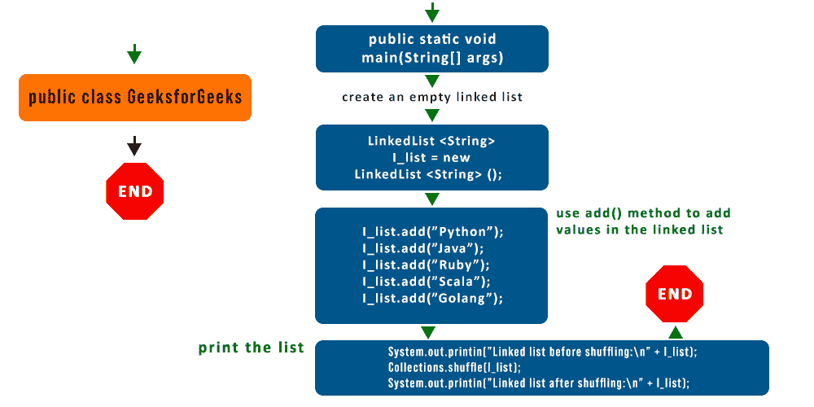

# 用示例链接 Java 中的 add()方法列表

> 原文:[https://www . geesforgeks . org/Java-util-linked list-add-method-in-Java/](https://www.geeksforgeeks.org/java-util-linkedlist-add-method-in-java/)

[LinkedList](https://www.geeksforgeeks.org/linked-list-in-java/) 是 LinkedList 数据结构的一个类实现，它是一个线性数据结构，其中元素不存储在连续的位置，每个元素都是一个单独的对象，有数据部分和地址部分。众所周知，类包含各种方法，因此在这里，我们将讨论和实现 add()方法，以更好地理解如何在 LinkedList 中添加元素。

为此，请参考下面的流程图，以更好地理解任何方法。请注意，在编程中浏览流程图非常重要。这里出现了两种情况，即默认添加元素和自定义添加元素。在这里，我们将按如下方式讨论这两个问题:



**情况 1:** 默认添加，在列表最后添加

此方法将指定的元素追加到此列表的末尾。该函数接受单个参数*元素*，如上面的语法所示

**语法:**

```
boolean add(Object element)
```

**参数:**由该参数指定的元素被附加到列表的末尾。

**返回值:**执行后布尔 t *rue* 。

**示例:**

## Java 语言(一种计算机语言，尤用于创建网站)

```
// Java Program to Illustrate add() Method
// of LinkedList class
// Where we are Adding at Last of List

// Importing required classes
import java.io.*;
import java.util.LinkedList;

// Main class
public class GFG {

    // Main driver method
    public static void main(String args[])
    {

        // Creating an empty LinkedList
        LinkedList list = new LinkedList();

        // Adding elements in the list
        // using add() method
        list.add("Geeks");
        list.add("for");
        list.add("Geeks");
        list.add("10");
        list.add("20");

        // Printing the elements of current LinkedList
        System.out.println("The list is:" + list);

        // Adding new elements to the end
        // Note: Default addition happens from last
        list.add("Last");
        list.add("Element");

        // Printing elements of updated LinkedList
        System.out.println("The new List is:" + list);
    }
}
```

**输出:**

```
The list is:[Geeks, for, Geeks, 10, 20]
The new List is:[Geeks, for, Geeks, 10, 20, Last, Element]
```

**情况 2:** 在指定索引处添加

此方法在列表的指定索引处插入一个元素。它会将当前在该位置的元素(如果有)和任何后续元素向右移动(将一个元素添加到它们的索引中)。

**语法:**

```
void add(int index, Object element)
```

**参数:**该方法接受如下所述的两个参数。

*   **索引:**要插入指定元素的索引。
*   **元素:**需要插入的元素。

**返回值:**执行后布尔 t *rue* 。

**示例:**

## Java 语言(一种计算机语言，尤用于创建网站)

```
// Java Program to Illustrate add() Method
// of LinkedList class
// Adding at a Specified Index

// Importing required classes 
import java.util.LinkedList;
import java.io.*;

// Main class 
class GFG {

    // Main driver method 
    public static void main(String[] args) {

        // Creating an empty LinkedList of string type
        LinkedList<String> ll = new LinkedList();

        // Adding elements to LinkedList
        // using add() method
        ll.add("Geeks");
        ll.add("For");
        ll.add("Geeks");

        // Printing the current elements of LinkedList
        System.out.println(ll);

        // Adding element at a particular index
        // by passing as an argument
        ll.add(2, "Java");

        // Printing the updated elements of LinkedList
        // after insertion at specified index
        System.out.println(ll);
    }
}
```

**输出:**

```
[Geeks, For, Geeks]
[Geeks, For, Java, Geeks]
```