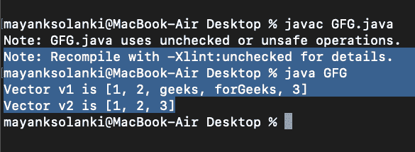

# Java 中的向量类

> 原文:[https://www.geeksforgeeks.org/java-util-vector-class-java/](https://www.geeksforgeeks.org/java-util-vector-class-java/)

向量类实现了一个可增长的对象数组。向量属于遗留类，但现在它与集合完全兼容。在 [java.util 包](https://www.geeksforgeeks.org/java-util-package-java/)中找到，实现[列表](https://www.geeksforgeeks.org/list-interface-java-examples/)界面，所以我们可以使用列表界面的所有方法，如下所示:


*   Vector 实现了一个动态数组，这意味着它可以根据需要增长或收缩。像数组一样，它包含可以使用整数索引访问的组件。
*   它们非常类似于[数组列表](https://www.geeksforgeeks.org/arraylist-in-java/)，但是 Vector 是同步的，并且有一些收集框架不包含的遗留方法。
*   它还像数组列表一样维护插入顺序。然而，它很少在非线程环境中使用，因为它是**同步的**，因此，它在添加、搜索、删除和更新其元素方面表现不佳。
*   向量类返回的迭代器是快速失效的。在并发修改的情况下，失败并抛出**ConcurrentModificationException。**

**语法:**

```java
public class Vector<E> extends AbstractList<E> implements List<E>, RandomAccess, Cloneable, Serializable
```

这里 **E** 是元素的类型。

*   它扩展了[抽象列表](https://www.geeksforgeeks.org/abstractlist-in-java-with-examples/)，实现了[列表](https://www.geeksforgeeks.org/list-interface-java-examples/)接口。
*   它实现了可序列化、可克隆、可迭代<e>、集合<e>、列表<e>、随机访问接口。</e></e></e>
*   直接已知的子类是[栈](https://www.geeksforgeeks.org/stack-class-in-java/)。

**关于矢量容量增量的要点如下:**

如果指定了增量，Vector 将在每个分配周期中根据它进行扩展。但是，如果没有指定增量，那么向量的容量在每个分配周期中会翻倍。Vector 定义了三个受保护的数据成员:

*   ***int capacity creation:***包含增量值。
*   ***int elementCount:*** 当前存储在向量中的元素数量。
*   ***对象元素数据[]:*** 保存向量的数组存储在其中。

向量声明中常见错误如下****:****

*   **如果定义的向量的初始大小为负，向量会抛出一个 **IllegalArgumentException** 。**
*   **如果指定的集合为空，则抛出**空指针异常**。**T3】****

### **构造器**

****1。Vector():** 创建初始容量为 10 的默认向量。**

```java
Vector<E> v = new Vector<E>();
```

****2。向量(int size):** 创建一个向量，其初始容量由大小指定。**

```java
Vector<E> v = new Vector<E>(int size);
```

****3。向量(int size，int incr):** 创建一个向量，其初始容量由大小指定，增量由 incr 指定。它指定每次向上调整向量大小时要分配的元素数量。**

```java
Vector<E> v = new Vector<E>(int size, int incr);
```

****4。向量(集合 c):** 创建包含集合 c 元素的向量**

```java
Vector<E> v = new Vector<E>(Collection c);
```

### **向量类中的方法**

<figure class="table">

| 

方法

 | 

描述

 |
| --- | --- |
| [加(E e)](https://www.geeksforgeeks.org/vector-add-method-in-java/) | 将指定的元素追加到该向量的末尾。 |
| [添加(int 索引，E 元素)](https://www.geeksforgeeks.org/vector-add-method-in-java/) | 在该向量的指定位置插入指定元素。 |
| [addAll(集合<？](https://www.geeksforgeeks.org/vector-addall-method-in-java/)[延伸 E > c)](https://www.geeksforgeeks.org/vector-addall-method-in-java/) | 按照指定集合的迭代器返回的顺序，将指定集合中的所有元素追加到该向量的末尾。 |
| add all(int 指数，[收藏<？延伸 E > c)](https://www.geeksforgeeks.org/vector-addall-method-in-java/) | 将指定集合中的所有元素插入到该向量的指定位置。 |
| [元件(e 物体)](https://www.geeksforgeeks.org/vector-addelement-method-in-java/) | 将指定的分量添加到该向量的末尾，将其大小增加一。 |
| [容量()](https://www.geeksforgeeks.org/vector-capacity-method-in-java/) | 返回该向量的当前容量。 |
| [晴()](https://www.geeksforgeeks.org/vector-clear-method-in-java/) | 从该向量中移除所有元素。 |
| [克隆()](https://www.geeksforgeeks.org/vector-clone-method-in-java-with-examples/) | 返回该向量的克隆。 |
| [包含(对象 o)](https://www.geeksforgeeks.org/vector-contains-method-in-java/) | 如果该向量包含指定的元素，则返回 true。 |
| [包含所有(收藏<？> c)](https://www.geeksforgeeks.org/vector-containsall-method-in-java/) | 如果此向量包含指定集合中的所有元素，则返回 true。 |
| 复制(对象[]anaarray) | 将该向量的分量复制到指定的数组中。 |
| 元素(int 指数) | 返回指定索引处的组件。 |
| [元素()](https://www.geeksforgeeks.org/vector-elements-method-in-java/) | 返回此向量的分量的枚举。 |
| [保证容量(int minCapacity)](https://www.tutorialspoint.com/java/util/vector_ensurecapacity.htm) | 如有必要，增加此向量的容量，以确保它至少可以容纳最小容量参数指定的组件数量。 |
| [等于(对象 o)](https://www.geeksforgeeks.org/vector-equals-method-in-java/) | 将指定的对象与该向量进行比较，看是否相等。 |
| [第一元素()](https://www.geeksforgeeks.org/vector-firstelement-method-in-java/) | 返回该向量的第一个分量(索引 0 处的项)。 |
| [forEach(消费者<？](https://www.geeksforgeeks.org/vector-foreach-method-in-java/)[超 E >动作)](https://www.geeksforgeeks.org/vector-foreach-method-in-java/) | 对 Iterable 的每个元素执行给定的操作，直到所有元素都被处理完或者该操作引发异常。 |
| [get(int index)](https://www.geeksforgeeks.org/vector-get-method-in-java/) | 返回该向量中指定位置的元素。 |
| [hashCode()](https://www.geeksforgeeks.org/vector-hashcode-method-in-java/) | 返回此向量的哈希代码值。 |
| [索引（对象 o）](https://www.geeksforgeeks.org/vector-indexof-method-in-java/#:~:text=indexOf(Object%20element)%20method%20is,does%20not%20contain%20the%20element.) | 返回该向量中指定元素的第一个匹配项的索引，如果该向量不包含元素，则为-1。 |
| [索引 Of(对象 o，int 索引)](https://www.geeksforgeeks.org/vector-indexof-method-in-java/#:~:text=indexOf(Object%20element)%20method%20is,does%20not%20contain%20the%20element.) | 返回该向量中指定元素第一次出现的索引，从索引向前搜索，如果找不到该元素，则返回-1。 |
| [插入元素 At(E obj，int index)](https://www.geeksforgeeks.org/vector-insertelementat-method-in-java/) | 将指定的对象作为组件插入到指定索引处的向量中。 |
| [【isempty()](https://www.geeksforgeeks.org/vector-isempty-method-in-java/) | 测试这个向量是否没有分量。 |
| [迭代器()](https://www.geeksforgeeks.org/vector-iterator-method-in-java-with-examples/) | 以适当的顺序返回列表中元素的迭代器。 |
| 负荷() | 返回向量的最后一个分量。 |
| [最后索引（对象 o）](https://www.geeksforgeeks.org/vector-lastindexof-method-in-java/) | 返回该向量中指定元素最后一次出现的索引，

如果该向量不包含元素，则为-1。 |
| [最后索引(对象 o，int 索引)](https://www.geeksforgeeks.org/vector-lastindexof-method-in-java/) | 返回此向量中指定元素最后一次出现的索引，从索引开始向后搜索，如果找不到该元素，则返回-1。 |
| [列表迭代器()](https://www.geeksforgeeks.org/vector-listiterator-method-in-java-with-examples/) | 返回列表中元素的列表迭代器(按正确的顺序)。 |
| [列表迭代器(int index)](https://www.geeksforgeeks.org/vector-listiterator-method-in-java-with-examples/) | 返回列表中元素的列表迭代器(按正确的顺序)，从列表中的指定位置开始。 |
| [移除(int index)](https://www.geeksforgeeks.org/vector-remove-method-in-java/) | 移除此向量中指定位置的元素。 |
| [移除(物体 o)](https://www.geeksforgeeks.org/vector-remove-method-in-java/) | 删除该向量中指定元素的第一个匹配项。如果向量不包含该元素，它将保持不变。 |
| [移除所有(集合<？> c)](https://www.geeksforgeeks.org/vector-removeall-method-in-java/) | 从此向量中移除指定集合中包含的所有元素。 |
| [移除元件()](https://www.geeksforgeeks.org/vector-removeallelements-method-in-java-with-example/) | 从该向量中移除所有分量，并将其大小设置为零。 |
| [移除元素(物件物件)](https://www.geeksforgeeks.org/vector-removeelement-method-in-java-with-example/) | 从此向量中移除参数的第一个(索引最低的)匹配项。 |
| [删除元素(int index)](https://www.geeksforgeeks.org/vector-removeelementat-method-in-java/) | 删除指定索引处的组件。 |
| [removeIf(谓语<？超 E >滤镜)](https://www.geeksforgeeks.org/vector-removeif-method-in-java/) | 移除此集合中满足给定谓词的所有元素。 |
| 删除范围(int fromIndex，[【int toindex】](https://www.geeksforgeeks.org/vector-removerange-method-in-java-with-example/) | 从该列表中删除索引介于 fromIndex(包含)和 toIndex(不包含)之间的所有元素。 |
| [更换所有(无操作员< E >操作员)](https://www.javatpoint.com/java-vector-replaceall-method) | 将列表中的每个元素替换为对该元素应用运算符的结果。 |
| [零售(收藏<？> c)](https://www.geeksforgeeks.org/vector-retainall-method-in-java-with-examples/) | 仅保留指定集合中包含的矢量中的元素。 |
| [集合(int 索引，E 元素)](https://www.geeksforgeeks.org/vector-set-method-in-java/#:~:text=set()%20method%20is%20used,Vector%20class%2C%20with%20another%20element.&text=Parameters%3A%20This%20function%20accepts%20two,above%20syntax%20and%20described%20below.) | 用指定的元素替换该向量中指定位置的元素。 |
| [setElementAt(E obj，int index)](https://www.geeksforgeeks.org/vector-setelementat-method-in-java-with-example/) | 将该向量指定索引处的组件设置为指定对象。 |
| [setSize(int newSize)](https://www.geeksforgeeks.org/vector-setsize-method-in-java-with-example/) | 设置该向量的大小。 |
| [尺寸()](https://www.geeksforgeeks.org/vector-size-method-in-java/) | 返回该向量中的分量数。 |
| [排序(比较者<？超 E > c)](https://www.geeksforgeeks.org/collections-sort-java-examples/) | 根据指定比较器引发的顺序对该列表进行排序。 |
| [分流器()](https://www.geeksforgeeks.org/arraylist-spliterator-method-in-java/) | 在此列表中的元素上创建后期绑定和故障快速拆分器。 |
| [子列表（int fromIndex， int toIndex）](https://www.geeksforgeeks.org/vector-sublist-method-in-java/) | 返回此列表中从索引(包括)到索引(不包括)之间的部分的视图。 |
| [toaarray()](https://www.geeksforgeeks.org/vector-toarray-method-in-java-with-examples/) | 以正确的顺序返回包含该向量中所有元素的数组。 |
| [toaarray(t[]a)](https://www.geeksforgeeks.org/vector-toarray-method-in-java-with-examples/) | 以正确的顺序返回包含该向量中所有元素的数组；返回数组的运行时类型是指定数组的运行时类型。 |
| [toString()](https://www.geeksforgeeks.org/vector-tostring-method-in-java-with-example/) | 返回此向量的字符串表示形式，包含每个元素的字符串表示形式。 |
| [trimToSize()](https://www.geeksforgeeks.org/vector-trimtosize-method-in-java-with-example/) | 将该向量的容量修剪为向量的当前大小。 |

</figure>

**让我们首先讨论和实现如何在使用这个类的方法之前创建和使用一个向量。**

****示例:****

## **Java 语言(一种计算机语言，尤用于创建网站)**

```java
// Java Program to Demonstrate Working of Vector
// Via Creating and Using It

// Importing required classes
import java.io.*;
import java.util.*;

// Main class
class GFG {

    // Main driver method
    public static void main(String[] args)
    {
        // Size of the Vector
        int n = 5;

        // Declaring the Vector with
        // initial size n
        Vector<Integer> v = new Vector<Integer>(n);

        // Appending new elements at
        // the end of the vector
        for (int i = 1; i <= n; i++)
            v.add(i);

        // Printing elements
        System.out.println(v);

        // Remove element at index 3
        v.remove(3);

        // Displaying the vector
        // after deletion
        System.out.println(v);

        // iterating over vector elements
        // usign for loop
        for (int i = 0; i < v.size(); i++)

            // Printing elements one by one
            System.out.print(v.get(i) + " ");
    }
}
```

****Output**

```java
[1, 2, 3, 4, 5]
[1, 2, 3, 5]
1 2 3 5
```** 

> ****注:****
> 
> *   **如果没有指定向量增量，那么它的容量将在每个增量周期中翻倍。**
> *   **向量的容量不能低于大小，它可能等于大小。**

### **在 Java 中对向量类执行各种操作**

**让我们讨论向量类的各种操作，如下所示:**

1.  **添加元素**
2.  **更新元素**
3.  **移除元素**
4.  **迭代元素**

****操作 1:** **添加元素****

**为了给向量添加元素，我们使用 [add()](https://www.geeksforgeeks.org/vector-add-method-in-java/) 方法。此方法被重载以基于不同的参数执行多个操作。它们如下所列:**

*   ****添加(对象):**此方法用于在向量的末尾添加一个元素。**
*   ****add(int index，Object):** 此方法用于在 Vector 中的特定索引处添加元素。**

****示例:****

## **Java 语言(一种计算机语言，尤用于创建网站)**

```java
// Java Program to Add Elements in Vector Class

// Importing required classes
import java.io.*;
import java.util.*;

// Main class
// AddElementsToVector
class GFG {

    // Main driver method
    public static void main(String[] arg)
    {

        // Case 1
        // Creating a default vector
        Vector v1 = new Vector();

        // Adding custom elements
        // using add() method
        v1.add(1);
        v1.add(2);
        v1.add("geeks");
        v1.add("forGeeks");
        v1.add(3);

        // Printing the vector elements to the console
        System.out.println("Vector v1 is " + v1);

        // Case 2
        // Creating generic vector
        Vector<Integer> v2 = new Vector<Integer>();

        // Adding custom elements
        // using add() method
        v2.add(1);
        v2.add(2);
        v2.add(3);

        // Printing the vector elements to the console
        System.out.println("Vector v2 is " + v2);
    }
}
```

****输出:****

****

```java
Vector v1 is [1, 2, geeks, forGeeks, 3]
Vector v2 is [1, 2, 3]
```

****操作 2:** **更新元素****

**添加元素后，如果我们想更改元素，可以使用 [set()](https://www.geeksforgeeks.org/vector-set-method-in-java/) 方法来完成。因为向量是有索引的，所以我们想要改变的元素是由元素的索引来引用的。因此，此方法获取一个索引，并在该索引处插入更新的元素。**

****例****

## **Java 语言(一种计算机语言，尤用于创建网站)**

```java
// Java code to change the
// elements in vector class

import java.util.*;

public class UpdatingVector {

    public static void main(String args[])
    {
        // Creating an empty Vector
        Vector<Integer> vec_tor = new Vector<Integer>();

        // Use add() method to add elements in the vector
        vec_tor.add(12);
        vec_tor.add(23);
        vec_tor.add(22);
        vec_tor.add(10);
        vec_tor.add(20);

        // Displaying the Vector
        System.out.println("Vector: " + vec_tor);

        // Using set() method to replace 12 with 21
        System.out.println("The Object that is replaced is: "
                        + vec_tor.set(0, 21));

        // Using set() method to replace 20 with 50
        System.out.println("The Object that is replaced is: "
                        + vec_tor.set(4, 50));

        // Displaying the modified vector
        System.out.println("The new Vector is:" + vec_tor);
    }
}
```

****Output**

```java
Vector: [12, 23, 22, 10, 20]
The Object that is replaced is: 12
The Object that is replaced is: 20
The new Vector is:[21, 23, 22, 10, 50]
```** 

****操作 3:** **去元素****

**为了从向量中移除元素，我们可以使用 [remove()](https://www.geeksforgeeks.org/vector-remove-method-in-java/) 方法。此方法被重载以基于不同的参数执行多个操作。它们是:**

*   ****移除(对象):**该方法用于从矢量中移除对象。如果有多个这样的对象，则删除第一个出现的对象。**
*   ****移除(int index):** 由于向量被索引，该方法采用整数值，该整数值简单地移除向量中特定索引处存在的元素。移除元素后，所有元素都被移动到左边以填充空间，并且对象的索引被更新。**

****例****

## **Java 语言(一种计算机语言，尤用于创建网站)**

```java
// Java code illustrating the removal
// of elements from vector

import java.util.*;
import java.io.*;

class RemovingElementsFromVector {

    public static void main(String[] arg)
    {

        // create default vector of capacity 10
        Vector v = new Vector();

          // Add elements using add() method
        v.add(1);
        v.add(2);
        v.add("Geeks");
        v.add("forGeeks");
        v.add(4);

        // removing first occurrence element at 1
        v.remove(1);

        // checking vector
        System.out.println("after removal: " + v);
    }
}
```

****输出:****

```java
after removal: [1, Geeks, forGeeks, 4]
```

****操作 4:迭代向量****

**有多种方法可以迭代向量。最著名的方法是结合使用基本 for 循环和 [get()](https://www.geeksforgeeks.org/vector-get-method-in-java/) 方法来获取特定索引处的元素，以及[高级 for 循环](https://www.geeksforgeeks.org/for-each-loop-in-java/)。**

****例****

## **Java 语言(一种计算机语言，尤用于创建网站)**

```java
// Java program to iterate the elements
// in a Vector

import java.util.*;

public class IteratingVector {

    public static void main(String args[])
    {
          // create an instance of vector
        Vector<String> v = new Vector<>();

          // Add elements using add() method
        v.add("Geeks");
        v.add("Geeks");
        v.add(1, "For");

        // Using the Get method and the
        // for loop
        for (int i = 0; i < v.size(); i++) {

            System.out.print(v.get(i) + " ");
        }

        System.out.println();

        // Using the for each loop
        for (String str : v)
            System.out.print(str + " ");
    }
}
```

****Output**

```java
Geeks For Geeks 
Geeks For Geeks
```** 

> ****注意:**一定要读一下 Java 中的[数组列表 vs Vector 类](https://www.geeksforgeeks.org/vector-vs-arraylist-java/)才能更好的掌握。**

**本文由**阿比舍克·维尔马**供稿。如果你喜欢 GeeksforGeeks 并想投稿，你也可以使用[write.geeksforgeeks.org](http://www.write.geeksforgeeks.org/)写一篇文章或者把你的文章邮寄到 review-team@geeksforgeeks.org。看到你的文章出现在极客博客主页上，帮助其他极客。**

**如果你发现任何不正确的地方，或者你想分享更多关于上面讨论的话题的信息，请写评论。**