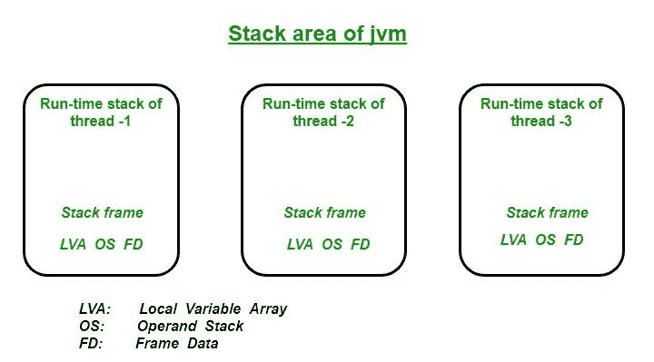
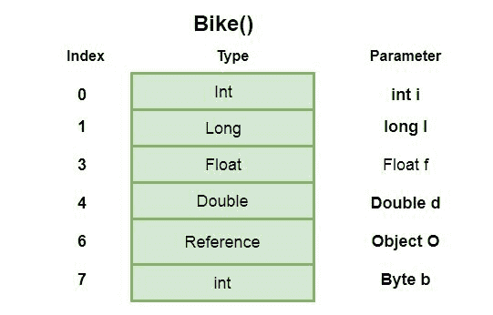
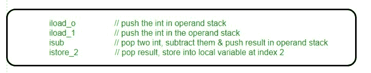
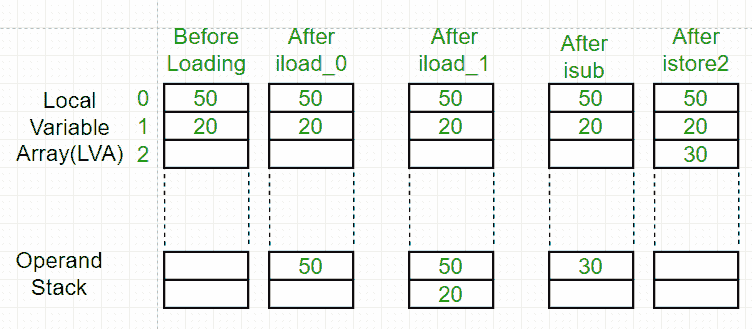

# Java 虚拟机(JVM)栈区

> 原文:[https://www . geesforgeks . org/Java-虚拟机-JVM-堆栈-区域/](https://www.geeksforgeeks.org/java-virtual-machine-jvm-stack-area/)

对于每个线程， [JVM](https://www.geeksforgeeks.org/jvm-works-jvm-architecture/) 在线程创建时创建一个单独的堆栈。Java 虚拟机堆栈的内存不需要是连续的。Java 虚拟机只在 Java 栈上直接执行两个操作:推送和弹出帧。特定线程的堆栈可以称为**运行时堆栈**。该线程执行的每个方法调用都存储在相应的运行时堆栈中，包括参数、局部变量、中间计算和其他数据。在完成一个方法之后，从堆栈中移除相应的条目。在完成所有方法调用后，堆栈变成空的，这个空堆栈在线程终止前被 JVM 销毁。存储在堆栈中的数据对相应的线程可用，而对其余的线程不可用。因此我们可以说本地数据是线程安全的。堆栈中的每个条目称为**堆栈帧**或**激活记录**。



**栈帧结构**
栈帧基本由**三个**部分组成:**局部变量数组，操作数栈&帧数据**。当 JVM 调用一个 Java 方法时，首先会检查类数据，以确定该方法在局部变量数组和操作数堆栈中所需的字数*(局部变量数组和操作数堆栈的大小，其中*是每个单独方法的*的字数)。它为被调用的方法创建一个适当大小的堆栈框架，并将其推送到 Java 堆栈上。*

**1。局部变量数组(LVA):**

*   堆栈框架的局部变量部分被组织为从零开始的单词数组。
*   它包含方法的所有参数和局部变量。
*   数组中的每个槽或条目都是 4 字节。
*   int、float 和 reference 类型的值占据数组中的 1 个条目或槽，即 4 个字节。
*   双精度值和长值占据数组中的两个连续条目，即总共 8 个字节。
*   **字节、短**、**和字符值在存储**之前将转换为 int 类型，并占用 1 个插槽，即 4 个字节。
*   但是存储布尔值的方式因 JVM 而异。但是大多数 JVM 在局部变量数组中为布尔值留出 1 个槽。
*   参数首先按照声明的顺序放入局部变量数组。
*   **例如:**让我们考虑一个有方法的类例子 **bike()** 那么局部变量数组将如下图所示:

```java
// Class Declaration
class Example
{
  public void bike(int i, long l, float f, 
               double d, Object o, byte b)
  {

  } 
}     
```



**2。操作数堆栈(OS):**T2

*   JVM 像粗活一样使用操作数堆栈作为工作空间，或者我们可以说用于存储中间计算的结果。
*   操作数堆栈被组织成一个像局部变量数组一样的字数组。但这不是通过使用像局部变量数组这样的索引来访问的，而是通过一些可以将值推入操作数堆栈的指令、一些可以从操作数堆栈弹出值的指令以及一些可以执行所需操作的指令来访问的。
*   **例如:**下面是一个 JVM 如何使用下面的代码，它将减去两个包含两个 int 的局部变量，并将 int 结果存储在第三个局部变量中:



*   所以这里前两条指令 *iload_0* 和 *iload_1* 将从局部变量数组中推出操作数堆栈中的值。指令 *isub* 将减去这两个值，并将结果存储回操作数堆栈，在 *istore_2* 之后，结果将从操作数堆栈中弹出，并存储到位置 2 的局部变量数组中。



**3。帧数据(FD):**

*   它包含所有符号引用(*常量池解析)*和与该特定方法相关的正常方法返回。
*   它还包含对异常表的引用，该表在异常情况下提供相应的捕获块信息。