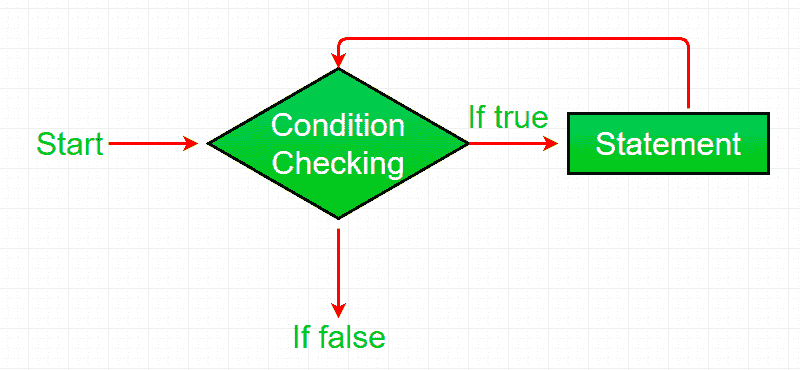

# Java while 循环示例

> 原文:[https://www . geesforgeks . org/Java-while-loop-with-examples/](https://www.geeksforgeeks.org/java-while-loop-with-examples/)

当我们需要重复执行一个语句块时，Java 中的[](https://www.geeksforgeeks.org/loops-in-java/)**循环就开始使用了。**

****Java while 循环**是一个控制流语句，允许基于给定的布尔条件重复执行代码。while 循环可以看作是一个重复的 if 语句。**

**[](https://media.geeksforgeeks.org/wp-content/uploads/20191118164726/While-Loop-GeeksforGeeks.jpg)**

****语法:****

```
while (test_expression)
{
   // statements

  update_expression;
}
```

**While 循环的各个**部分是:****

1.  ****测试表达式:**在这个表达式中，我们必须测试条件。如果条件评估为真，那么我们将执行循环体并更新表达式。否则，我们将退出 while 循环。
    **例:**

    ```
    i <= 10
    ```** 
2.  ****更新表达式**:执行循环体后，该表达式将循环变量增加/减少某个值。
    **例:**

    ```
    i++;
    ```** 

****While 循环是如何执行的？****

1.  **控件落入 while 循环。**
2.  **流程跳转到条件**
3.  **测试条件。

    1.  如果条件为真，则该流进入身体。
    2.  如果条件为假，流程将超出循环** 
4.  **循环体内部的语句被执行。**
5.  **上升发生。**
6.  **控制流回到步骤 2。**
7.  **边做边循环已经结束，流程已经流出。**

****循环流程图(控制流程):**
[](https://media.geeksforgeeks.org/wp-content/uploads/20191108120545/Java-while-loop.png)**

****例 1:** 本程序将尝试打印《Hello World》5 次。**

```
// Java program to illustrate while loop.

class whileLoopDemo {
    public static void main(String args[])
    {
        // initialization expression
        int i = 1;

        // test expression
        while (i < 6) {
            System.out.println("Hello World");

            // update expression
            i++;
        }
    }
}
```

****Output:**

```
Hello World
Hello World
Hello World
Hello World
Hello World

```** 

****试运行示例 1:** 程序将以以下方式执行。**

```
1\. Program starts.
2\. i is initialized with value 1.
3\. Condition is checked. 1 < 6 yields true.
  3.a) "Hello World" gets printed 1st time.
  3.b) Updation is done. Now i = 2.
4\. Condition is checked. 2 < 6 yields true.
  4.a) "Hello World" gets printed 2nd time.
  4.b) Updation is done. Now i = 3.
5\. Condition is checked. 3 < 6 yields true.
  5.a) "Hello World" gets printed 3rd time
  5.b) Updation is done. Now i = 4.
6\. Condition is checked. 4 < 6 yields true.
  6.a) "Hello World" gets printed 4th time
  6.b) Updation is done. Now i = 5.
7\. Condition is checked. 5 < 6 yields true.
  7.a) "Hello World" gets printed 5th time
  7.b) Updation is done. Now i = 6.
8\. Condition is checked. 6 < 6 yields false.
9\. Flow goes outside the loop. Program terminates. 
```

****例 2:** 这个程序会找到从 1 到 10 的数的和。**

```
// Java program to illustrate while loop

class whileLoopDemo {
    public static void main(String args[])
    {
        int x = 1, sum = 0;

        // Exit when x becomes greater than 4
        while (x <= 10) {
            // summing up x
            sum = sum + x;

            // Increment the value of x for
            // next iteration
            x++;
        }
        System.out.println("Summation: " + sum);
    }
}
```

****Output:**

```
Summation: 55

```** 

 ****相关文章:****

1.  **[Java 中的循环](https://www.geeksforgeeks.org/loops-in-java/)**
2.  **[Java For 循环示例](https://www.geeksforgeeks.org/java-for-loop-with-examples/)**
3.  **[Java 边做边循环示例](https://www.geeksforgeeks.org/java-do-while-loop-with-examples/)**
4.  **[C、C++、Java 中 for 和 while 循环的区别](https://www.geeksforgeeks.org/difference-between-for-and-while-loop-in-c-c-java/)**
5.  **[C、C++、Java 中 while 和 do-while 循环的区别](https://www.geeksforgeeks.org/difference-between-while-and-do-while-loop-in-c-c-java/)**