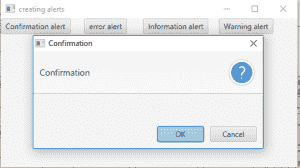
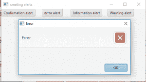
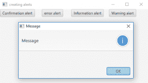
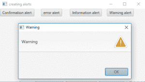
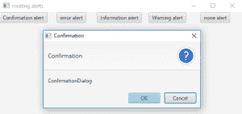
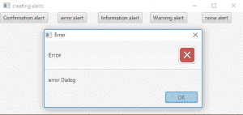
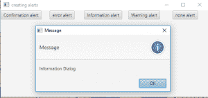
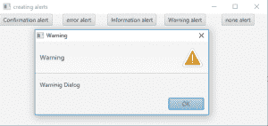
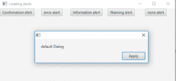

# JavaFX |带示例的 Alert】

> 原文:[https://www.geeksforgeeks.org/javafx-alert-with-examples/](https://www.geeksforgeeks.org/javafx-alert-with-examples/)

Alert 是 JavaFX 的一部分，也是 Dialog 类的子类。警报是一些预定义的对话框，用于向用户显示一些信息。预警基本上是特定的预警类型:

*   **确认警报:**确认警报类型将警报对话框配置为以提示对话框内容正在寻求用户确认的方式出现。
*   **警告警报:**警告警报类型将警报对话框配置为以这样一种方式出现，即提示对话框内容警告用户某些事实或操作。
*   **无警报:**无警报类型具有不在警报中设置任何默认属性的效果。
*   **信息提醒:**信息提醒类型将“提醒”对话框配置为以这样一种方式出现，即提示对话框的内容正在通知用户一条信息。
*   **错误警报:**错误警报类型将警报对话框配置为以某种方式出现，表明出现了问题。

警报包含 3 个部分:

*   朗读者
*   内容文本
*   确认按钮

**该类的构造函数有:**

1.  **警报(Alert。警报类型 a)** :使用指定的警报类型创建新警报。
2.  **警报(Alert。警报类型 a、字符串 c、按钮类型… b)** :使用指定的警报类型、内容和按钮类型创建新警报。

**常用方法:**

<figure class="table">

| 方法 | 说明 |
| --- | --- |
| **数字类型()** | 设置指定的警报类型 |
| **设置警报类型(警报。警报类型 a)** | 为警报设置指定的警报类型 |
| **getbutton 类型()** | 返回当前在此警报实例中设置的所有按钮类型实例的观察列表。 |
| **setContentText(字符串 s)** | 设置警报的上下文文本 |
| get content text() | 返回警报的内容文本。 |

</figure>

下面的程序说明了警报类:

1.  **程序创建不同类型的警报并显示:**该程序创建默认类型的警报。需要时，警报将更改为不同的警报类型。该程序创建一个按钮，由名称 b、b1、b2、b3 表示。按钮将在场景中创建，而场景又将在舞台中托管。我们将创建一个标签来显示按钮是否被按下。函数 setTitle()用于为舞台提供标题。然后创建一个平铺窗格，在该窗格上调用 addChildren()方法在场景内部附加按钮和标签。最后，调用 show()方法来显示最终结果。事件处理程序将使用 setOnAction()函数添加到按钮中。当按钮被按下时，它们将显示与它们相关联的相应警报，并将使用函数 setAlertType()函数设置相应的警报类型。

## Java 语言(一种计算机语言，尤用于创建网站)

```
// Java Program to create alert of different
// types and display them

import javafx.application.Application;
import javafx.scene.Scene;
import javafx.scene.control.Button;
import javafx.scene.layout.*;
import javafx.event.ActionEvent;
import javafx.event.EventHandler;
import javafx.scene.control.*;
import javafx.stage.Stage;
import javafx.scene.control.Alert.AlertType;
public class Alert_1 extends Application {

    // launch the application
    public void start(Stage s)
    {
        // set title for the stage
        s.setTitle("creating alerts");

        // create a button
        Button b = new Button("Confirmation alert");
        Button b1 = new Button("error alert");
        Button b2 = new Button("Information alert");
        Button b3 = new Button("Warning alert");

        // create a tile pane
        TilePane r = new TilePane();

        // create a alert
        Alert a = new Alert(AlertType.NONE);

        // action event
        EventHandler<ActionEvent> event = new
                         EventHandler<ActionEvent>() {
            public void handle(ActionEvent e)
            {
                // set alert type
                a.setAlertType(AlertType.CONFIRMATION);

                // show the dialog
                a.show();
            }
        };

        // action event
        EventHandler<ActionEvent> event1 = new
                         EventHandler<ActionEvent>() {
            public void handle(ActionEvent e)
            {
                // set alert type
                a.setAlertType(AlertType.ERROR);

                // show the dialog
                a.show();
            }
        };

        // action event
        EventHandler<ActionEvent> event2 = new
                         EventHandler<ActionEvent>() {
            public void handle(ActionEvent e)
            {
                // set alert type
                a.setAlertType(AlertType.INFORMATION);

                // show the dialog
                a.show();
            }
        };

        // action event
        EventHandler<ActionEvent> event3 = new
                          EventHandler<ActionEvent>() {
            public void handle(ActionEvent e)
            {
                // set alert type
                a.setAlertType(AlertType.WARNING);

                // show the dialog
                a.show();
            }
        };

        // when button is pressed
        b.setOnAction(event);
        b1.setOnAction(event1);
        b2.setOnAction(event2);
        b3.setOnAction(event3);

        // add button
        r.getChildren().add(b);
        r.getChildren().add(b1);
        r.getChildren().add(b2);
        r.getChildren().add(b3);

        // create a scene
        Scene sc = new Scene(r, 200, 200);

        // set the scene
        s.setScene(sc);

        s.show();
    }

    public static void main(String args[])
    {
        // launch the application
        launch(args);
    }
}
```

1.  **输出:**









1.  **用于创建警报并设置不同警报类型和按钮类型以及设置不同内容文本的程序:**该程序创建默认类型的警报。需要时，警报将更改为不同的警报类型。该程序创建一个按钮，由名称 b、b1、b2、b3、b4 表示。按钮将在场景中创建，而场景又将在舞台中托管。我们将创建一个标签来显示按钮是否被按下。函数 setTitle()用于为舞台提供标题。然后创建一个平铺窗格，在该窗格上调用 addChildren()方法在场景内部附加按钮和标签。最后，调用 show()方法来显示最终结果。事件处理程序将使用 setOnAction()函数添加到按钮中。当按钮被按下时，它们将显示与它们相关联的相应警报，并将使用函数 setAlertType()函数设置相应的警报类型。内容文本也将使用 setContentText()方法进行更改。我们将为默认类型的第四个按钮创建一个新的警报，并使用警报的构造函数设置一个按钮类型。

## Java 语言(一种计算机语言，尤用于创建网站)

```
// Java Program to create alert and set
// different alert types and button type
// and also set different content text

import javafx.application.Application;
import javafx.scene.Scene;
import javafx.scene.control.Button;
import javafx.scene.layout.*;
import javafx.event.ActionEvent;
import javafx.event.EventHandler;
import javafx.scene.control.*;
import javafx.stage.Stage;
import javafx.scene.control.Alert.AlertType;

public class Alert_2 extends Application {

    // launch the application
    public void start(Stage s)
    {
        // set title for the stage
        s.setTitle("creating alerts");

        // create a button
        Button b = new Button("Confirmation alert");
        Button b1 = new Button("error alert");
        Button b2 = new Button("Information alert");
        Button b3 = new Button("Warning alert");
        Button b4 = new Button("none alert");

        // create a tile pane
        TilePane r = new TilePane();

        // create a alert
        Alert a = new Alert(AlertType.NONE);

        // action event
        EventHandler<ActionEvent> event = new
                          EventHandler<ActionEvent>() {
            public void handle(ActionEvent e)
            {
                // set alert type
                a.setAlertType(AlertType.CONFIRMATION);

                // set content text
                a.setContentText("ConfirmationDialog");

                // show the dialog
                a.show();
            }
        };

        // action event
        EventHandler<ActionEvent> event1 = new
                          EventHandler<ActionEvent>() {
            public void handle(ActionEvent e)
            {
                // set alert type
                a.setAlertType(AlertType.ERROR);

                // set content text
                a.setContentText("error Dialog");

                // show the dialog
                a.show();
            }
        };

        // action event
        EventHandler<ActionEvent> event2 = new
                          EventHandler<ActionEvent>() {
            public void handle(ActionEvent e)
            {
                // set alert type
                a.setAlertType(AlertType.INFORMATION);

                // set content text
                a.setContentText("Information Dialog");

                // show the dialog
                a.show();
            }
        };

        // action event
        EventHandler<ActionEvent> event3 = new
                            EventHandler<ActionEvent>() {
            public void handle(ActionEvent e)
            {
                // set alert type
                a.setAlertType(AlertType.WARNING);

                // set content text
                a.setContentText("Warning Dialog");

                // show the dialog
                a.show();
            }
        };

        // action event
        EventHandler<ActionEvent> event4 = new
                               EventHandler<ActionEvent>() {
            public void handle(ActionEvent e)
            {
                Alert a1 = new Alert(AlertType.NONE,
                              "default Dialog",ButtonType.APPLY);

                // show the dialog
                a1.show();
            }
        };

        // when button is pressed
        b.setOnAction(event);
        b1.setOnAction(event1);
        b2.setOnAction(event2);
        b3.setOnAction(event3);
        b4.setOnAction(event4);

        // add button
        r.getChildren().add(b);
        r.getChildren().add(b1);
        r.getChildren().add(b2);
        r.getChildren().add(b3);
        r.getChildren().add(b4);

        // create a scene
        Scene sc = new Scene(r, 200, 200);

        // set the scene
        s.setScene(sc);

        s.show();
    }

    public static void main(String args[])
    {
        // launch the application
        launch(args);
    }
}
```

1.  **输出:**











*   [https://docs . Oracle . com/javase/8/JavaFX/API/JavaFX/scene/control/alert . html](https://docs.oracle.com/javase/8/javafx/api/javafx/scene/control/Alert.html)
*   [https://docs . Oracle . com/javase/8/JavaFX/API/JavaFX/scene/control/Alert。AlertType.html](https://docs.oracle.com/javase/8/javafx/api/javafx/scene/control/Alert.AlertType.html)