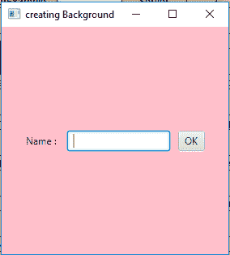
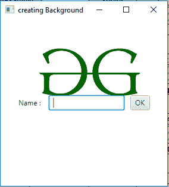

# JavaFX |背景类

> 原文:[https://www.geeksforgeeks.org/javafx-background-class/](https://www.geeksforgeeks.org/javafx-background-class/)

背景类是 JavaFX 的一部分。背景类设置区域的背景。每个背景由几个填充或背景图像组成，但不能为空，但可以为空。背景类是不可变的，因此您可以在许多不同的区域上自由重用相同的背景。

**类的构造函数:**

1.  **背景(BackgroundFill… f)** :用指定的填充创建一个新的背景对象。
2.  **背景(BackgroundFill[]填充，BackgroundImage[]图像)**:用指定的填充和背景图像创建新的背景对象。
3.  **背景(BackgroundImage… i)** :用指定的背景图像创建一个新的背景对象。
4.  **背景(列表填充，列表图像)**:用指定的填充和背景图像列表创建一个新的背景对象。

**常用方法:**

| 方法 | 说明 |
| --- | --- |
| getFills() | 返回背景所有填充的列表。 |
| getImages() | 返回背景的所有背景图像的列表。 |
| getOutsets() | 返回此背景的输出。 |
| isEmpty() | 返回背景是否为空。 |
| isFillPercentageBased() | 返回此背景的填充是否基于百分比。 |

下面的程序说明了后台类的使用:

1.  **Java program to set a fill for the background of a container:** In this program we will create a Background named *background* with specified BackgroundFill and add this to the background. We will create an HBox named *hbox*, a Label named *label*, TextField named *textfield* and a Button named *button* . Now add the label, textfield and button to the HBox. We will set the background of hbox using the *setBackground()* function.Now set the alignment of HBox to *Pos.CENTER* and also add some spacing between the nodes using *setSpacing()* method. We will create a Scene named *scene* and add the HBox to the scene. The scene will be set to the stage using the *setScene()* function. We will call the *show()* function to display the results.

    ```java
    // Java program to set a fill for the background 
    // of a container
    import javafx.application.Application;
    import javafx.scene.Scene;
    import javafx.scene.control.*;
    import javafx.scene.layout.*;
    import javafx.stage.Stage;
    import javafx.event.ActionEvent;
    import javafx.event.EventHandler;
    import javafx.scene.canvas.*;
    import javafx.scene.web.*;
    import javafx.scene.layout.*;
    import javafx.scene.image.*;
    import java.io.*;
    import javafx.geometry.*;
    import javafx.scene.Group;
    import javafx.scene.paint.*;

    public class Background_2 extends Application {

        // launch the application
        public void start(Stage stage)
        {

            try {

                // set title for the stage
                stage.setTitle("creating Background");

                // create a label
                Label label = new Label("Name : ");

                // create a text field
                TextField textfield = new TextField();

                // set preferred column count
                textfield.setPrefColumnCount(10);

                // create a button
                Button button = new Button("OK");

                // add the label, text field and button
                HBox hbox = new HBox(label, textfield, button);

                // set spacing
                hbox.setSpacing(10);

                // set alignment for the HBox
                hbox.setAlignment(Pos.CENTER);

                // create a scene
                Scene scene = new Scene(hbox, 280, 280);

                // create a background fill
                BackgroundFill background_fill = new BackgroundFill(Color.PINK, 
                                              CornerRadii.EMPTY, Insets.EMPTY);

                // create Background
                Background background = new Background(background_fill);

                // set background
                hbox.setBackground(background);

                // set the scene
                stage.setScene(scene);

                stage.show();
            }

            catch (Exception e) {

                System.out.println(e.getMessage());
            }
        }

        // Main Method
        public static void main(String args[])
        {

            // launch the application
            launch(args);
        }
    }
    ```

    **输出:**

    

2.  **Java program to add an image to the background of a container:** In this program we will create a Background named *background* with specified BackgroundImage and add this image to the background of the container. Import the image using the FileInputStream and then convert the file into Image object Use this Image object to create a BackgroundImage. We will create an HBox named *hbox*, a Label named *label*, TextField named *textfield* and a Button named *button* . Now add the label, textfield, and button to the HBox. Set the background of the *hbox* using the *setBackground()* function. Set the alignment of HBox to *Pos.CENTER* and also add some spacing between the nodes using *setSpacing()* method. We will create a Scene named *scene* and add the HBox to the scene. The scene will be set to the stage using the *setScene()* function. Finally call the *show()* method to display the result.

    ```java
    // Java program to add an image to 
    // the background of a container
    import javafx.application.Application;
    import javafx.scene.Scene;
    import javafx.scene.control.*;
    import javafx.scene.layout.*;
    import javafx.stage.Stage;
    import javafx.event.ActionEvent;
    import javafx.event.EventHandler;
    import javafx.scene.canvas.*;
    import javafx.scene.web.*;
    import javafx.scene.layout.*;
    import javafx.scene.image.*;
    import java.io.*;
    import javafx.geometry.*;
    import javafx.scene.Group;

    public class Background_1 extends Application {

        // launch the application
        public void start(Stage stage)
        {

            try {

                // set title for the stage
                stage.setTitle("creating Background");

                // create a label
                Label label = new Label("Name : ");

                // create a text field
                TextField textfield = new TextField();

                // set preferred column count
                textfield.setPrefColumnCount(10);

                // create a button
                Button button = new Button("OK");

                // add the label, text field and button
                HBox hbox = new HBox(label, textfield, button);

                // set spacing
                hbox.setSpacing(10);

                // set alignment for the HBox
                hbox.setAlignment(Pos.CENTER);

                // create a scene
                Scene scene = new Scene(hbox, 280, 280);

                // create a input stream
                FileInputStream input = new FileInputStream("f:\\gfg.png");

                // create a image
                Image image = new Image(input);

                // create a background image
                BackgroundImage backgroundimage = new BackgroundImage(image, 
                                                 BackgroundRepeat.NO_REPEAT, 
                                                 BackgroundRepeat.NO_REPEAT, 
                                                 BackgroundPosition.DEFAULT, 
                                                    BackgroundSize.DEFAULT);

                // create Background
                Background background = new Background(backgroundimage);

                // set background
                hbox.setBackground(background);

                // set the scene
                stage.setScene(scene);

                stage.show();
            }

            catch (Exception e) {

                System.out.println(e.getMessage());
            }
        }

        // Main Method
        public static void main(String args[])
        {

            // launch the application
            launch(args);
        }
    }
    ```

    **输出:**
    

**注意:**上述程序可能无法在在线 IDE 中运行。请使用离线编译器。

**参考:**[https://docs . Oracle . com/javase/8/JavaFX/API/JavaFX/scene/layout/background . html](https://docs.oracle.com/javase/8/javafx/api/javafx/scene/layout/Background.html)