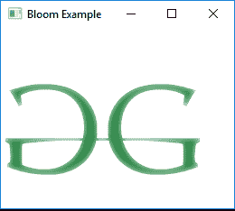

# JavaFX | Bloom 类

> 原文:[https://www.geeksforgeeks.org/javafx-bloom-class/](https://www.geeksforgeeks.org/javafx-bloom-class/)

Bloom 类是 JavaFX 的一部分。布隆是一种高级效果，根据可配置的阈值，它使输入图像的较亮部分看起来发光。绽放类继承*效果*类。

**类的构造函数:**

1.  **绽放()**:创建一个新的绽放对象。
2.  **绽放(双 t)** :用指定的阈值创建新的绽放效果。

**常用方法:**

| 方法 | 说明 |
| --- | --- |
| getInput() | 获取属性输入的值 |
| getThreshold() | 返回阈值的值 |
| 设置输入(效果五) | 设置属性输入的值 |
| 设置阈值(双 v) | 设置效果的阈值 |

下面的程序说明了布鲁姆类的使用:

1.  **Java program to import an image and add bloom effect to it:** In this program a *FileInputStream* is created and an image is taken as input from a file. Image named *image* is created using the input from the file input stream. From the image, an *image view object* is created and it is added to the *VBox*.The VBox is then added to the scene and the scene is added to the stage. A Bloom effect is created with a specified level passed as parameters and the effect is set to the image view using *setEffect()* function.

    ```java
    // Java program to import an image
    // and add bloom effect to it
    import javafx.application.Application;
    import javafx.scene.Scene;
    import javafx.scene.control.*;
    import javafx.scene.layout.*;
    import javafx.stage.Stage;
    import javafx.scene.image.*;
    import javafx.scene.effect.*;
    import java.io.*;
    import javafx.event.ActionEvent;
    import javafx.event.EventHandler;
    import javafx.scene.Group;

    public class bloom_1 extends Application {

        // launch the application
        public void start(Stage stage) throws Exception
        {

            // set title for the stage
            stage.setTitle("Bloom Example");

            // create a input stream
            FileInputStream input = new FileInputStream("D:\\GFG.png");

            // create a image
            Image image = new Image(input);

            // create a image View
            ImageView imageview = new ImageView(image);

            // create a bloom effect
            Bloom bloom = new Bloom(0.9);

            // set effect
            imageview.setEffect(bloom);

            // create a VBox
            VBox vbox = new VBox(imageview);

            // create a scene
            Scene scene = new Scene(vbox, 200, 200);

            // set the scene
            stage.setScene(scene);

            stage.show();
        }

        // Main Method
        public static void main(String args[])
        {

            // launch the application
            launch(args);
        }
    }
    ```

    **输入图像:**

    [](https://media.geeksforgeeks.org/wp-content/uploads/GFG-14.png)

    **输出:**

    [](https://media.geeksforgeeks.org/wp-content/uploads/Bloom_1.png)

2.  **Java program to import an image and set bloom effect to it, the Threshold value of the bloom effect can be controlled using a button:** In this program an *FileInputStream* is created and an image is taken as input from a file. Image named *image* is created using the input from the file input stream. From the image, an *image view object* is created and it is added to the *VBox*.The *VBox* is then added to the scene and the scene is added to the stage. A Bloom effect is created with a specified level passed as parameters and the effect is set to the image view using *setEffect()* function. A Button named button is created which is used to increase the bloom of the image. The button is also added to the *VBox*. The bloom of the image is increased using the *setThreshold()* function. The events related to button is handled using *EventHandler*.

    ```java
    // Java program to import an image and
    // set bloom effect to it. The Threshold
    // value of the bloom effect can be 
    // controlled using the button
    import javafx.application.Application;
    import javafx.scene.Scene;
    import javafx.scene.control.*;
    import javafx.scene.layout.*;
    import javafx.stage.Stage;
    import javafx.scene.image.*;
    import javafx.scene.effect.*;
    import java.io.*;
    import javafx.event.ActionEvent;
    import javafx.event.EventHandler;
    import javafx.scene.Group;

    public class bloom_2 extends Application {

        double level = 0.1;

        // launch the application
        public void start(Stage stage) throws Exception
        {

            // set title for the stage
            stage.setTitle("Bloom Example");

            // create a input stream
            FileInputStream input = new FileInputStream("D:\\GFG.png");

            // create a image
            Image image = new Image(input);

            // create a image View
            ImageView imageview = new ImageView(image);

            // create a bloom effect
            Bloom bloom = new Bloom(level);

            // create a button
            Button button = new Button("bloom");

            // action event
            EventHandler<ActionEvent> event = new EventHandler<ActionEvent>() {

                public void handle(ActionEvent e)
                {

                    // increase the level
                    level += 0.1;
                    if (level > 1)
                        level = 0.0;

                    // set Level for bloom
                    bloom.setThreshold(level);
                }
            };

            // set on action of button
            button.setOnAction(event);

            // set effect
            imageview.setEffect(bloom);

            // create a VBox
            VBox vbox = new VBox(imageview, button);

            // create a scene
            Scene scene = new Scene(vbox, 200, 200);

            // set the scene
            stage.setScene(scene);

            stage.show();
        }

        // Main Method
        public static void main(String args[])
        {

            // launch the application
            launch(args);
        }
    }
    ```

    **输入图像:**
    [](https://media.geeksforgeeks.org/wp-content/uploads/GFG-14.png)

    **输出:**

    <video class="wp-video-shortcode" id="video-219554-1" width="640" height="360" preload="metadata" controls=""><source type="video/mp4" src="https://media.geeksforgeeks.org/wp-content/uploads/Bloom_2.mp4?_=1">[https://media.geeksforgeeks.org/wp-content/uploads/Bloom_2.mp4](https://media.geeksforgeeks.org/wp-content/uploads/Bloom_2.mp4)</video>

**注意:**上述程序可能无法在在线 IDE 中运行。请使用离线编译器。

**参考:**[https://docs . Oracle . com/javase/8/JavaFX/API/JavaFX/场景/效果/Bloom.html](https://docs.oracle.com/javase/8/javafx/api/javafx/scene/effect/Bloom.html)