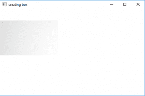
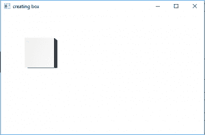

# JavaFX |带示例的盒子

> 原文:[https://www.geeksforgeeks.org/javafx-box-with-examples/](https://www.geeksforgeeks.org/javafx-box-with-examples/)

Box 是 JavaFX 的一部分。盒子类定义了一个三维盒子的宽度、高度和深度。盒子在原点居中。

**该类的构造函数为:**

1.  **Box()** :创建一个空的 Box 实例。
2.  **Box(双 w，双 h，双 d)** :创建一个具有指定宽度、高度和深度的 Box 的空实例。

**常用方法**

<figure class="table">

| 方法 | 说明 |
| --- | --- |
| **获取深度（）** | 得到盒子的深度。 |
| **getWidth()** | 得到盒子的宽度。 |
| **getHeight（）** | 得到盒子的高度 |
| **setHeight(double v)** | 设置盒子的高度 |
| **setWidth(double v)** | 设置盒子的宽度 |
| **设置深度(双 v)** | 设置盒子的深度 |

</figure>

**以下程序将说明 Box 类的使用。**

**Java 程序创建一个盒子并在舞台上展示**

这个程序创建一个由名称框指示的框(高度、宽度和深度作为参数传递)。盒子将在场景中创建，而场景又将在舞台中托管。函数 setTitle()用于为舞台提供标题。然后创建一个组，并附加该框。这个小组附属于现场。最后，调用 show()方法显示最终结果。

## Java 语言(一种计算机语言，尤用于创建网站)

```
// Java program to create a box and display it on the stage
import javafx.application.Application;
import javafx.scene.Scene;
import javafx.scene.shape.DrawMode;
import javafx.scene.layout.*;
import javafx.event.ActionEvent;
import javafx.scene.shape.Box;
import javafx.scene.control.*;
import javafx.stage.Stage;
import javafx.scene.Group;
public class box_0 extends Application {

    // launch the application
    public void start(Stage stage)
    {
        // set title for the stage
        stage.setTitle("creating box");

        // create a box
        Box box = new Box(200.0f, 120.0f, 150.0f);

        // create a Group
        Group group = new Group(box);

        // translate the box to a position
        box.setTranslateX(100);
        box.setTranslateY(100);

        // create a scene
        Scene scene = new Scene(group, 500, 300);

        // set the scene
        stage.setScene(scene);

        stage.show();
    }

    public static void main(String args[])
    {
        // launch the application
        launch(args);
    }
}
```

**输出:**



**Java 程序创建一个盒子并添加一个透视相机来渲染 3D 对象**

这个程序创建一个由名称框指示的框(高度、宽度和深度作为参数传递)。盒子将在场景中创建，而场景又将在舞台中托管。函数 setTitle()用于为舞台提供标题。然后创建一个组，并附加该框。这个小组附属于现场。最后，调用 show()方法显示最终结果。将创建一个透视相机并将其添加到场景中，以 3D 方式渲染该框。

## Java 语言(一种计算机语言，尤用于创建网站)

```
// Java program to create a box and add a
// perspective camera to render the 3D object
import javafx.application.Application;
import javafx.scene.Scene;
import javafx.scene.shape.DrawMode;
import javafx.scene.layout.*;
import javafx.event.ActionEvent;
import javafx.scene.shape.Box;
import javafx.scene.control.*;
import javafx.stage.Stage;
import javafx.scene.Group;
import javafx.scene.PerspectiveCamera;
public class box_1 extends Application {

    // launch the application
    public void start(Stage stage)
    {
        // set title for the stage
        stage.setTitle("creating box");

        // create a box
        Box box = new Box(70.0f, 70.0f, 40.0f);

        // create a Group
        Group group = new Group(box);

        // translate the box to a position
        box.setTranslateX(100);
        box.setTranslateY(100);

        // create a perspective camera
        PerspectiveCamera perspectivecamera = new PerspectiveCamera(false);
        perspectivecamera.setTranslateX(0);
        perspectivecamera.setTranslateY(0);
        perspectivecamera.setTranslateZ(0);

        // create a scene
        Scene scene = new Scene(group, 500, 300);

        // set camera for scene
        scene.setCamera(perspectivecamera);

        // set the scene
        stage.setScene(scene);

        stage.show();
    }

    public static void main(String args[])
    {
        // launch the application
        launch(args);
    }
}
```

**输出:**



**注意:以上程序可能无法在在线 IDE 中运行，请使用离线编译器**
**参考**
[https://docs . Oracle . com/javase/8/JavaFX/API/JavaFX/scene/shape/box . html](https://docs.oracle.com/javase/8/javafx/api/javafx/scene/shape/Box.html)