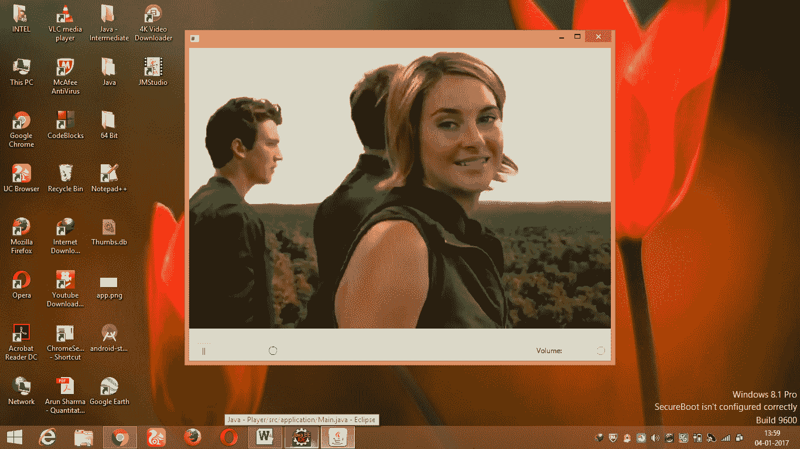

# JavaFX |打造媒体播放器

> 原文:[https://www . geesforgeks . org/JavaFX-building-a-media-player/](https://www.geeksforgeeks.org/javafx-building-a-media-player/)

这个 JavaFX 库用于制作功能丰富的互联网应用程序(它们提供与桌面应用程序相似的体验和功能)。像其他 Java 库一样，基于该库构建的产品是平台无关的，它们可以在手机、电视、电脑等设备上运行。

其他基于 JVM 的技术，如 Groovy、JRuby 等，可以与 JavaFX 一起使用，但是，由于 JavaFX 本身提供了大部分特性，这种需求很少出现。它与 Java Swing 高度兼容，其内容可以无缝嵌入到 JavaFX 应用程序中。

**在 JavaFX 中构建媒体播放器**

对于媒体播放器应用程序，我们有三个不同的类，第一个是启动这个应用程序的 Main 类，然后是运行视频和音频的 player 类和控制媒体的 MediaBar 类。
 **实施:** 

```java
// Java program to Build a Media 
// Player in JavaFX
import java.io.File;
import java.net.MalformedURLException;

import javafx.application.Application;
import javafx.event.ActionEvent;
import javafx.event.EventHandler;
import javafx.stage.FileChooser;
import javafx.stage.Stage;
import javafx.scene.Scene;
import javafx.scene.control.Menu;
import javafx.scene.control.MenuBar;
import javafx.scene.control.MenuItem;
import javafx.scene.layout.BorderPane;
import javafx.scene.paint.Color;

// launches the application
public class Main extends Application { 
    Player player;
    FileChooser fileChooser;
    public void start(final Stage primaryStage)
    {
        // setting up the stages
        MenuItem open = new MenuItem("Open");
        Menu file = new Menu("File");
        MenuBar menu = new MenuBar();

        // Connecting the above three
        file.getItems().add(open); // it would connect open with file
        menu.getMenus().add(file);

        // Adding functionality to switch to different videos
        fileChooser = new FileChooser();
        open.setOnAction(new EventHandler<ActionEvent>(){
            public void handle(ActionEvent e)
            {
                // Pausing the video while switching
                player.player.pause();
                File file = fileChooser.showOpenDialog(primaryStage);

                // Choosing the file to play
                if (file != null) {
                    try {
                        player = new Player(file.toURI().toURL().toExternalForm());
                        Scene scene = new Scene(player, 720, 535, Color.BLACK);
                        primaryStage.setScene(scene);
                    }
                    catch (MalformedURLException e1) {
                        e1.printStackTrace();
                    }
                }
            }

            // here you can choose any video
            player = new Player("file:/// F:/songs/srk.mp4");

            // Setting the menu at the top
            player.setTop(menu); 

            // Adding player to the Scene
            Scene scene = new Scene(player, 720, 535, Color.BLACK); 

            // height and width of the video player
            // background color set to Black
            primaryStage.setScene(scene); // Setting the scene to stage
            primaryStage.show(); // Showing the stage
    }

     // Main function to launch the application
     public static void main(String[] args){
           launch(args);
     }
}

    import javafx.scene.layout.BorderPane;
    import javafx.scene.layout.Pane;
    import javafx.scene.media.Media;
    import javafx.scene.media.MediaPlayer;
    import javafx.scene.media.MediaView;

    public class Player extends BorderPane // Player class extend BorderPane
    // in order to divide the media
    // player into regions
    {
        Media media;
        MediaPlayer player;
        MediaView view;
        Pane mpane;
        MediaBar bar;
        public Player(String file)
        { // Default constructor
            media = new Media(file);
            player = new MediaPlayer(media);
            view = new MediaView(player);
            mpane = new Pane();
            mpane.getChildren().add(view); // Calling the function getChildren

            // inorder to add the view
            setCenter(mpane);
            bar = new MediaBar(player); // Passing the player to MediaBar
            setBottom(bar); // Setting the MediaBar at bottom
            setStyle("-fx-background-color:#bfc2c7"); // Adding color to the mediabar
            player.play(); // Making the video play
        }
    }

    import javafx.application.Platform;
    import javafx.beans.InvalidationListener;
    import javafx.beans.Observable;
    import javafx.event.ActionEvent;
    import javafx.event.EventHandler;
    import javafx.geometry.Insets;
    import javafx.geometry.Pos;
    import javafx.scene.control.Button;
    import javafx.scene.control.Label;
    import javafx.scene.control.Slider;
    import javafx.scene.layout.HBox;
    import javafx.scene.layout.Priority;
    import javafx.scene.media.MediaPlayer;
    import javafx.scene.media.MediaPlayer.Status;

    public class MediaBar extends HBox { // MediaBar extends Horizontal Box

        // introducing Sliders
        Slider time = new Slider(); // Slider for time
        Slider vol = new Slider(); // Slider for volume
        Button PlayButton = new Button("||"); // For pausing the player
        Label volume = new Label("Volume: ");
        MediaPlayer player;

        public MediaBar(MediaPlayer play)
        { // Default constructor taking
            // the MediaPlayer object
            player = play;

            setAlignment(Pos.CENTER); // setting the HBox to center
            setPadding(new Insets(5, 10, 5, 10));
            // Settih the preference for volume bar
            vol.setPrefWidth(70);
            vol.setMinWidth(30);
            vol.setValue(100);
            HBox.setHgrow(time, Priority.ALWAYS);
            PlayButton.setPrefWidth(30);

            // Adding the components to the bottom

            getChildren().add(PlayButton); // Playbutton
            getChildren().add(time); // time slider
            getChildren().add(volume); // volume slider
            getChildren().add(vol);

            // Adding Functionality
            // to play the media player
            PlayButton.setOnAction(new EventHandler<ActionEvent>() {
                public void handle(ActionEvent e)
                {
                    Status status = player.getStatus(); // To get the status of Player
                    if (status == status.PLAYING) {

                        // If the status is Video playing
                        if (player.getCurrentTime().greaterThanOrEqualTo(player.getTotalDuration())) {

                            // If the player is at the end of video
                            player.seek(player.getStartTime()); // Restart the video
                            player.play();
                        }
                        else {
                            // Pausing the player
                            player.pause();

                            PlayButton.setText(">");
                        }
                    } // If the video is stopped, halted or paused
                    if (status == Status.HALTED || status == Status.STOPPED || status == Status.PAUSED) {
                        player.play(); // Start the video
                        PlayButton.setText("||");
                    }
                }
            });

            // Providing functionality to time slider
            player.currentTimeProperty().addListener(new InvalidationListener() {
                public void invalidated(Observable ov)
                {
                    updatesValues();
                }
            });

            // Inorder to jump to the certain part of video
            time.valueProperty().addListener(new InvalidationListener() {
                public void invalidated(Observable ov)
                {
                    if (time.isPressed()) { // It would set the time
                        // as specified by user by pressing
                        player.seek(player.getMedia().getDuration().multiply(time.getValue() / 100));
                    }
                }
            });

            // providing functionality to volume slider
            vol.valueProperty().addListener(new InvalidationListener() {
                public void invalidated(Observable ov)
                {
                    if (vol.isPressed()) {
                        player.setVolume(vol.getValue() / 100); // It would set the volume
                        // as specified by user by pressing
                    }
                }
            });
        }

        // Outside the constructor
        protected void updatesValues()
        {
            Platform.runLater(new Runnable() {
                public void run()
                {
                    // Updating to the new time value
                    // This will move the slider while running your video
                    time.setValue(player.getCurrentTime().toMillis()
                                      player.getTotalDuration()
                                          .toMillis()
                                  * 100);
                }
            });
        }
    }
```

在离线 IDE 上运行上述程序时，媒体播放器看起来类似于:



**解说**T2【我们这边有三节课-
1。主类启动我们的程序
2。玩家类玩我们的媒体播放器
3。MediaBar 类为我们的媒体栏控制面板添加控制。

在我们扩展到应用程序类的 Main.java 类中，我们有两种方法一种是启动程序的主要方法，另一种是启动方法，我们可以在其中设置舞台和媒体控制边界。然后我们在底部添加了滑块来控制视频的时间和音量。为了增加跳转到视频特定部分的功能，我们使用了-

```java
player.seek(player.getMedia().
                  getDuration().multiply(time.getValue()/100));
```

以及改变媒体

```java
 fileChooser.showOpenDialog(primaryStage) 
```

已在上述程序中使用。出于造型目的，我们提出了 CSS，如中所示

```java
-fx-background-color:#bfc2c7
```

JavaFX 最好的特性之一是可以用级联样式表(CSS)控制格式。我们使用了。getStatus()函数检查播放器的状态，即它是暂停、播放、停止还是暂停，并采取相应的行动。

**注意:**导入时，始终选择 JavaFX 文件。

**参考资料:** [参考视频](https://youtu.be/oAg7Q8mkNNM?list=PLKRttGQgeMcBFsPTGDSv1Rto_3mRryUE2)