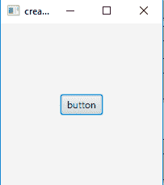
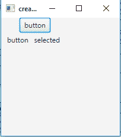
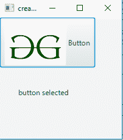
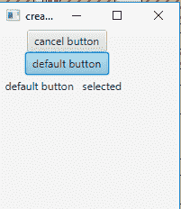
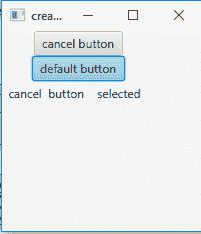

# JavaFX |按钮示例

> 原文:[https://www.geeksforgeeks.org/javafx-button-with-examples/](https://www.geeksforgeeks.org/javafx-button-with-examples/)

按钮类是 JavaFX 包的一部分，它可以有文本或图形，或者两者都有。

JavaFX 中的按钮可以有三种不同的类型:

1.  **正常按钮:**正常按钮
2.  **默认按钮:**接收键盘 VK 输入的默认按钮
3.  **取消按钮:**接收键盘 VK 输入的取消按钮

当按钮被按下时，一个动作事件被发送。此操作事件可以由事件处理程序管理。按钮还可以通过实现事件处理程序来处理鼠标事件，从而响应鼠标事件。

**按钮类的构造函数为**:

1.  **按钮()**:创建一个标签为空字符串的按钮。
2.  **按钮(字符串 t)** :创建一个以指定文本为标签的按钮。
3.  **按钮(字符串 t，节点 g)** :用指定的文本和图标为其标签创建一个按钮。

**常用方法**:

| 方法 | 说明 |
| --- | --- |
| **集合枚扣（布尔值 v）** | 设置取消按钮属性的值。 |
| **设置缺省按钮（布尔值 v）** | 设置属性默认值按钮的值 |
| **isDefaultButton()** | 获取属性 defaultButton 的值。 |
| **是信用按钮（）** | 获取取消按钮属性的值。 |
| **取消按钮属性（）** | 取消按钮是接收键盘 VK 按下的按钮 |
| **defaultButtonProperty()** | 默认按钮是接收键盘 VK 输入的按钮 |
| **createDefaultSkin()** | 为此控件创建默认外观的新实例。 |

下面的程序说明了按钮在 JavaFX 中的使用。

1.  **Program to create a button and add it to the stage:** This program creates a Button indicated by the name *b*. The button will be created inside a scene, which in turn will be hosted inside a stage. The function setTitle() is used to provide title to the stage. Then a tile pane is created, on which addChildren() method is called to attach the button inside the scene. Finally, the show() method is called to display the final results.

    ```
    // Java Program to create a button and add it to the stage
    import javafx.application.Application;
    import javafx.scene.Scene;
    import javafx.scene.control.Button;
    import javafx.scene.layout.StackPane;
    import javafx.stage.Stage;
    public class button extends Application {

        // launch the application
        public void start(Stage s)
        {
            // set title for the stage
            s.setTitle("creating buttons");

            // create a button
            Button b = new Button("button");

            // create a stack pane
            StackPane r = new StackPane();

            // add button
            r.getChildren().add(b);

            // create a scene
            Scene sc = new Scene(r, 200, 200);

            // set the scene
            s.setScene(sc);

            s.show();
        }

        public static void main(String args[])
        {
            // launch the application
            launch(args);
        }
    }
    ```

    **输出** :
    

2.  **Java program to create a button and add event handler to it**: This program creates a Button indicated by the name b. The button will be created inside a scene, which in turn will be hosted inside a stage. We would create a label to show if the button is pressed or not. The function setTitle() is used to provide title to the stage. Then a tile pane is created, on which addChildren() method is called to attach the button and label inside the scene. Finally, the show() method is called to display the final results.we would create an event handler to handle the button events. The event handler would be added to the button using setOnAction() function.

    ```
    // Java program to create a button and add event handler to it
    import javafx.application.Application;
    import javafx.scene.Scene;
    import javafx.scene.control.Button;
    import javafx.scene.layout.*;
    import javafx.event.ActionEvent;
    import javafx.event.EventHandler;
    import javafx.scene.control.Label;
    import javafx.stage.Stage;
    public class button_1 extends Application {

        // launch the application
        public void start(Stage s)
        {
            // set title for the stage
            s.setTitle("creating buttons");

            // create a button
            Button b = new Button("button");

            // create a stack pane
            TilePane r = new TilePane();

            // create a label
            Label l = new Label("button not selected");

            // action event
            EventHandler<ActionEvent> event = new EventHandler<ActionEvent>() {
                public void handle(ActionEvent e)
                {
                    l.setText("   button   selected    ");
                }
            };

            // when button is pressed
            b.setOnAction(event);

            // add button
            r.getChildren().add(b);
            r.getChildren().add(l);

            // create a scene
            Scene sc = new Scene(r, 200, 200);

            // set the scene
            s.setScene(sc);

            s.show();
        }

        public static void main(String args[])
        {
            // launch the application
            launch(args);
        }
    }
    ```

    **输出** :
    

3.  **Java Program to create a button with a image and add event handler to it**: This program creates a Button with an image on it indicated by the name b. The image will be included using the File Input Stream that imports the image. we will then create an image using the object of file input stream and then create an image view using the image file. The button will be created inside a scene, which in turn will be hosted inside a stage.we would create a label to show if the button is pressed or not. The function setTitle() is used to provide title to the stage. Then a tile pane is created, on which addChildren() method is called to attach the button and label inside the scene. Finally, the show() method is called to display the final results.we would create an event handler to handle the button events. The event handler would be added to the button using setOnAction() function.

    ```
    // Java Program to create a button with a image and
    // add event handler to it
    import javafx.application.Application;
    import javafx.scene.Scene;
    import javafx.scene.control.Button;
    import javafx.scene.layout.*;
    import javafx.scene.image.*;
    import java.io.*;
    import javafx.event.ActionEvent;
    import javafx.event.EventHandler;
    import javafx.scene.control.Label;
    import javafx.stage.Stage;
    import java.net.*;
    public class button_2 extends Application {

        // launch the application
        public void start(Stage s) throws Exception
        {
            // set title for the stage
            s.setTitle("creating buttons");

            // create a input stream
            FileInputStream input = new FileInputStream("f:\\gfg.png");

            // create a image
            Image i = new Image(input);

            // create a image View
            ImageView iw = new ImageView(i);

            // create a button
            Button b = new Button("", iw);

            // create a stack pane
            TilePane r = new TilePane();

            // create a label
            Label l = new Label("button not selected");

            // action event
            EventHandler<ActionEvent> event = new EventHandler<ActionEvent>() {
                public void handle(ActionEvent e)
                {
                    l.setText("button selected    ");
                }
            };

            // when button is pressed
            b.setOnAction(event);

            // add button
            r.getChildren().add(b);
            r.getChildren().add(l);

            // create a scene
            Scene sc = new Scene(r, 200, 200);

            // set the scene
            s.setScene(sc);

            s.show();
        }

        public static void main(String args[])
        {
            // launch the application
            launch(args);
        }
    }
    ```

    **输出**
    

4.  **Java Program to create a button with a image and text and add event handler to it**

    这个程序创建一个按钮，按钮上有一个图像和一个由名称 b 表示的文本。图像将使用导入图像的文件输入流来包含。然后我们将使用文件输入流的对象创建一个图像，然后使用图像文件创建一个图像视图。按钮将在场景中创建，而场景又将在舞台中托管。我们将创建一个标签来显示按钮是否被按下。函数 setTitle()用于为舞台提供标题。然后创建一个平铺窗格，在该窗格上调用 addChildren()方法在场景内部附加按钮和标签。最后，调用 show()方法来显示最终结果。事件处理程序将使用 setOnAction()函数添加到按钮中。

    ```
    // Java Program to create a button with a image
    // and text and add event handler to it
    import javafx.application.Application;
    import javafx.scene.Scene;
    import javafx.scene.control.Button;
    import javafx.scene.layout.*;
    import javafx.scene.image.*;
    import java.io.*;
    import javafx.event.ActionEvent;
    import javafx.event.EventHandler;
    import javafx.scene.control.Label;
    import javafx.stage.Stage;
    import java.net.*;
    public class button_3 extends Application {

        // launch the application
        public void start(Stage s) throws Exception
        {
            // set title for the stage
            s.setTitle("creating buttons");

            // create a input stream
            FileInputStream input = new FileInputStream("f:\\gfg.png");

            // create a image
            Image i = new Image(input);

            // create a image View
            ImageView iw = new ImageView(i);

            // create a button
            Button b = new Button("Button", iw);

            // create a stack pane
            TilePane r = new TilePane();

            // create a label
            Label l = new Label("button not selected");

            // action event
            EventHandler<ActionEvent> event = new EventHandler<ActionEvent>() {
                public void handle(ActionEvent e)
                {
                    l.setText("button selected    ");
                }
            };

            // when button is pressed
            b.setOnAction(event);

            // add button
            r.getChildren().add(b);
            r.getChildren().add(l);

            // create a scene
            Scene sc = new Scene(r, 200, 200);

            // set the scene
            s.setScene(sc);

            s.show();
        }

        public static void main(String args[])
        {
            // launch the application
            launch(args);
        }
    }
    ```

    **输出** :
    

5.  **Java program to create a default button and a cancel button:** This program creates a Button indicated by the name b and b1 . The button b will act as a cancel button which will respond to the escape keypress of keyboard and button b1 will behave as a default button which will respond to enter keypress of the keyboard). The button will be created inside a scene, which in turn will be hosted inside a stage.we would create a label to show which button is pressed. The function setTitle() is used to provide title to the stage. Then a tile pane is created, on which addChildren() method is called to attach the button and label inside the scene. Finally, the show() method is called to display the final results.we would create an event handler to handle the button events. The event handler would be added to the button using setOnAction() function.

    ```
    // Java program to create a default button and a
    // cancel button and add event handler to it
    import javafx.application.Application;
    import javafx.scene.Scene;
    import javafx.scene.control.Button;
    import javafx.scene.layout.*;
    import javafx.event.ActionEvent;
    import javafx.event.EventHandler;
    import javafx.scene.control.Label;
    import javafx.stage.Stage;
    public class button_4 extends Application {

        // launch the application
        public void start(Stage s)
        {
            // set title for the stage
            s.setTitle("creating buttons");

            // create a button
            Button b = new Button("cancel button");

            // set cancel button
            b.setCancelButton(true);

            // create a button
            Button b1 = new Button("default button");

            // set default button
            b1.setDefaultButton(true);

            // create a stack pane
            TilePane r = new TilePane();

            // create a label
            Label l = new Label("button not selected");

            // action event
            EventHandler<ActionEvent> event = new EventHandler<ActionEvent>() {
                public void handle(ActionEvent e)
                {
                    l.setText("  cancel  button    selected    ");
                }
            };
            EventHandler<ActionEvent> event1 = new EventHandler<ActionEvent>() {
                public void handle(ActionEvent e)
                {
                    l.setText("  default button   selected    ");
                }
            };

            // when button is pressed
            b.setOnAction(event);
            b1.setOnAction(event1);

            // add button
            r.getChildren().add(b);
            r.getChildren().add(b1);
            r.getChildren().add(l);

            // create a scene
            Scene sc = new Scene(r, 200, 200);

            // set the scene
            s.setScene(sc);

            s.show();
        }

        public static void main(String args[])
        {
            // launch the application
            launch(args);
        }
    }
    ```

    **输出** :
    
    

**注意:**上述程序可能无法在联机 IDE 中运行，请使用脱机编译器。

**参考**:[https://docs . Oracle . com/javase/8/JavaFX/API/JavaFX/scene/control/button . html](https://docs.oracle.com/javase/8/javafx/api/javafx/scene/control/Button.html)