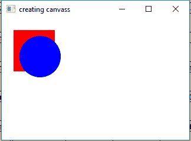
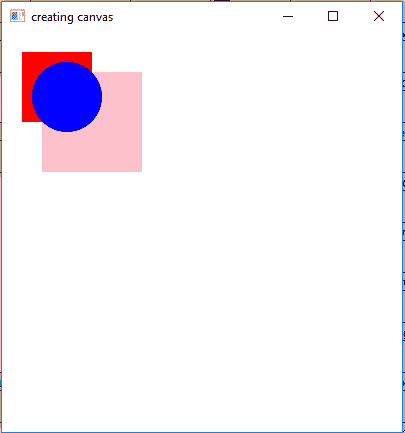

# JavaFX |画布类

> 原文:[https://www.geeksforgeeks.org/javafx-canvas-class/](https://www.geeksforgeeks.org/javafx-canvas-class/)

Canvas 类是 JavaFX 的一部分。Canvas 类基本上创建了一个图像，可以使用 GraphicsContext 提供的一组图形命令来绘制。画布具有指定的高度和宽度，所有的绘制操作都被裁剪到画布的边界。

**类的构造函数:**

1.  **画布()**:创建新的画布对象。
2.  **Canvas(双 w，双 h)** :创建具有指定宽度和高度的新 Canvas 对象。

**常用方法:**

| 方法 | 说明 |
| --- | --- |
| getgraphicstext 2d() | 返回与画布关联的图形上下文。 |
| getHeight（） | 返回画布的高度。 |
| getWidth（） | 返回画布的宽度。 |
| setHeight(双 v) | 设置画布的高度。 |
| setWidth(双 d) | 设置画布的宽度。 |

下面的程序说明了 Canvas 类的使用:

1.  **Java Program to create a canvas with specified width and height(as arguments of constructor), add it to the stage and also add a circle and rectangle on it:** In this program we will create a Canvas named *canvas* with specified width and height. We will extract the *GraphicsContext* using the *getGraphicsContext2D()* function and draw a rectangle and a oval of different color. Now we will create a Group named *group* and add the canvas to the group. Now create a scene and add the group to the scene and then attach the scene to the stage and call the *show()* function to display the results.

    ```java
    // Java Program to create a canvas with specified
    // width and height(as arguments of constructor),
    // add it to the stage and also add a circle and
    // rectangle on it
    import javafx.application.Application;
    import javafx.scene.Scene;
    import javafx.scene.control.*;
    import javafx.scene.layout.*;
    import javafx.stage.Stage;
    import javafx.event.ActionEvent;
    import javafx.event.EventHandler;
    import javafx.scene.canvas.*;
    import javafx.scene.paint.Color;
    import javafx.scene.Group;

    public class canvas extends Application {

        // launch the application
        public void start(Stage stage)
        {

            // set title for the stage
            stage.setTitle("creating canvas");

            // create a canvas
            Canvas canvas = new Canvas(100.0f, 100.0f);

            // graphics context
            GraphicsContext graphics_context = 
                 canvas.getGraphicsContext2D();

            // set fill for rectangle
            graphics_context.setFill(Color.RED);
            graphics_context.fillRect(20, 20, 70, 70);

            // set fill for oval
            graphics_context.setFill(Color.BLUE);
            graphics_context.fillOval(30, 30, 70, 70);

            // create a Group
            Group group = new Group(canvas);

            // create a scene
            Scene scene = new Scene(group, 200, 200);

            // set the scene
            stage.setScene(scene);

            stage.show();
        }

        // Main Method
        public static void main(String args[])
        {

            // launch the application
            launch(args);
        }
    }
    ```

    **输出:**

    

2.  **Java Program to create a canvas and use setHeight() and setWidth() function to set canvas size and add it to the stage and also add a circle and rectangle on it:** In this program we will create a Canvas named *canvas* and set the width and height using the *setWidth()* and *setHeight()* function. We will extract the GraphicsContext using the *getGraphicsContext2D()* function and draw two rectangles and a oval of different color. We will create a Group named *group* and add the canvas to the group. We will create a scene and add the group to the scene and then attach the scene to the stage. Finally, call the *show()* function to display the results.

    ```java
    // Java Program to create a canvas and use 
    // setHeight() and setWidth() function to
    // set canvas size and add it to the stage
    // and also add a circle and rectangle on it
    import javafx.application.Application;
    import javafx.scene.Scene;
    import javafx.scene.control.*;
    import javafx.scene.layout.*;
    import javafx.stage.Stage;
    import javafx.event.ActionEvent;
    import javafx.event.EventHandler;
    import javafx.scene.canvas.*;
    import javafx.scene.paint.Color;
    import javafx.scene.Group;

    public class canvas1 extends Application {

        // launch the application
        public void start(Stage stage)
        {

            // set title for the stage
            stage.setTitle("creating canvas");

            // create a canvas
            Canvas canvas = new Canvas();

            // set height and width
            canvas.setHeight(400);
            canvas.setWidth(400);

            // graphics context
            GraphicsContext graphics_context = 
                canvas.getGraphicsContext2D();

            // set fill for rectangle
            graphics_context.setFill(Color.PINK);
            graphics_context.fillRect(40, 40, 100, 100);

            // set fill for rectangle
            graphics_context.setFill(Color.RED);
            graphics_context.fillRect(20, 20, 70, 70);

            // set fill for oval
            graphics_context.setFill(Color.BLUE);
            graphics_context.fillOval(30, 30, 70, 70);

            // create a Group
            Group group = new Group(canvas);

            // create a scene
            Scene scene = new Scene(group, 400, 400);

            // set the scene
            stage.setScene(scene);

            stage.show();
        }

        // Main Method
        public static void main(String args[])
        {

            // launch the application
            launch(args);
        }
    }
    ```

    **输出:**

    

    **注意:**上述程序可能无法在在线 IDE 中运行。请使用离线编译器。

    **参考:**[https://docs . Oracle . com/javase/8/JavaFX/API/JavaFX/scene/canvas/canvas . html](https://docs.oracle.com/javase/8/javafx/api/javafx/scene/canvas/Canvas.html)