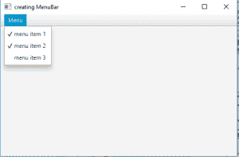
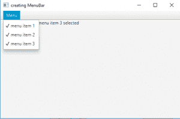
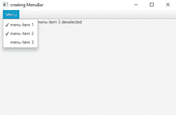

# JavaFX | CheckMenuItem 带示例

> 原文:[https://www . geeksforgeeks . org/JavaFX-checkmenuitem-with-examples/](https://www.geeksforgeeks.org/javafx-checkmenuitem-with-examples/)

CheckMenuItem 是 JavaFX 库的一部分。CheckMenuItem 可以添加到菜单中，它有两种状态:选中和未选中。用户可以在这两种状态之间切换菜单。CheckMenuItem 继承自 MenuItem 类。

 **类的构造函数有:** 

1.  **CheckMenuItem(String t)** :用指定的文本创建一个 CheckMenuItem
2.  **CheckMenuItem(字符串 t，节点 g)** :用指定的文本和图形创建一个 CheckMenuItem

**常用方法:**

| 方法 | 说明 |
| --- | --- |
| **isSelected()** | 返回 menuitem 是否被选中 |
| **所选属性（）** | 表示此 CheckMenuItem 的当前状态 |
| **设置选定(布尔 v)** | 设置选定属性的值 |

下面的程序说明了 JavaFX 的 CheckMenuItem 类:

1.  **Java program to create a menu bar and add a menu to it and also add checkmenuitems to menu:** This program creates a menubar indicated by the name menu_bar. A menu will be created by name menu and 3 checkmenuitems menuitem1, menuitem2, menuitem3 will be added to the menu and the menu will be added to the menubar menu_bar. The menubar will be created inside a scene, which in turn will be hosted inside a stage. The function setTitle() is used to provide title to the stage. Then a VBox is created, on which addChildren() method is called to attach the menubar inside the scene. Finally, the show() method is called to display the final results.

    ```java
    // Java program to create a menu bar and add
    // menu to it and also add checkmenuitems to menu
    import javafx.application.Application;
    import javafx.scene.Scene;
    import javafx.scene.control.Button;
    import javafx.scene.layout.*;
    import javafx.event.ActionEvent;
    import javafx.event.EventHandler;
    import javafx.scene.control.*;
    import javafx.stage.Stage;
    import javafx.scene.control.Alert.AlertType;
    import java.time.LocalDate;
    public class checkmenuitems_0 extends Application {

        // launch the application
        public void start(Stage stage)
        {
            // set title for the stage
            stage.setTitle("creating check menu items");

            // create a menu
            Menu menu = new Menu("Menu");

            // create menuitems
            CheckMenuItem menuitem1 = new CheckMenuItem("menu item 1");
            CheckMenuItem menuitem2 = new CheckMenuItem("menu item 2");
            CheckMenuItem menuitem3 = new CheckMenuItem("menu item 3");

            // add menu items to menu
            menu.getItems().add(menuitem1);
            menu.getItems().add(menuitem2);
            menu.getItems().add(menuitem3);

            // create a menubar
            MenuBar menu_bar = new MenuBar();

            // add menu to menubar
            menu_bar.getMenus().add(menu);

            // create a VBox
            VBox vbox = new VBox(menu_bar);

            // create a scene
            Scene scene = new Scene(vbox, 500, 300);

            // set the scene
            stage.setScene(scene);

            stage.show();
        }

        public static void main(String args[])
        {
            // launch the application
            launch(args);
        }
    }
    ```

    **输出:**
    

2.  **Java program to create a menu bar and add menu to it and also add checkmenuitems to menu and also add an event handler to handle the events:** This program creates a menubar indicated by the name menu_bar. A menu will be created by name menu and 3 checkmenuitems menuitem1, menuitem2, menuitem3 will be added to the menu and the menu will be added to the menubar menu_bar. The menubar will be created inside a scene, which in turn will be hosted inside a stage. The function setTitle() is used to provide title to the stage. Then a VBox is created, on which addChildren() method is called to attach the menubar inside the scene. Finally, the show() method is called to display the final results. A label will also be created that will show which checkmenuitem is selected. An action event will be created to process the action when the check menu item is clicked by the user.

    ```java
    // Java program to create a menu bar and add
    // menu to it and also add checkmenuitems to menu
    // and also add event handler to handle the events
    import javafx.application.Application;
    import javafx.scene.Scene;
    import javafx.scene.control.Button;
    import javafx.scene.layout.*;
    import javafx.event.ActionEvent;
    import javafx.event.EventHandler;
    import javafx.scene.control.*;
    import javafx.stage.Stage;
    import javafx.scene.control.Alert.AlertType;
    import java.time.LocalDate;
    public class checkmenuitems_2 extends Application {

        // launch the application
        public void start(Stage stage)
        {
            // set title for the stage
            stage.setTitle("creating check menu items");

            // create a menu
            Menu menu = new Menu("Menu");

            // create menuitems
            CheckMenuItem menuitem1 = new CheckMenuItem("menu item 1");
            CheckMenuItem menuitem2 = new CheckMenuItem("menu item 2");
            CheckMenuItem menuitem3 = new CheckMenuItem("menu item 3");

            // add menu items to menu
            menu.getItems().add(menuitem1);
            menu.getItems().add(menuitem2);
            menu.getItems().add(menuitem3);

            // label to display events
            Label description = new Label("\t\t\t\t"
                                          + "no menu item selected");

            // create events for menu items
            // action event
            EventHandler<ActionEvent> event = new EventHandler<ActionEvent>() {
                public void handle(ActionEvent e)
                {
                    if (((CheckMenuItem)e.getSource()).isSelected())
                        description.setText
                         ("\t\t\t\t" + ((CheckMenuItem)e.getSource())
                           .getText() + " selected");
                    else
                        description.setText
                         ("\t\t\t\t" + ((CheckMenuItem)e.getSource())
                           .getText() + " deselected");
                }
            };

            // add event
            menuitem1.setOnAction(event);
            menuitem2.setOnAction(event);
            menuitem3.setOnAction(event);

            // create a menubar
            MenuBar menu_bar = new MenuBar();

            // add menu to menubar
            menu_bar.getMenus().add(menu);

            // create a VBox
            VBox vbox = new VBox(menu_bar, description);

            // create a scene
            Scene scene = new Scene(vbox, 500, 300);

            // set the scene
            stage.setScene(scene);

            stage.show();
        }

        public static void main(String args[])
        {
            // launch the application
            launch(args);
        }
    }
    ```

    **输出:**
    

    

    **注意:**上述程序可能无法在联机 IDE 中运行，请使用脱机编译器。

    **参考:**[https://docs . Oracle . com/JavaFX/2/API/JavaFX/scene/control/checkmenuitem . html](https://docs.oracle.com/javafx/2/api/javafx/scene/control/CheckMenuItem.html)