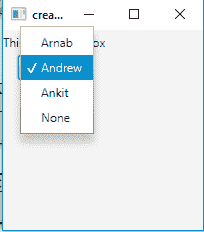
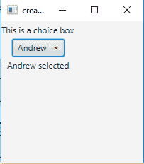

# JavaFX | ChoiceBox

> 原文:[https://www.geeksforgeeks.org/javafx-choicebox/](https://www.geeksforgeeks.org/javafx-choicebox/)

ChoiceBox 是 JavaFX 包的一部分。ChoiceBox 显示一组项目，并允许用户选择一个选项，它将在顶部显示当前选择的项目。除非另外选择，否则默认情况下，选项框没有选定的项目。可以先指定项目，然后指定选定项目，也可以先指定选定项目，然后指定项目。

**choice box 类的构造函数为**:

1.  **ChoiceBox()** :新建一个空的 ChoiceBox。
2.  **选择盒子(可观察的列表项目)**:用给定的一组项目创建一个新的选择盒子。

**常用方法**:

| 方法 | 说明 |
| --- | --- |
| **【getitem()** | 获取属性项的值。 |
| **getValue（）** | 获取属性值。 |
| **隐藏()** | 关闭选项列表。 |
| **设置项目(观察列表值)** | 设置属性项的值。 |
| **设定值(T 值)** | 设置属性值。 |
| **显示()** | 打开选项列表。 |

下面的程序说明了 ChoiceBox 的使用:

1.  **Program to create a ChoiceBox and add items to it**: This program creates a ChoiceBox named c and add a list of string to it using(ChoiceBox(FXCollections.observableArrayList(string_array))). We would add the choice and a label to the tilepane(getChildren().add() function). Then we will create a stage (container) and add the tilepane to the scene and add the scene to the stage. Then display the stage using show() function.

    ```
    // Java  Program to create a ChoiceBox and add items to it.
    import javafx.application.Application;
    import javafx.scene.Scene;
    import javafx.scene.control.*;
    import javafx.scene.layout.*;
    import javafx.event.ActionEvent;
    import javafx.event.EventHandler;
    import javafx.collections.*;
    import javafx.stage.Stage;
    public class Choice_1 extends Application {

        // launch the application
        public void start(Stage s)
        {
            // set title for the stage
            s.setTitle("creating ChoiceBox");

            // create a button
            Button b = new Button("show");

            // create a tile pane
            TilePane r = new TilePane();

            // create a label
            Label l = new Label("This is a choice box");

            // string array
            String st[] = { "Arnab", "Andrew", "Ankit", "None" };

            // create a choiceBox
            ChoiceBox c = new ChoiceBox(FXCollections.observableArrayList(st));

            // add ChoiceBox
            r.getChildren().add(l);
            r.getChildren().add(c);

            // create a scene
            Scene sc = new Scene(r, 200, 200);

            // set the scene
            s.setScene(sc);

            s.show();
        }

        public static void main(String args[])
        {
            // launch the application
            launch(args);
        }
    }
    ```

    **输出** :
    

2.  **Program to create a ChoiceBox and add listener to it**: This program creates a ChoiceBox named c and add a list of string to it using(ChoiceBox(FXCollections.observableArrayList(string_array))). We would add a change listener to detect when the user selects an item of the choice (we will add the listener using addListener() function ). The change listener has a function(public void changed(ObservableValue ov, Number value, Number new_value)) which is invoked when the selection of choice is changed. We would add the choice and a label to the tilepane(getChildren().add() function). Then we will create a stage (container) and add the tilepane to the scene and add the scene to the stage. Finally, display the stage using show() function.

    ```
    // Java  Program to create a ChoiceBox and add listener to it.
    import javafx.application.Application;
    import javafx.scene.Scene;
    import javafx.scene.control.*;
    import javafx.scene.layout.*;
    import javafx.event.ActionEvent;
    import javafx.event.EventHandler;
    import javafx.collections.*;
    import javafx.beans.value.*;
    import javafx.stage.Stage;
    public class Choice_2 extends Application {

        // launch the application
        public void start(Stage s)
        {
            // set title for the stage
            s.setTitle("creating ChoiceBox");

            // create a button
            Button b = new Button("show");

            // create a tile pane
            TilePane r = new TilePane();

            // create a label
            Label l = new Label("This is a choice box");
            Label l1 = new Label("nothing selected");

            // string array
            String st[] = { "Arnab", "Andrew", "Ankit", "None" };

            // create a choiceBox
            ChoiceBox c = new ChoiceBox(FXCollections.observableArrayList(st));

            // add a listener
            c.getSelectionModel().selectedIndexProperty().addListener(new ChangeListener<Number>() {

                // if the item of the list is changed
                public void changed(ObservableValue ov, Number value, Number new_value)
                {

                    // set the text for the label to the selected item
                    l1.setText(st[new_value.intValue()] + " selected");
                }
            });

            // add ChoiceBox
            r.getChildren().add(l);
            r.getChildren().add(c);
            r.getChildren().add(l1);

            // create a scene
            Scene sc = new Scene(r, 200, 200);

            // set the scene
            s.setScene(sc);

            s.show();
        }

        public static void main(String args[])
        {
            // launch the application
            launch(args);
        }
    }
    ```

    **输出** :
    

**注意:**上述程序可能无法在联机 IDE 中运行，请使用脱机编译器。

**参考:**[https://docs . Oracle . com/javase/8/JavaFX/API/JavaFX/scene/control/choice box . html](https://docs.oracle.com/javase/8/javafx/api/javafx/scene/control/ChoiceBox.html)