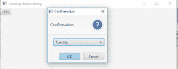
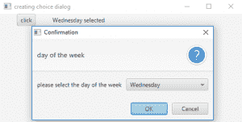

# JavaFX | choice medialog

> 原文:[https://www.geeksforgeeks.org/javafx-choicedialog/](https://www.geeksforgeeks.org/javafx-choicedialog/)

ChoiceDialog 是 JavaFX 框架的一部分。选择媒体日志是一个对话框，为用户提供一组选项，用户最多可以从中选择一个选项。Choice 类是基类 Dialog 的派生类。
**该班建造师为** :

1.  **选择媒体日志()**:创建一个没有项目的空选择对话框。
2.  **选择媒体日志(T d，集合选项)**:创建一个选项对话框，其中包含来自所提供集合的一组项目和一个选定项目
3.  **选择媒体日志(T d，T…选项)**:创建一个选项对话框，其中包含一个默认选定项目和一系列可供用户选择的选项。

**常用方法**:

<figure class="table">

| 方法 | 说明 |
| --- | --- |
| **【getitem()** | 返回选择框中所有可用的项目 |
| **getSelectedItem()** | 返回对话框中选定的项目 |
| **set electioneditem(t 项)** | 设置对话框的选定项目 |
| **setContentText(字符串 s)** | 设置对话框的内容文本 |
| **setHeaderText(字符串 s)** | 设置对话框的标题文本 |

</figure>

下面的程序说明了选择媒体日志类:

1.  **程序创建一个选择对话框并显示出来**:这个程序创建一个选择对话框 *d* 和一个字符串数组 *days* ，其中包含一周中的日期名称。该程序创建一个由名称 *b* 表示的按钮。该按钮将在场景内创建，而场景又将在舞台内托管。我们将创建一个标签来显示按钮是否被按下。函数 setTitle()用于为舞台提供标题。然后创建一个平铺窗格，在该窗格上调用 addChildren()方法在场景内部附加按钮和标签。最后，调用 show()方法来显示最终结果。事件处理程序将使用 setOnAction()函数添加到按钮中。单击按钮时，选择对话框出现，其中包含选定的项目。允许用户从提供的选项中选择一个项目。

## Java 语言(一种计算机语言，尤用于创建网站)

```java
// Java Program to create a choice dialog and display it
import javafx.application.Application;
import javafx.scene.Scene;
import javafx.scene.control.Button;
import javafx.scene.layout.*;
import javafx.event.ActionEvent;
import javafx.event.EventHandler;
import javafx.scene.control.*;
import javafx.stage.Stage;
import javafx.scene.control.Alert.AlertType;
public class choice_1 extends Application {

    // launch the application
    public void start(Stage s)
    {
        // set title for the stage
        s.setTitle("creating choice dialog");

        // create a button
        Button b = new Button("click");

        // create a tile pane
        TilePane r = new TilePane();

        // items for the dialog
        String days[] = { "Monday", "Tuesday", "Wednesday",
                                       "Thursday", "Friday" };

        // create a choice dialog
        ChoiceDialog d = new ChoiceDialog(days[1], days);

        // action event
        EventHandler<ActionEvent> event = new EventHandler<ActionEvent>()
        {
            public void handle(ActionEvent e)
            {

                // show the dialog
                d.show();
            }
        };

        // when button is pressed
        b.setOnAction(event);

        // add button
        r.getChildren().add(b);

        // create a scene
        Scene sc = new Scene(r, 200, 200);

        // set the scene
        s.setScene(sc);

        s.show();
    }

    public static void main(String args[])
    {
        // launch the application
        launch(args);
    }
}
```

1.  **输出:**



1.  **程序创建一个选项对话框并添加标题和内容文本，还添加一个标签来显示所选的选项**:该程序创建一个选项对话框 d 和一个字符串数组 *days* ，其中包含一周中各天的名称。该程序创建一个名为 *b* 的按钮。该按钮将在场景内创建，而场景又将在舞台内托管。我们将创建一个标签来显示按钮是否被按下。函数 setTitle()用于为舞台提供标题。然后创建一个平铺窗格，在该窗格上调用 addChildren()方法在场景内部附加按钮和标签。最后，调用 show()方法来显示最终结果。事件处理程序将使用 setOnAction()函数添加到按钮中。单击按钮时，选择对话框出现，其中包含选定的项目。允许用户从提供的选项中选择一个项目。我们还创建了一个标签 l 来显示当前选择的项目。我们还将使用 setHeaderText()和 setContentText()函数设置标题文本和内容文本。我们将使用 getSelectedItem()函数获取所选项目。

## Java 语言(一种计算机语言，尤用于创建网站)

```java
// Java Program to create a choice dialog and add header
// and content text and also add a label to
// display the selected choice
import javafx.application.Application;
import javafx.scene.Scene;
import javafx.scene.control.Button;
import javafx.scene.layout.*;
import javafx.event.ActionEvent;
import javafx.event.EventHandler;
import javafx.scene.control.*;
import javafx.stage.Stage;
import javafx.scene.control.Alert.AlertType;
public class choice_2 extends Application {

    // launch the application
    public void start(Stage s)
    {
        // set title for the stage
        s.setTitle("creating choice dialog");

        // create a button
        Button b = new Button("click");

        // items for the dialog
        String days[] = { "Monday", "Tuesday", "Wednesday",
                                       "Thursday", "Friday" };

        // create a label
        Label l = new Label(days[1] + " selected");

        // create a tile pane
        TilePane r = new TilePane();

        // create a choice dialog
        ChoiceDialog d = new ChoiceDialog(days[1], days);

        // action event
        EventHandler<ActionEvent> event = new EventHandler<ActionEvent>() {
            public void handle(ActionEvent e)
            {
                // setheader text
                d.setHeaderText("day of the week");

                // set content text
                d.setContentText("please select the day of the week");

                // show the dialog
                d.showAndWait();

                // get the selected item
                l.setText(d.getSelectedItem() + " selected");
            }
        };

        // when button is pressed
        b.setOnAction(event);

        // add button
        r.getChildren().add(b);
        r.getChildren().add(l);

        // create a scene
        Scene sc = new Scene(r, 200, 200);

        // set the scene
        s.setScene(sc);

        s.show();
    }

    public static void main(String args[])
    {
        // launch the application
        launch(args);
    }
}
```

1.  **输出:**

