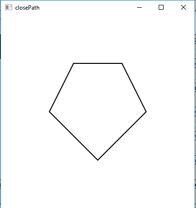

# JavaFX | ClosePath 类

> 原文:[https://www.geeksforgeeks.org/javafx-closepath-class/](https://www.geeksforgeeks.org/javafx-closepath-class/)

ClosePath 类是 JavaFX 的一部分。ClosePath 类通过连接指定路径的两个未连接的末端来关闭路径。ClosePath 类继承了 *PathElement* 类。

**该类的构造函数:**

*   **闭合路径()**:创建一个新的闭合路径对象。

**常用方法:**

| 方法 | 说明 |
| --- | --- |
| toString() | 返回封闭路径对象的字符串表示形式。 |

**示例:** *Java 程序创建一个路径并向其添加多个 LineTo 对象，并使用 ClosePath 对象关闭路径并显示:*

*   在这个程序中，我们将创建一个名为*路径*的路径对象。
*   用指定的 X 和 Y 坐标名称创建四个 LineTo 对象 *Lineto* 、 *Lineto1* 、 *Lineto2* 、 *Lineto3* 。
*   最初路径没有关闭，所以我们将通过添加名为 *close* 的 ClosePath 对象来关闭路径。
*   然后创建一个名为*移动到*的移动到对象。
*   现在将“移动到”和“线条到”对象添加到路径中。
*   将此路径添加到 group 对象并将 Group 对象添加到场景并将场景添加到舞台并调用 *show()* 函数显示最终结果。

```
// Java program to create a path and add multiple 
// LineTo objects to it and close the path using 
// ClosePath object and display it
import javafx.application.Application;
import javafx.scene.Scene;
import javafx.scene.control.*;
import javafx.scene.layout.*;
import javafx.stage.Stage;
import javafx.scene.layout.*;
import javafx.scene.paint.*;
import javafx.scene.text.*;
import javafx.geometry.*;
import javafx.scene.layout.*;
import javafx.scene.shape.*;
import javafx.scene.paint.*;
import javafx.scene.*;

public class closepath extends Application {

    // launch the application
    public void start(Stage stage)
    {

        try {

            // set title for the stage
            stage.setTitle("closePath");

            // create LineTo
            LineTo Lineto = new LineTo(300, 200);
            LineTo Lineto1 = new LineTo(200, 300);
            LineTo Lineto2 = new LineTo(100, 200);
            LineTo Lineto3 = new LineTo(150, 100);

            // create a closePath object
            ClosePath close = new ClosePath();

            // create moveto
            MoveTo moveto = new MoveTo(250, 100);

            // create a Path
            Path path = new Path(moveto, Lineto, Lineto1, 
                                Lineto2, Lineto3, close);

            // set stroke width
            path.setStrokeWidth(2);

            // create a Group
            Group group = new Group(path);

            // create a scene
            Scene scene = new Scene(group, 400, 400);

            // set the scene
            stage.setScene(scene);

            stage.show();
        }

        catch (Exception e) {

            System.out.println(e.getMessage());
        }
    }

    // Main Method
    public static void main(String args[])
    {

        // launch the application
        launch(args);
    }
}
```

**输出:**



**注意:**上述程序可能无法在联机 IDE 中运行，请使用脱机编译器。

**参考:**[https://docs . Oracle . com/javase/8/JavaFX/API/JavaFX/scene/shape/closepath . html](https://docs.oracle.com/javase/8/javafx/api/javafx/scene/shape/ClosePath.html)