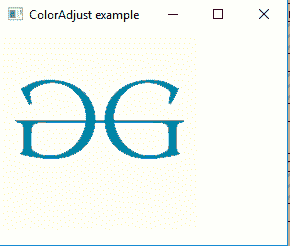
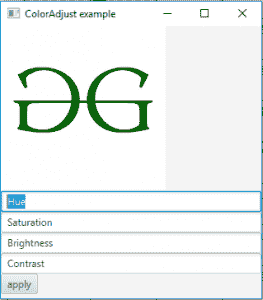
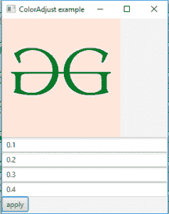

# JavaFX | ColorAdjust 类

> 原文:[https://www.geeksforgeeks.org/javafx-coloradjust-class/](https://www.geeksforgeeks.org/javafx-coloradjust-class/)

ColorAdjust 类是 JavaFX 的一部分。颜色调整类允许对色调、饱和度、亮度和对比度进行逐像素调整。颜色调整类继承效果类。
**类的构造函数:**

1.  **颜色调整()**:创建颜色调整类的新对象
2.  **颜色调整(双色调、双饱和度、双亮度、双对比度)**:用指定的色调、饱和度、亮度和对比度值创建颜色调整类的新对象。

**常用方法:**

<figure class="table">

| 方法 | 说明 |
| --- | --- |
| getBrightness() | 返回颜色调整效果的亮度值 |
| 设置亮度(双 v) | 设置颜色调整效果的亮度值 |
| getHue() | 返回颜色调整效果的色调值 |
| setHue(双 v) | 设置颜色调整效果的色调值 |
| getContrast() | 返回颜色调整效果的对比度值 |
| setContrast(双 v) | 设置颜色调整效果的对比度值 |
| getSaturation() | 返回颜色饱和度的值调整效果 |
| setsaturation(双 v) | 设置颜色调整效果的饱和度值 |
| getInput() | 返回属性输入的值 |
| 设置输入(效果五) | 设置属性输入的值 |

</figure>

下面的程序说明了 ColorAdjust 类的使用:

1.  **Java 程序，对指定色调、亮度、对比度和饱和度的图像应用颜色调整效果:**在该程序中，创建一个*文件输入流*，并从文件中获取图像作为输入。名为*的图像*是使用来自文件输入流的输入创建的。从图像中创建*图像视图对象*，并将其添加到 *VBox* 中。然后 *VBox* 被添加到场景中，场景被添加到舞台中。创建*颜色调整*效果，使用功能*设置色调()*、*设置亮度()*、*设置饱和度()*、*设置对比度()*设置色调、饱和度、对比度和亮度的值，并使用*设置效果()*功能将效果设置为图像视图。

## Java 语言(一种计算机语言，尤用于创建网站)

```
// Java Program to apply color Adjust effect
// to a image with specified hue, brightness,
// contrast and Saturation
import javafx.application.Application;
import javafx.scene.Scene;
import javafx.scene.control.*;
import javafx.scene.layout.*;
import javafx.stage.Stage;
import javafx.scene.image.*;
import javafx.scene.effect.*;
import java.io.*;
import javafx.event.ActionEvent;
import javafx.event.EventHandler;
import javafx.scene.Group;

public class ColorAdjust_1 extends Application {

    // launch the application
    public void start(Stage stage) throws Exception
    {

        // set title for the stage
        stage.setTitle("ColorAdjust example");

        // create a input stream
        FileInputStream input = new FileInputStream("f:\\gfg.png");

        // create a image
        Image image = new Image(input);

        // create a image View
        ImageView imageview = new ImageView(image);

        // create a ColorAdjust effect
        ColorAdjust color_adjust = new ColorAdjust();

        // set hue, saturation, brightness, and contrast
        color_adjust.setHue(0.4);
        color_adjust.setBrightness(0.6);
        color_adjust.setContrast(0.8);
        color_adjust.setSaturation(0.1);

        // set effect
        imageview.setEffect(color_adjust);

        // create a VBox
        VBox vbox = new VBox(imageview);

        // create a scene
        Scene scene = new Scene(vbox, 200, 200);

        // set the scene
        stage.setScene(scene);

        stage.show();
    }

    // Main Method
    public static void main(String args[])
    {

        // launch the application
        launch(args);
    }
}
```

1.  **输入图像:**


1.  **输出:**



1.  **将色彩调整效果应用于具有色调、亮度、对比度和饱和度的图像的 Java 程序被作为来自用户的输入(使用文本字段):**在该程序中，创建一个*文件输入流*，并且图像被作为来自文件的输入。名为*的图像*是使用来自文件输入流的输入创建的。从图像中，创建一个*图像视图对象*，并将其添加到 *VBox* 中。然后 *VBox* 被添加到场景中，场景被添加到舞台中。创建*颜色调整*效果，使用功能*设置色调()*、*设置亮度()*、*设置饱和度()*、*设置对比度()*设置色调、饱和度、对比度和亮度的值，并使用*设置效果()*功能将效果设置为图像视图。我们将创建四个文本字段(色调、饱和度、对比度和亮度)和一个按钮按钮。用户将给出必要的色调、饱和度、对比度和亮度值，当按下按钮时，这些值将应用于图像。创建*事件处理程序*来处理按钮事件。

## Java 语言(一种计算机语言，尤用于创建网站)

```
// Java Program to apply color Adjust effect
// to a image with hue, brightness, contrast
// and Saturation taken as input from from user
import javafx.application.Application;
import javafx.scene.Scene;
import javafx.scene.control.*;
import javafx.scene.layout.*;
import javafx.stage.Stage;
import javafx.scene.image.*;
import javafx.scene.effect.*;
import java.io.*;
import javafx.event.ActionEvent;
import javafx.event.EventHandler;
import javafx.scene.Group;

public class ColorAdjust_2 extends Application {

// launch the application
public void start(Stage stage) throws Exception
{

    // set title for the stage
    stage.setTitle("ColorAdjust example");

    // textfields
    TextField hue, saturation, brightness, contrast;

    // create the textFields
    hue = new TextField("Hue");
    saturation = new TextField("Saturation");
    brightness = new TextField("Brightness");
    contrast = new TextField("Contrast");

    // create a input stream
    FileInputStream input = new FileInputStream("f:\\gfg.png");

    // create a image
    Image image = new Image(input);

    // create a image View
    ImageView imageview = new ImageView(image);

    // create a ColorAdjust effect
    ColorAdjust color_adjust = new ColorAdjust();

    // create a button
    Button button = new Button("apply");

    // action event
    EventHandler<ActionEvent> event = new EventHandler<ActionEvent>() {
        public void handle(ActionEvent e)
        {
            // set the hue, brightness, contrast and saturation
            color_adjust.setHue(Double.parseDouble(hue.getText()));

            color_adjust.setBrightness(Double.parseDouble(
                                     brightness.getText()));

            color_adjust.setContrast(Double.parseDouble(
                                    contrast.getText()));

            color_adjust.setSaturation(Double.parseDouble(
                                     saturation.getText()));
        }
    };

    // set on action of button
    button.setOnAction(event);

    // set effect
    imageview.setEffect(color_adjust);

    // create a VBox
    VBox vbox = new VBox(imageview, hue, saturation,
                    brightness, contrast, button);

    // create a scene
    Scene scene = new Scene(vbox, 200, 400);

    // set the scene
    stage.setScene(scene);

    stage.show();
}

// Main Method
public static void main(String args[])
{

    // launch the application
    launch(args);
}
}
```

1.  **输入图像:**


1.  **输出:**





**注意:**上述程序可能无法在在线 IDE 中运行。请使用离线编译器。
**参考:**[https://docs . Oracle . com/javase/8/JavaFX/API/JavaFX/scene/effect/coloradjust . html](https://docs.oracle.com/javase/8/javafx/api/javafx/scene/effect/ColorAdjust.html)