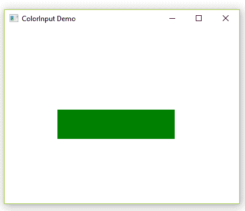

# JavaFX | ColorInput 类

> 原文:[https://www.geeksforgeeks.org/javafx-colorinput-class/](https://www.geeksforgeeks.org/javafx-colorinput-class/)

ColorInput 类是 JavaFX 的一部分。它用于创建一个效果，渲染一个矩形区域，填充给定的颜色。这相当于将一个填充的矩形渲染到图像中，并使用 ImageInput 效果，只是它更方便，而且效率可能更高。它主要作为输入传递到其他效果中。

**类的构造函数:**

1.  **颜色输入()**:使用默认参数创建颜色输入的新实例。
2.  **ColorInput(双 x，双 y，双宽度，双高度，Paint paint)** :使用指定的 x，y，宽度，高度和 Paint 创建 ColorInput 的新实例。

**常用方法:**

| 方法 | 描述 |
| --- | --- |
| getX（） | 获取属性 x 的值。 |
| --- | --- |
| 盖蒂（） | 获取属性 y 的值。 |
| --- | --- |
| 设置高度(双精度值) | 设置属性高度的值 |
| --- | --- |
| 设定油漆(油漆值) | 设置属性绘制的值。 |
| --- | --- |
| 设置宽度(双精度值) | 设置属性宽度的值。 |
| --- | --- |
| setX(双值) | 设置属性 x 的值。 |
| --- | --- |
| setY(双数值) | 设置属性 y 的值。 |
| --- | --- |
| getHeight（） | 获取属性高度的值。 |
| --- | --- |
| getPaint() | 获取属性 paint 的值。 |
| --- | --- |
| getWidth（） | 获取属性宽度的值 |
| --- | --- |

1.  **Java program to Demonstrate ColorInput class:** In this program, *ColorInput Effect* is created and then we set the color, height, width, and coordinates of the region of ColorInput. A group object and scene object is created. A scene is added to the stage and then we set the title of the stage.

    ```java
    // Java program to Demonstrate ColorInput class
    import javafx.application.Application;
    import javafx.scene.Group;
    import javafx.scene.Scene;
    import javafx.scene.effect.ColorInput;
    import javafx.scene.paint.Color;
    import javafx.scene.shape.Rectangle;
    import javafx.stage.Stage;

    public class ColorInputDemo extends Application {

        // Main Method 
        public static void main(String[] args)
        {

            // launch the application
            launch(args);
        }

        // launch the application
        public void start(Stage primaryStage) throws Exception
        {

            // Instantiating the ColorInput class
            ColorInput color = new ColorInput();

            // set the color
            color.setPaint(Color.GREEN);

            // sets the height of the region of color input
            color.setHeight(50);

            // sets the width of the region of color input
            color.setWidth(200);

            // set the coordinates of the Colorinput
            color.setX(90);
            color.setY(140);

            // create a rectangle
            Rectangle rect = new Rectangle();

            // applying coloradjust effect
            rect.setEffect(color);

            // create a group object
            Group root = new Group();

            // create a scene object
            Scene scene = new Scene(root, 400, 300);

            root.getChildren().add(rect);

            // adding scene to the stage
            primaryStage.setScene(scene);

            // set title of the stage
            primaryStage.setTitle("ColorInput Demo");

            primaryStage.show();
        }
    }
    ```

    **输出:**

    

2.  **Java program to apply ColorInput class to the created rectangle by clicking on the button using EventHandler:** In this program, we first set the Height, Width, and coordinates of a rectangle and then create a rectangle of the same dimension. Now, create a Button and set the Layouts of the Button. Now, using EventHandler, first, instantiate a ColorInput class using proper dimension and then set ColorInput Effect to the Button. Create a group object and add Button and rectangle to it. Then Create a Scene and add it to the stage.

    ```java
    // Java program to apply ColorInput class to 
    // the created rectangle by clicking on the 
    // button using EventHandler
    import javafx.application.Application;
    import javafx.event.ActionEvent;
    import javafx.event.EventHandler;
    import javafx.scene.Group;
    import javafx.scene.Scene;
    import javafx.scene.control.Button;
    import javafx.scene.effect.ColorInput;
    import javafx.scene.paint.Color;
    import javafx.scene.shape.Rectangle;
    import javafx.stage.Stage;

    public class ColorInputExample extends Application {

        public void start(Stage stage)
        {

            double x = 10;
            double y = 10;
            double w = 40;
            double h = 180;

            // Rectangle
            Rectangle rect = new Rectangle(x, y, w, h);
            rect.setFill(Color.WHITE);
            rect.setStrokeWidth(1);
            rect.setStroke(Color.BLACK);

            // Button
            Button button = new Button("Click To See the Effects!");

            // set button layout coordinates
            button.setLayoutX(100);
            button.setLayoutY(30);

            button.setPrefSize(250, 150);

            button.setOnAction(new EventHandler<ActionEvent>() {

                public void handle(ActionEvent event)
                {
                    // instantiating the colorinput class
                    ColorInput colorInput = new ColorInput(x, y, 
                                         w, h, Color.STEELBLUE);

                    // Setting ColorInput effect
                    button.setEffect(colorInput);
                }
            });

            // create the Group object
            Group root = new Group();

            root.getChildren().addAll(button, rect);

            Scene scene = new Scene(root, 450, 300);
            stage.setTitle("JavaFX ColorInput Effect");
            stage.setScene(scene);

            stage.show();
        }

        // Main Method
        public static void main(String args[])
        {

            // Launch the application
            launch(args);
        }
    }
    ```

    **输出:**

    <video class="wp-video-shortcode" id="video-221408-1" width="640" height="360" preload="metadata" controls=""><source type="video/mp4" src="https://media.geeksforgeeks.org/wp-content/uploads/ColorInput.mp4?_=1">[https://media.geeksforgeeks.org/wp-content/uploads/ColorInput.mp4](https://media.geeksforgeeks.org/wp-content/uploads/ColorInput.mp4)</video>

**注意:**上述程序可能无法在在线 IDE 中运行。请使用离线编译器。

**参考:**[https://docs . Oracle . com/JavaFX/2/API/JavaFX/scene/effect/color input . html](https://docs.oracle.com/javafx/2/api/javafx/scene/effect/ColorInput.html)