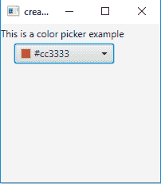
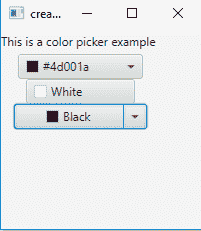
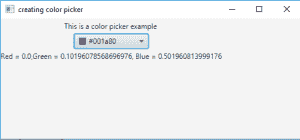

# JavaFx | ColorPicker 带示例

> 原文:[https://www . geesforgeks . org/JavaFX-color picker-with-examples/](https://www.geeksforgeeks.org/javafx-colorpicker-with-examples/)

ColorPicker 是 JavaFX 的一部分。颜色选择器允许用户从给定的一组颜色中选择一种颜色，或者自定义颜色。可以使用 setValue()函数设置初始颜色，或者在构造函数中定义它，用户选择的颜色可以使用 getValue()函数找到。
当用户从颜色选择器中选择一种颜色时，会生成一个 Action 事件。此事件可以使用事件处理程序来处理。

**拾色器外观有三种控制方式:**

*   简单的按钮模式*   菜单按钮模式*   A split menu button mode

    **该类的构造函数为:**

    1.  **颜色选择器()**:创建一个默认的颜色选择器实例，所选颜色设置为白色。
    2.  **颜色选择器(颜色 c)** :创建一个颜色选择器实例，并将选定的颜色设置为给定的颜色。

    **常用方法**:

    | 方法 | 说明 |
    | --- | --- |
    | **getCustomColors()** | 获取用户添加到调色板的自定义颜色列表。 |
    | **setValue(颜色 c)** | 将拾色器的颜色设置为 c 色 |
    | **getValue（）** | 返回一个 color 对象，该对象定义用户选择的颜色 |

    以下程序将说明拾色器的使用:

    1.  **Program to create a color picker and add it to the stage:** This program creates a ColorPicker indicated by the name *cp*. The color picker will be created inside a scene, which in turn will be hosted inside a stage (which is the top level JavaFX container). The function setTitle() is used to provide title to the stage.Then a tile-pane is created, on which addChildren() method is called to attach the color picker inside the scene, along with the resolution specified by (200, 200) in the code. Finally, the show() method is called to display the final results.

        ```java
        // Java Program to create a color picker and add it to the stage
        import javafx.application.Application;
        import javafx.scene.Scene;
        import javafx.scene.control.*;
        import javafx.scene.layout.*;
        import javafx.event.ActionEvent;
        import javafx.event.EventHandler;
        import javafx.collections.*;
        import javafx.stage.Stage;
        import javafx.scene.text.Text.*;
        import javafx.scene.paint.*;
        import javafx.scene.text.*;
        public class colorpicker extends Application {
            // labels
            Label l;

            // launch the application
            public void start(Stage s)
            {
                // set title for the stage
                s.setTitle("creating color picker");

                // create a tile pane
                TilePane r = new TilePane();

                // create a label
                l = new Label("This is a color picker example ");

                // create a color picker
                ColorPicker cp = new ColorPicker(Color.BLUE);

                // add label
                r.getChildren().add(l);
                r.getChildren().add(cp);

                // create a scene
                Scene sc = new Scene(r, 200, 200);

                // set the scene
                s.setScene(sc);

                s.show();
            }

            public static void main(String args[])
            {
                // launch the application
                launch(args);
            }
        }
        ```

        **输出:**
        

    2.  **Program to create color picker of three different appearance:** This program creates a ColorPicker indicated by the name cp, cp1, cp2\. *cp* will have the appearance of menu button, cp1 will have the appearance of button and cp2 will have the appearance of the split button. The color pickers will be created inside a scene, which in turn will be hosted inside a stage (which is the top level JavaFX container). The function setTitle() is used to provide title to the stage. Then a tile-pane is created, on which addChildren() method is called to attach the color picker inside the scene, along with the resolution specified by (200, 200) in the code. Finally, the show() method is called to display the final results.

        ```java
        // Java Program to create color picker of three different appearance
        import javafx.application.Application;
        import javafx.scene.Scene;
        import javafx.scene.control.*;
        import javafx.scene.layout.*;
        import javafx.event.ActionEvent;
        import javafx.event.EventHandler;
        import javafx.collections.*;
        import javafx.stage.Stage;
        import javafx.scene.text.Text.*;
        import javafx.scene.paint.*;
        import javafx.scene.text.*;
        public class colorpicker_1 extends Application {
            // labels
            Label l;

            // launch the application
            public void start(Stage s)
            {
                // set title for the stage
                s.setTitle("creating color picker");

                // create a tile pane
                TilePane r = new TilePane();

                // create a label
                l = new Label("This is a color picker example ");

                // create a color picker
                ColorPicker cp = new ColorPicker(Color.BLUE);

                // create a color picker
                ColorPicker cp1 = new ColorPicker(Color.BLUE);

                // set the appearance of color picker to  button
                cp1.getStyleClass().add("button");

                // create a color picker
                ColorPicker cp2 = new ColorPicker(Color.BLUE);

                // set the appearance of color picker to split button
                cp2.getStyleClass().add("split-button");

                // add label
                r.getChildren().add(l);
                r.getChildren().add(cp);
                r.getChildren().add(cp1);
                r.getChildren().add(cp2);

                // create a scene
                Scene sc = new Scene(r, 200, 200);

                // set the scene
                s.setScene(sc);

                s.show();
            }

            public static void main(String args[])
            {
                // launch the application
                launch(args);
            }
        }
        ```

        **输出** :
        

    3.  **Program to create color picker and add a listener to it:** This program creates a ColorPicker indicated by the name cp .we will create an event hab=ndler and a label l2 that will show the color selected by the user. The event handler will handle the events of the colorpicker and will set the text of the label l2 to the RGB value of the color selected. The event will be associated with the color picker using setOnAction() method. The color pickers will be created inside a scene, which in turn will be hosted inside a stage (which is the top level JavaFX container). The function setTitle() is used to provide title to the stage. Then a tile-pane is created, on which addChildren() method is called to attach the color picker inside the scene, along with the resolution specified by (200, 200) in the code. Finally, the show() method is called to display the final results.

        ```java
        // Java Program to create  color picker and add listener to it
        import javafx.application.Application;
        import javafx.scene.Scene;
        import javafx.scene.control.*;
        import javafx.scene.layout.*;
        import javafx.event.ActionEvent;
        import javafx.event.EventHandler;
        import javafx.collections.*;
        import javafx.stage.Stage;
        import javafx.scene.text.Text.*;
        import javafx.scene.paint.*;
        import javafx.scene.text.*;
        public class colorpicker_2 extends Application {
            // labels
            Label l;

            // launch the application
            public void start(Stage s)
            {
                // set title for the stage
                s.setTitle("creating color picker");

                // create a tile pane
                TilePane r = new TilePane();

                // create a label
                l = new Label("This is a color picker example ");
                Label l1 = new Label("no selected color ");

                // create a color picker
                ColorPicker cp = new ColorPicker();

                // create a event handler
                EventHandler<ActionEvent> event = new EventHandler<ActionEvent>() {
                    public void handle(ActionEvent e)
                    {
                        // color
                        Color c = cp.getValue();

                        // set text of the label to RGB value of color
                        l1.setText("Red = " + c.getRed() + ", Green = " + c.getGreen() 
                                                         + ", Blue = " + c.getBlue());
                    }
                };

                // set listener
                cp.setOnAction(event);

                // add label
                r.getChildren().add(l);
                r.getChildren().add(cp);
                r.getChildren().add(l1);

                // create a scene
                Scene sc = new Scene(r, 500, 200);

                // set the scene
                s.setScene(sc);

                s.show();
            }

            public static void main(String args[])
            {
                // launch the application
                launch(args);
            }
        }
        ```

        **输出** :
        

        **注意:**上述程序可能无法在联机 IDE 中运行，请使用脱机编译器。
        **参考:**[https://docs . Oracle . com/javase/8/JavaFX/API/JavaFX/scene/control/color picker . html](https://docs.oracle.com/javase/8/javafx/api/javafx/scene/control/ColorPicker.html)