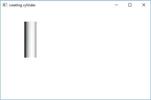
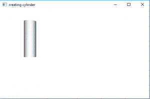

# JavaFX |带示例的圆柱体

> 原文:[https://www . geesforgeks . org/JavaFX-带示例的圆柱体/](https://www.geeksforgeeks.org/javafx-cylinder-with-examples/)

柱面是 JavaFX 的一部分。圆柱体类用于创建指定高度和半径的三维圆柱体。圆柱体以原点为中心。

**该类的构造函数为**

1.  **圆柱体()**:创建半径为 1.0、高度为 2.0 的圆柱体的新实例。
2.  **圆柱体(双 r，双 h)** :创建给定半径和高度的圆柱体的新实例。
3.  **圆柱体(双 r，双 h，int div)** :创建给定半径、高度和分割的圆柱体的新实例

**常用方法**

<figure class="table">

| 方法 | 说明 |
| --- | --- |
| **getHeight（）** | 返回圆柱体的高度 |
| **行道()** | 返回圆柱体底部的半径 |
| **setHeight(double v)** | 设置圆柱体的高度 |
| **setRadius(double v)** | 设置圆柱体的半径 |

</figure>

**Java 程序创建一个圆柱体并将其添加到舞台**

这个程序创建一个由圆柱体名称(高度和半径作为参数传递)表示的圆柱体。圆柱体将在场景中创建，而场景又将在舞台中托管。函数 setTitle()用于为舞台提供标题。然后创建一个组，并附着圆柱体。这个小组附属于现场。最后，调用 show()方法显示最终结果。

## Java 语言(一种计算机语言，尤用于创建网站)

```java
// Java program to create a cylinder
// and add it to the stage
import javafx.application.Application;
import javafx.scene.Scene;
import javafx.scene.shape.DrawMode;
import javafx.scene.layout.*;
import javafx.event.ActionEvent;
import javafx.scene.shape.Cylinder;
import javafx.scene.control.*;
import javafx.stage.Stage;
import javafx.scene.Group;
public class cylinder_0 extends Application {

    // launch the application
    public void start(Stage stage)
    {
        // set title for the stage
        stage.setTitle("creating cylinder");

        // create a cylinder
        Cylinder cylinder = new Cylinder(20.0f, 120.0f);

        // create a Group
        Group group = new Group(cylinder);

        // translate the cylinder to a position
        cylinder.setTranslateX(100);
        cylinder.setTranslateY(100);

        // create a scene
        Scene scene = new Scene(group, 500, 300);

        // set the scene
        stage.setScene(scene);

        stage.show();
    }

    public static void main(String args[])
    {
        // launch the application
        launch(args);
    }
}
```

**输出:**



**Java 程序创建一个圆柱体并给它添加一个透视相机**

这个程序创建一个由圆柱名称表示的圆柱(高度和半径作为参数传递)。圆柱体将在场景中创建，而场景又将在舞台中托管。函数 setTitle()用于为舞台提供标题。然后创建一个组，并附着圆柱体。这个小组附属于现场。最后，调用 show()方法显示最终结果。将创建一个透视相机并将其添加到场景中，以 3D 方式渲染圆柱体。

## Java 语言(一种计算机语言，尤用于创建网站)

```java
// Java program to create a cylinder and add a perspective camera to it .
import javafx.application.Application;
import javafx.scene.Scene;
import javafx.scene.shape.DrawMode;
import javafx.scene.layout.*;
import javafx.event.ActionEvent;
import javafx.scene.shape.Cylinder;
import javafx.scene.control.*;
import javafx.stage.Stage;
import javafx.scene.Group;
import javafx.scene.PerspectiveCamera;
public class cylinder_1 extends Application {

    // launch the application
    public void start(Stage stage)
    {
        // set title for the stage
        stage.setTitle("creating cylinder");

        // create a cylinder
        Cylinder cylinder = new Cylinder(20.0f, 120.0f);

        // create a Group
        Group group = new Group(cylinder);

        // translate the cylinder to a position
        cylinder.setTranslateX(100);
        cylinder.setTranslateY(100);

        // create a perspective camera
        PerspectiveCamera camera = new PerspectiveCamera(false);
        camera.setTranslateX(0);
        camera.setTranslateY(0);
        camera.setTranslateZ(0);

        // create a scene
        Scene scene = new Scene(group, 500, 300);

        scene.setCamera(camera);

        // set the scene
        stage.setScene(scene);

        stage.show();
    }

    public static void main(String args[])
    {
        // launch the application
        launch(args);
    }
}
```

**输出:**



**注意:以上程序可能无法在在线 IDE 中运行，请使用离线编译器**

**参考:**

[https://docs . Oracle . com/javase/8/JavaFX/API/JavaFX/scene/shape/cylinder . html](https://docs.oracle.com/javase/8/javafx/api/javafx/scene/shape/Cylinder.html)