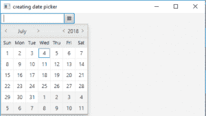

# JavaFX |带示例的日期选择器

> 原文:[https://www . geesforgeks . org/JavaFX-datepicker-with-examples/](https://www.geeksforgeeks.org/javafx-datepicker-with-examples/)

DatePicker 是 JavaFX 包的一部分，DatePicker 允许从弹出日历中选择日期，或者在日期选择器的文本字段中手动键入文本。

**日期选择器类的构造函数是:**

1.  **日期选择器()**:使用空日期值集创建默认日期选择器实例。
2.  **日期选择器(LocalDate l)** :创建一个日期选择器实例，并将该值设置为给定的日期。

**常用方法:**

| 方法 | 说明 |
| --- | --- |
| **get 年表()** | 获取属性年表的值。 |
| get editor() | 返回日期选择器的文本编辑器 |
| **isShowWeekNumbers（）** | 返回是否显示周数 |
| **设置年表(年表 v)** | 设置属性年表的值。 |
| **setShowWeekNumbers（boolean v）** | 如果真值作为参数传递，则设置日期选择器显示周数 |

以下程序说明了日期选择器类:

1.  **Program to create a date picker and display it in stage:** This program creates a Date Picker indicated by the name *d*. The DatePicker will be created inside a scene, which in turn will be hosted inside a stage. The function setTitle() is used to provide title to the stage. Then a tile pane is created, on which addChildren() method is called to attach the button inside the scene. Finally, the show() method is called to display the final results.

    ```java
    // Java Program to create a date picker
    // and display it in stage
    import javafx.application.Application;
    import javafx.scene.Scene;
    import javafx.scene.control.Button;
    import javafx.scene.layout.*;
    import javafx.event.ActionEvent;
    import javafx.event.EventHandler;
    import javafx.scene.control.*;
    import javafx.stage.Stage;
    import javafx.scene.control.Alert.AlertType;
    import java.time.LocalDate;
    public class date_picker_1 extends Application {

        // launch the application
        public void start(Stage s)
        {
            // set title for the stage
            s.setTitle("creating date picker");

            // create a tile pane
            TilePane r = new TilePane();

            // create a date picker
            DatePicker d = new DatePicker();

            // add button and label
            r.getChildren().add(d);

            // create a scene
            Scene sc = new Scene(r, 200, 200);

            // set the scene
            s.setScene(sc);

            s.show();
        }

        public static void main(String args[])
        {
            // launch the application
            launch(args);
        }
    }
    ```

    **输出:**
    

2.  **Program to create a date picker and create a label to show the date:** This program creates a DatePicker indicated by the name *d*. The Date Picker will be created inside a scene, which in turn will be hosted inside a stage. We would create a label to show which date is choosed. The function setTitle() is used to provide title to the stage. Then a tile pane is created, on which addChildren() method is called to attach the button and label inside the scene. Finally, the show() method is called to display the final results.we would create an event handler to handle the date picker events. The event handler would be added to the button using setOnAction() function.The setShowWeekNumbers() will set the date picker to show week number of respective weeks.

    ```java
    // Java Program to create a date picker
    // and create a label to show the date
    import javafx.application.Application;
    import javafx.scene.Scene;
    import javafx.scene.control.Button;
    import javafx.scene.layout.*;
    import javafx.event.ActionEvent;
    import javafx.event.EventHandler;
    import javafx.scene.control.*;
    import javafx.stage.Stage;
    import javafx.scene.control.Alert.AlertType;
    import java.time.*;
    import java.time.chrono.*;
    public class date_picker_2 extends Application {

        // launch the application
        public void start(Stage s)
        {
            // set title for the stage
            s.setTitle("creating date picker");

            // create a tile pane
            TilePane r = new TilePane();

            // label to show the date
            Label l = new Label("no date selected");

            // create a date picker
            DatePicker d = new DatePicker();

            // action event
            EventHandler<ActionEvent> event = new EventHandler<ActionEvent>() {
                public void handle(ActionEvent e)
                {
                    // get the date picker value
                    LocalDate i = d.getValue();

                    // get the selected date
                    l.setText("Date :" + i);
                }
            };

            // show week numbers
            d.setShowWeekNumbers(true);

            // when datePicker is pressed
            d.setOnAction(event);

            // add button and label
            r.getChildren().add(d);
            r.getChildren().add(l);

            // create a scene
            Scene sc = new Scene(r, 200, 200);

            // set the scene
            s.setScene(sc);

            s.show();
        }

        public static void main(String args[])
        {
            // launch the application
            launch(args);
        }
    }
    ```

    **输出:**
    

    **注意:**上述程序可能无法在联机 IDE 中运行，请使用脱机 IDE。

    **参考:**[https://docs . Oracle . com/javase/8/JavaFX/API/JavaFX/scene/control/datepicker . html](https://docs.oracle.com/javase/8/javafx/api/javafx/scene/control/DatePicker.html)