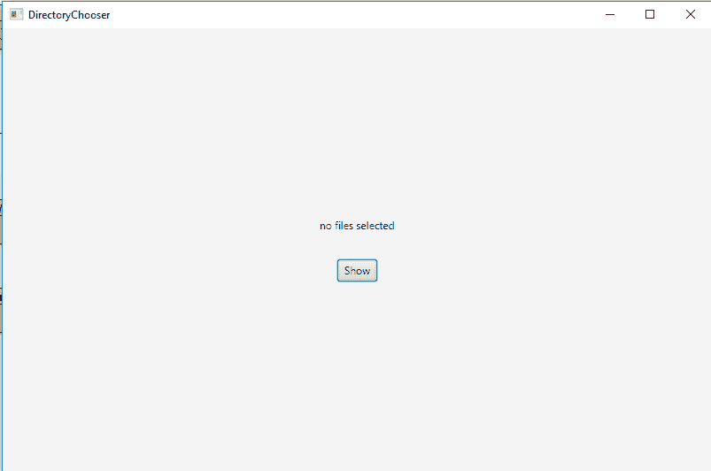
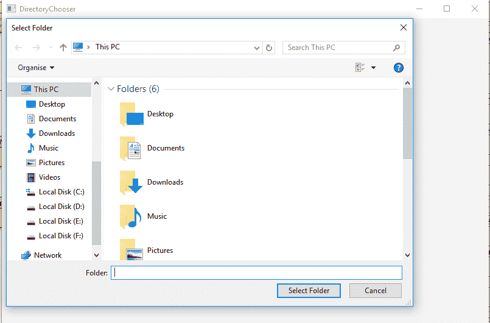
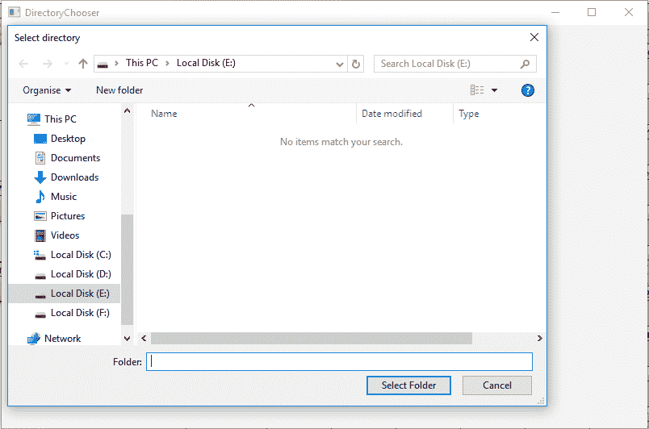

# JavaFX |目录选择器类

> 原文:[https://www . geesforgeks . org/JavaFX-directorychouser-class/](https://www.geeksforgeeks.org/javafx-directorychooser-class/)

DirectoryChooser 类是 JavaFX 的一部分。目录选择器类显示了一个目录选择器对话框，允许用户选择一个特定的目录。打开目录对话框可能总是导致无操作，即返回空文件。目录选择器类继承对象类。

**该类的构造函数:**

*   **目录选择器()**:创建目录选择器的新对象。

**常用方法:**

| 方法 | 说明 |
| --- | --- |
| getInitialDirectory() | 返回目录选择器的初始目录。 |
| getTitle（） | 返回目录选择器的标题。 |
| setnitialdirectory(val 文件) | 设置属性 initialDirectory 的值 |
| setTitle（String t） | 设置目录选择器的标题。 |
| 显示对话框(带窗口) | 显示新的目录选择对话框。 |

以下程序说明了目录选择器类的使用:

1.  **Java Program to create DirectoryChooser and add it to the stage:** In this program we will create a directory chooser named *dir_chooser*. Create a Label named *label* and a Button named *button*. Create an EventHandler to handle the events when the button pressed. When the button pressed, a directory chooser dialog appears and the selected directory is shown as text in the *label*. Add the label and the button to *Vbox* and add the *VBox* to the Scene and add the scene to the stage, and call the *show()* function to display the final results.

    ```java
    // Java Program to create DirectoryChooser
    // and add it to the stage
    import javafx.application.Application;
    import javafx.scene.Scene;
    import javafx.scene.control.*;
    import javafx.scene.layout.*;
    import javafx.stage.Stage;
    import javafx.geometry.*;
    import javafx.scene.paint.*;
    import javafx.scene.canvas.*;
    import javafx.scene.text.*;
    import javafx.scene.Group;
    import javafx.scene.shape.*;
    import javafx.event.ActionEvent;
    import javafx.event.EventHandler;
    import javafx.collections.*;
    import java.io.*;
    import javafx.stage.DirectoryChooser;

    public class DirectoryChooser_1 extends Application {

        // launch the application
        public void start(Stage stage)
        {

            try {

                // set title for the stage
                stage.setTitle("DirectoryChooser");

                // create a Directory chooser
                DirectoryChooser dir_chooser = new DirectoryChooser();

                // create a Label
                Label label = new Label("no files selected");

                // create a Button
                Button button = new Button("Show");

                // create an Event Handler
                EventHandler<ActionEvent> event = 
                new EventHandler<ActionEvent>() {

                    public void handle(ActionEvent e)
                    {

                        // get the file selected
                        File file = dir_chooser.showDialog(stage);

                        if (file != null) {
                            label.setText(file.getAbsolutePath() + "  selected");
                        }
                    }
                };

                button.setOnAction(event);

                // create a VBox
                VBox vbox = new VBox(30, label, button);

                // set Alignment
                vbox.setAlignment(Pos.CENTER);

                // create a scene
                Scene scene = new Scene(vbox, 800, 500);

                // set the scene
                stage.setScene(scene);

                stage.show();
            }

            catch (Exception e) {

                System.out.println(e.getMessage());
            }
        }

        // Main Method
        public static void main(String args[])
        {

            // launch the application
            launch(args);
        }
    }
    ```

    **输出:**

    

    

2.  **Java Program to create DirectoryChooser, set title, initial directory and add it to the stage:** In this program we will create a directory chooser named *dir_chooser*. Create a Label named *label* and a Button named *button*. Set the title and initial directory of directory chooser using the *setTitle()* and *setInitialDirectory()* function. We will create a EventHandler to handle the events when the button is pressed. When the button is pressed a directory chooser dialog appears and the selected directory is shown as text in the *label*. Add the label and the button to *Vbox* and add the *VBox* to the Scene and add the scene to the stage, and call the *show()* function to display the final results.

    ```java
    // Java Program to create DirectoryChooser,
    // set title, initial directory
    // and add it to the stage
    import javafx.application.Application;
    import javafx.scene.Scene;
    import javafx.scene.control.*;
    import javafx.scene.layout.*;
    import javafx.stage.Stage;
    import javafx.geometry.*;
    import javafx.scene.paint.*;
    import javafx.scene.canvas.*;
    import javafx.scene.text.*;
    import javafx.scene.Group;
    import javafx.scene.shape.*;
    import javafx.event.ActionEvent;
    import javafx.event.EventHandler;
    import javafx.collections.*;
    import java.io.*;
    import javafx.stage.DirectoryChooser;

    public class DirectoryChooser_2 extends Application {

        // launch the application
        public void start(Stage stage)
        {

            try {

                // set title for the stage
                stage.setTitle("DirectoryChooser");

                // create a Directory chooser
                DirectoryChooser dir_chooser = 
                       new DirectoryChooser();

                // set title
                dir_chooser.setTitle("Select directory");

                // set initial directory
                dir_chooser.setInitialDirectory(new File("e:\\"));

                // create a Label
                Label label = new Label("no files selected");

                // create a Button
                Button button = new Button("Show");

                // create an Event Handler
                EventHandler<ActionEvent> event =
                new EventHandler<ActionEvent>() {

                    public void handle(ActionEvent e)
                    {
                        // get the file selected
                        File file = dir_chooser.showDialog(stage);

                        if (file != null) {
                            label.setText(file.getAbsolutePath() + "  selected");
                        }
                    }
                };

                button.setOnAction(event);

                // create a VBox
                VBox vbox = new VBox(30, label, button);

                // set Alignment
                vbox.setAlignment(Pos.CENTER);

                // create a scene
                Scene scene = new Scene(vbox, 800, 500);

                // set the scene
                stage.setScene(scene);

                stage.show();
            }

            catch (Exception e) {

                System.out.println(e.getMessage());
            }
        }

        // Main Method
        public static void main(String args[])
        {

            // launch the application
            launch(args);
        }
    }
    ```

    **输出:**

    

    

**注意:**上述程序可能无法在联机 IDE 中运行，请使用脱机编译器。

**参考:**[https://docs . Oracle . com/javase/8/JavaFX/API/JavaFX/stage/directorychooser . html](https://docs.oracle.com/javase/8/javafx/api/javafx/stage/DirectoryChooser.html)