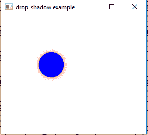
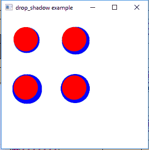

# JavaFX | DropShadow 类

> 原文:[https://www.geeksforgeeks.org/javafx-dropshadow-class/](https://www.geeksforgeeks.org/javafx-dropshadow-class/)

DropShadow 类是 JavaFX 的一部分。DropShadow 类创建一个高级效果，以指定的半径、扩散、模糊类型和偏移量呈现内容后面的对象的阴影。DropShadow 类继承*效果*类。

**类的构造函数:**

1.  **DropShadow()** :创建 DropShadow 的新对象。
2.  **DropShadow(BlurType blurType，Color color，double radius，double spread，double offsetX，double offsetY)** :用指定的值 BlurType，radius，spread，offsetX，offsetY 创建 DropShadow 的新对象。
3.  **DropShadow(双半径，颜色颜色)**:用指定的半径和颜色值创建 DropShadow 的新对象。
4.  **DropShadow(双半径，双偏移，双偏移，颜色)**:用指定的半径，偏移，偏移和颜色值创建 DropShadow 的新对象。

**常用方法:**

| 方法 | 说明 |
| --- | --- |
| getBlurType() | 返回效果的模糊类型。 |
| 获得颜色 （） | 返回效果的颜色。 |
| getInput() | 返回属性输入的值。 |
| 跟踪半径() | 返回 dropShadow 效果的半径。 |
| 设置模糊类型(模糊类型 v) | 设置 dropShadow 效果的模糊类型。 |
| setColor(颜色 v) | 设置阴影效果的颜色。 |
| 设置输入(效果五) | 设置属性输入的值。 |
| setRadius(双 v) | 设置阴影效果的半径。 |
| setoffsetx(双 v) | 设置 offsetX 的值。 |
| setffsety(double v) | 设置偏移量的值。 |
| getOffsetX() | 返回 offsetX 的值。 |
| getoffsection() | 返回偏移量的值。 |
| getSpread() | 返回投影效果的扩散值。 |
| setSpread(双 v) | 设置投影效果的扩散值。 |

下面的程序说明了 DropShadow 类的使用:

1.  **Java program to create a Circle and add DropShadow effect to it:** In this program we will create a Circle named *circle* and create a DropShadow effect *drop_shadow* with specified radius and color. The DropShadow effect will be added to the circle using the *setEffect()* function and the circle will be added to the group. The circles will be translated to specific position in the stage using *setTranslateX()* and *setTranslateY()* function. The group will be added to the scene and the scene will be added to the stage.

    ```java
    // Java program to create a Circle and
    // add DropShadow effect to it
    import javafx.application.Application;
    import javafx.scene.Scene;
    import javafx.scene.control.*;
    import javafx.scene.layout.*;
    import javafx.stage.Stage;
    import javafx.scene.image.*;
    import javafx.scene.effect.*;
    import java.io.*;
    import javafx.scene.shape.Circle;
    import javafx.scene.paint.Color;
    import javafx.scene.Group;

    public class drop_shadow_1 extends Application {

        // launch the application
        public void start(Stage stage) throws Exception
        {

            // set title for the stage
            stage.setTitle("drop_shadow example");

            // create a circle
            Circle circle = new Circle(50.0f, 50.0f, 25.0f);

            // set fill for circle
            circle.setFill(Color.BLUE);

            // translate to a position
            circle.setTranslateX(50.0f);
            circle.setTranslateY(50.0f);

            // create a drop_shadow effect
            DropShadow drop_shadow = new DropShadow(10, Color.RED);

            // set effect
            circle.setEffect(drop_shadow);

            // create a Group
            Group group = new Group(circle);

            // create a scene
            Scene scene = new Scene(group, 200, 200);

            // set the scene
            stage.setScene(scene);

            stage.show();
        }

        // Main Method
        public static void main(String args[])
        {

            // launch the application
            launch(args);
        }
    }
    ```

    **输出:**

    

2.  **Java program to create four Circles and add DropShadow effect to it, which are of different blur types and different values of offsetX, offsetY and radius:** In this program we will create Circles named *circle*, *circle1*, *circle2*, *circle3* and create a DropShadow effects named *drop_shadow1*, *drop_shadow2*, *drop_shadow3*, *drop_shadow4* with specified radius, color, offsetX, offsetY, spread and blur type. The DropShadow effect will be added to the circle using the *setEffect()* function and the circles will be added to the group. The circles will be translated to specific position in the stage using *setTranslateX()* and *setTranslateY()* function. The group will be added to the scene and the scene will be added to the stage.

    ```java
    // Java program to create four Circles and 
    // add DropShadow effect to it which are of
    // different blur types and different values 
    // of offsetX, offsetY and radius
    import javafx.application.Application;
    import javafx.scene.Scene;
    import javafx.scene.control.*;
    import javafx.scene.layout.*;
    import javafx.stage.Stage;
    import javafx.scene.image.*;
    import javafx.scene.effect.*;
    import java.io.*;
    import javafx.scene.shape.Circle;
    import javafx.scene.paint.Color;
    import javafx.scene.Group;

    public class drop_shadow_2 extends Application {

        // launch the application
        public void start(Stage stage) throws Exception
        {

            // set title for the stage
            stage.setTitle("drop_shadow example");

            // create a circle
            Circle circle = new Circle(0.0f, 0.0f, 25.0f, Color.RED);
            Circle circle1 = new Circle(0.0f, 0.0f, 25.0f, Color.RED);
            Circle circle2 = new Circle(0.0f, 0.0f, 25.0f, Color.RED);
            Circle circle3 = new Circle(0.0f, 0.0f, 25.0f, Color.RED);

            // translate to a position
            circle.setTranslateX(50.0f);
            circle.setTranslateY(50.0f);

            // translate to a position
            circle1.setTranslateX(150.0f);
            circle1.setTranslateY(50.0f);

            // translate to a position
            circle2.setTranslateX(50.0f);
            circle2.setTranslateY(150.0f);

            // translate to a position
            circle3.setTranslateX(150.0f);
            circle3.setTranslateY(150.0f);

            // create drop_shadow effect
            DropShadow drop_shadow1 = new DropShadow(BlurType.values()[0], 
                                         Color.BLUE, 5, 3.0f, 2.0f, 2.0f);

            DropShadow drop_shadow2 = new DropShadow(BlurType.values()[1], 
                                         Color.BLUE, 5, 3.0f, 3.0f, 3.0f);

            DropShadow drop_shadow3 = new DropShadow(BlurType.values()[2], 
                                         Color.BLUE, 5, 4.0f, 3.0f, 3.0f);

            DropShadow drop_shadow4 = new DropShadow(BlurType.values()[3], 
                                         Color.BLUE, 5, 4.0f, 2.0f, 2.0f);

            // set effect
            circle.setEffect(drop_shadow1);
            circle1.setEffect(drop_shadow2);
            circle2.setEffect(drop_shadow3);
            circle3.setEffect(drop_shadow4);

            // create a Group
            Group group = new Group(circle, circle1, circle2, circle3);

            // create a scene
            Scene scene = new Scene(group, 400, 400);

            // set the scene
            stage.setScene(scene);

            stage.show();
        }

        // Main Method
        public static void main(String args[])
        {

            // launch the application
            launch(args);
        }
    }
    ```

    **输出:**

    

**注意:**上述程序可能无法在在线 IDE 中运行。请使用离线编译器。

**参考:**[https://docs . Oracle . com/javase/8/JavaFX/API/JavaFX/场景/效果/DropShadow.html](https://docs.oracle.com/javase/8/javafx/api/javafx/scene/effect/DropShadow.html)