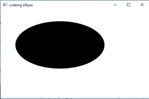
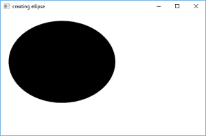
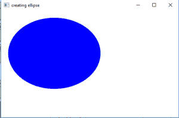

# JavaFX |带示例的椭圆

> 原文:[https://www.geeksforgeeks.org/javafx-ellipse-with-examples/](https://www.geeksforgeeks.org/javafx-ellipse-with-examples/)

椭圆类是 JavaFX 库的一部分。椭圆类通过提供中心以及 X 和 Y 半径来创建椭圆。椭圆类扩展了形状类。

**类的构造函数有:**

1.  **椭圆()**:创建椭圆的空实例
2.  **椭圆(双 X，双 Y)** :用给定的 X 和 Y 半径创建一个椭圆
3.  **椭圆(双 X，双 Y，双 X，双 Y)** :创建具有给定中心和半径的椭圆

**常用方法:**

| 方法 | 说明 |
| --- | --- |
| **get enterx()** | 返回椭圆中心的 X 坐标 |
| **getCenterY()** | 返回椭圆中心的 Y 坐标 |
| **哀悼者()** | 返回 X 半径的值(沿主轴) |
| **抱怨()** | 返回 Y 半径的值(沿短轴) |
| **set enterx(double v)** | 设置椭圆中心的 X 坐标 |
| **设置中心(双 v)** | 设置椭圆中心的 Y 坐标 |
| **setradix(double v)** | 返回 X 半径的值(沿主轴) |
| **setradisy(double v)** | 返回 Y 半径的值(沿短轴) |
| **设置填充(颜色 c)** | 设置椭圆的填充 |

下面的程序将说明椭圆类的使用:

1.  **Java program to create ellipse by passing the coordinates of the center and radius as arguments in constructor:**

    该程序创建一个由名称椭圆指示的椭圆(中心和半径的坐标作为参数传递)。椭圆将在场景内创建，而场景又将在舞台内托管。函数 setTitle()用于为舞台提供标题。然后创建一个组，并附加椭圆。这个小组附属于现场。最后，调用 show()方法显示最终结果。

    ```
    // Java program to create ellipse by passing the
    // coordinates of the center and radius as arguments in constructor
    import javafx.application.Application;
    import javafx.scene.Scene;
    import javafx.scene.control.Button;
    import javafx.scene.layout.*;
    import javafx.event.ActionEvent;
    import javafx.scene.shape.Ellipse;
    import javafx.scene.control.*;
    import javafx.stage.Stage;
    import javafx.scene.Group;
    public class ellipse_0 extends Application {

        // launch the application
        public void start(Stage stage)
        {
            // set title for the stage
            stage.setTitle("creating ellipse");

            // create a ellipse
            Ellipse ellipse = new Ellipse(200.0f, 120.0f, 150.0f, 80.f);

            // create a Group
            Group group = new Group(ellipse);

            // create a scene
            Scene scene = new Scene(group, 500, 300);

            // set the scene
            stage.setScene(scene);

            stage.show();
        }

        public static void main(String args[])
        {
            // launch the application
            launch(args);
        }
    }
    ```

    **输出:**
    

2.  **Java program to create ellipse by passing the coordinates of the center and radius using functions setCenterX(), setCenterY() etc.:**

    该程序创建一个由名称椭圆表示的椭圆。中心和半径的坐标将使用函数 setCenterX()、setCenterY()、setRadiusX()和 setRadiusY()函数来设置。椭圆将在场景内创建，而场景又将在舞台内托管。函数 setTitle()用于为舞台提供标题。然后创建一个组，并附加椭圆。这个小组附属于现场。最后，调用 show()方法显示最终结果。

    ```
    // Java program to create ellipse by passing the
    // coordinates of the center and radius using
    // functions setCenterX(), setCenterY() etc.
    import javafx.application.Application;
    import javafx.scene.Scene;
    import javafx.scene.control.Button;
    import javafx.scene.layout.*;
    import javafx.event.ActionEvent;
    import javafx.scene.shape.Ellipse;
    import javafx.scene.control.*;
    import javafx.stage.Stage;
    import javafx.scene.Group;
    public class ellipse_1 extends Application {

        // launch the application
        public void start(Stage stage)
        {
            // set title for the stage
            stage.setTitle("creating ellipse");

            // create a ellipse
            Ellipse ellipse = new Ellipse();

            // set center
            ellipse.setCenterX(150.0f);
            ellipse.setCenterY(120.0f);

            // set radius
            ellipse.setRadiusX(130.0f);
            ellipse.setRadiusY(100.0f);

            // create a Group
            Group group = new Group(ellipse);

            // create a scene
            Scene scene = new Scene(group, 500, 300);

            // set the scene
            stage.setScene(scene);

            stage.show();
        }

        public static void main(String args[])
        {
            // launch the application
            launch(args);
        }
    }
    ```

    **输出:**
    

3.  **Java program to create ellipse by passing the coordinates of the center and radius using functions setCenterX(), setCenterY(), and set a fill using setFill() function:**

    该程序创建一个由名称椭圆表示的椭圆。中心和半径的坐标将使用函数 setCenterX()、setCenterY()、setRadiusX()和 setRadiusY()函数来设置。函数 setFill()将用于设置椭圆的填充。椭圆将在场景内创建，而场景又将在舞台内托管。函数 setTitle()用于为舞台提供标题。然后创建一个组，并附加椭圆。这个小组附属于现场。最后，调用 show()方法显示最终结果。

    ```
    // Java program to create ellipse by passing the
    // coordinates of the center and radius using
    // functions setCenterX(), setCenterY(), and
    // set a fill using setFill() function
    import javafx.application.Application;
    import javafx.scene.Scene;
    import javafx.scene.control.Button;
    import javafx.scene.layout.*;
    import javafx.event.ActionEvent;
    import javafx.scene.shape.Ellipse;
    import javafx.scene.control.*;
    import javafx.scene.paint.Color;
    import javafx.stage.Stage;
    import javafx.scene.Group;
    public class ellipse_2 extends Application {

        // launch the application
        public void start(Stage stage)
        {
            // set title for the stage
            stage.setTitle("creating ellipse");

            // create a ellipse
            Ellipse ellipse = new Ellipse();

            // set center
            ellipse.setCenterX(150.0f);
            ellipse.setCenterY(120.0f);

            // set radius
            ellipse.setRadiusX(130.0f);
            ellipse.setRadiusY(100.0f);

            // set fill
            ellipse.setFill(Color.BLUE);

            // create a Group
            Group group = new Group(ellipse);

            // create a scene
            Scene scene = new Scene(group, 500, 300);

            // set the scene
            stage.setScene(scene);

            stage.show();
        }

        public static void main(String args[])
        {
            // launch the application
            launch(args);
        }
    }
    ```

    **输出:**
    

    **注意:**上述程序可能无法在联机 IDE 中运行，请使用脱机编译器。
    **参考:**[https://docs . Oracle . com/javase/8/JavaFX/API/JavaFX/scene/shape/ellipse . html](https://docs.oracle.com/javase/8/javafx/api/javafx/scene/shape/Ellipse.html)