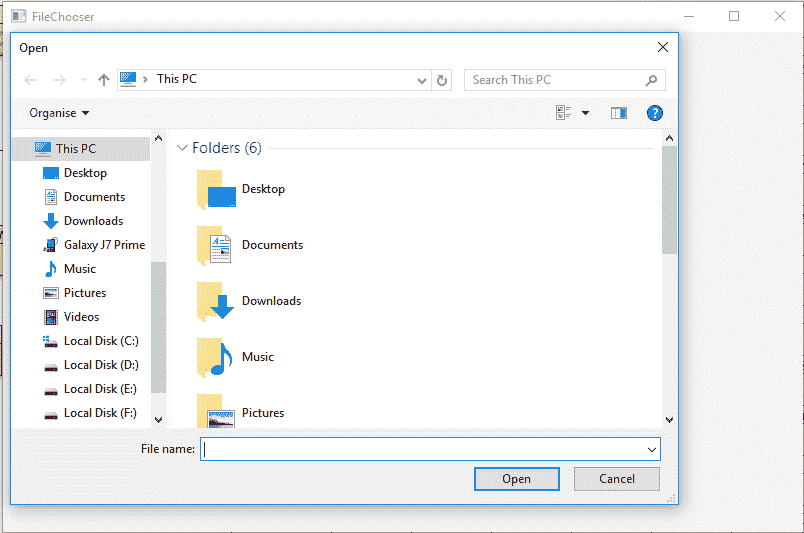
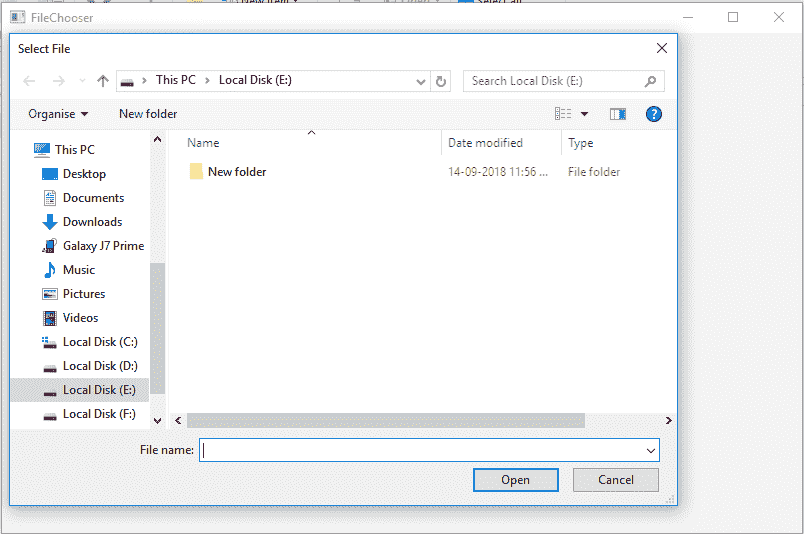
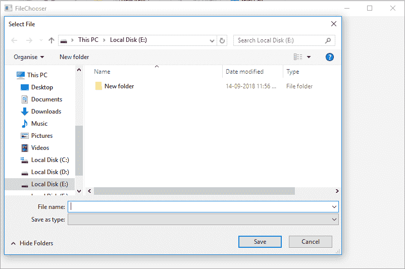

# JavaFX |文件选择器类

> 原文:[https://www.geeksforgeeks.org/javafx-filechooser-class/](https://www.geeksforgeeks.org/javafx-filechooser-class/)

FileChooser 类是 JavaFX 的一部分。用于调用*文件打开对话框*选择单个文件(显示打开对话框)，文件*打开对话框选择多个文件*(显示打开对话框)和*文件保存对话框*(显示保存对话框)。文件选择器类继承对象类。

**该类的构造函数为:**

*   **文件选择器()**:创建一个新的文件选择器对话框。

**常用方法:**

<figure class="table">

| 方法 | 说明 |
| --- | --- |
| getInitialDirectory() | 返回文件选择器的初始目录。 |
| getTitle（） | 返回文件选择器的标题。 |
| setinitial 目录(文件 f) | 设置文件选择器的初始目录。 |
| setTitle（String t） | 设置文件选择器的标题。 |
| showOpenDialog(视窗 w) | 显示一个新的打开文件选择对话框。 |
| setInitialFileName（String n） | 设置文件选择器的初始文件名。 |
| 显示保存对话框（窗口 w） | 显示新的保存文件选择对话框。 |
| getInitialFileName() | 返回文件选择器的初始文件名。 |

</figure>

以下程序说明了文件选择器类的使用:

**1。创建文件选择器并将其添加到舞台上的 Java 程序:**在这个程序中，我们将创建一个名为*文件选择器*的文件选择器。然后创建一个名为*的标签*和两个名为*按钮*和*按钮 1* 的按钮。我们将创建两个事件处理程序来处理按下*按钮*或*按钮 1* 时的事件。按下按钮时，出现打开文件选择器对话框，所选文件在*标签*中显示为文本，按下按钮 1 时，出现保存文件选择器，所选文件在标签中显示为文本。将标签和按钮添加到 *Vbox* 并将 *VBox* 添加到场景并将场景添加到舞台，并调用 *show()* 功能显示最终结果。

## Java 语言(一种计算机语言，尤用于创建网站)

```
// Java Program to create fileChooser
// and add it to the stage
import javafx.application.Application;
import javafx.scene.Scene;
import javafx.scene.control.*;
import javafx.scene.layout.*;
import javafx.stage.Stage;
import javafx.geometry.*;
import javafx.scene.paint.*;
import javafx.scene.canvas.*;
import javafx.scene.text.*;
import javafx.scene.Group;
import javafx.scene.shape.*;
import javafx.event.ActionEvent;
import javafx.event.EventHandler;
import javafx.collections.*;
import java.io.*;
import javafx.stage.FileChooser;

public class FileChooser_1 extends Application {

// launch the application
public void start(Stage stage)
{

    try {

        // set title for the stage
        stage.setTitle("FileChooser");

        // create a File chooser
        FileChooser fil_chooser = new FileChooser();

        // create a Label
        Label label = new Label("no files selected");

        // create a Button
        Button button = new Button("Show open dialog");

        // create an Event Handler
        EventHandler<ActionEvent> event =
        new EventHandler<ActionEvent>() {

            public void handle(ActionEvent e)
            {

                // get the file selected
                File file = fil_chooser.showOpenDialog(stage);

                if (file != null) {

                    label.setText(file.getAbsolutePath()
                                        + "  selected");
                }
            }
        };

        button.setOnAction(event);

        // create a Button
        Button button1 = new Button("Show save dialog");

        // create an Event Handler
        EventHandler<ActionEvent> event1 =
         new EventHandler<ActionEvent>() {

            public void handle(ActionEvent e)
            {

                // get the file selected
                File file = fil_chooser.showSaveDialog(stage);

                if (file != null) {
                    label.setText(file.getAbsolutePath()
                                        + "  selected");
                }
            }
        };

        button1.setOnAction(event1);

        // create a VBox
        VBox vbox = new VBox(30, label, button, button1);

        // set Alignment
        vbox.setAlignment(Pos.CENTER);

        // create a scene
        Scene scene = new Scene(vbox, 800, 500);

        // set the scene
        stage.setScene(scene);

        stage.show();
    }

    catch (Exception e) {

        System.out.println(e.getMessage());
    }
}

// Main Method
public static void main(String args[])
{

    // launch the application
    launch(args);
}
}
```

**输出:**

  

**2。Java 程序创建文件选择器，设置标题，初始文件，并将其添加到阶段:**在这个程序中，我们将创建一个名为 *fil_chooser* 的文件选择器。然后创建一个名为标签的标签和两个名为*按钮*和*按钮 1* 的按钮。使用 *setTitle()* 和 *setInitialDirectory()* 功能设置文件选择器的标题和初始目录。现在创建两个事件处理程序来处理按下*按钮*或*按钮 1* 时的事件。当按下*按钮*时，出现*打开文件选择器对话框*，所选文件在标签中显示为文本；当按下*按钮 1* 时，出现*保存文件选择器*，所选文件在*标签*中显示为文本。将标签和按钮添加到 *Vbox* 并将 *VBox* 添加到场景并将场景添加到舞台，并调用 *show()* 功能显示最终结果。

## Java 语言(一种计算机语言，尤用于创建网站)

```
// Java Program to create FileChooser
// & set title, initial File
// and add it to the stage
import javafx.application.Application;
import javafx.scene.Scene;
import javafx.scene.control.*;
import javafx.scene.layout.*;
import javafx.stage.Stage;
import javafx.geometry.*;
import javafx.scene.paint.*;
import javafx.scene.canvas.*;
import javafx.scene.text.*;
import javafx.scene.Group;
import javafx.scene.shape.*;
import javafx.event.ActionEvent;
import javafx.event.EventHandler;
import javafx.collections.*;
import java.io.*;
import javafx.stage.FileChooser;

public class FileChooser_2 extends Application {

// launch the application
public void start(Stage stage)
{

    try {

        // set title for the stage
        stage.setTitle("FileChooser");

        // create a File chooser
        FileChooser fil_chooser = new FileChooser();

        // set title
        fil_chooser.setTitle("Select File");

        // set initial File
        fil_chooser.setInitialDirectory(new File("e:\\"));

        // create a Label
        Label label = new Label("no files selected");

        // create a Button
        Button button = new Button("Show open dialog");

        // create an Event Handler
        EventHandler<ActionEvent> event =
        new EventHandler<ActionEvent>() {

            public void handle(ActionEvent e)
            {

                // get the file selected
                File file = fil_chooser.showOpenDialog(stage);

                if (file != null) {
                    label.setText(file.getAbsolutePath()
                                        + "  selected");
                }
            }
        };

        button.setOnAction(event);

        // create a Button
        Button button1 = new Button("Show save dialog");

        // create an Event Handler
        EventHandler<ActionEvent> event1 =
         new EventHandler<ActionEvent>() {

            public void handle(ActionEvent e)
            {

                // get the file selected
                File file = fil_chooser.showSaveDialog(stage);

                if (file != null) {
                    label.setText(file.getAbsolutePath()
                                        + "  selected");
                }
            }
        };

        button1.setOnAction(event1);

        // create a VBox
        VBox vbox = new VBox(30, label, button, button1);

        // set Alignment
        vbox.setAlignment(Pos.CENTER);

        // create a scene
        Scene scene = new Scene(vbox, 800, 500);

        // set the scene
        stage.setScene(scene);

        stage.show();
    }

    catch (Exception e) {

        System.out.println(e.getMessage());
    }
}

// Main Method
public static void main(String args[])
{

    // launch the application
    launch(args);
}
}
```

**输出:**

  

**注意:**上述程序可能无法在联机 IDE 中运行，请使用脱机编译器。

**参考:**