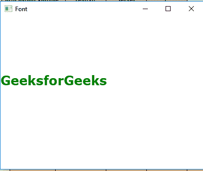
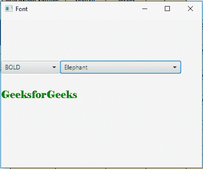

# JavaFX |字体类

> 原文:[https://www.geeksforgeeks.org/javafx-font-class/](https://www.geeksforgeeks.org/javafx-font-class/)

字体类是 JavaFX 的一部分。字体类表示用于在屏幕上呈现文本的字体。字体的大小被描述为以磅为单位，实际测量值约为 1/72 英寸。字体类继承 *[对象类](https://www.geeksforgeeks.org/object-class-in-java/)* 。

**类的构造函数:**

1.  **字体(双 s)** :创建指定大小的字体对象。
2.  **字体(字符串 n，双 s) :** 创建具有指定名称和大小的字体对象。

**常用方法:**

| 方法 | 说明 |
| --- | --- |
| 字体(双 s) | 创建指定大小的字体对象。 |
| 字体(字符串 f) | 创建具有指定族名的字体对象。 |
| 字体(字符串 f，双 s) | 创建具有指定族名和大小的字体对象。 |
| 字体(字符串 f，字体姿势 p，双 s) | 使用指定的族名、姿势和大小创建字体对象。 |
| 字体(字符串 f，字体粗细，双 s) | 使用指定的字体名称、字体粗细和大小创建字体对象。 |
| 字体(字符串 f，字体粗细 w，字体姿势 p，双 s) | 使用指定的字体名称、字体粗细、字体姿态和大小创建字体对象。 |
| getDefault（） | 返回默认字体。 |
| getFamilies() | 获取用户系统上安装的所有字体系列。 |
| getFamily() | 返回字体系列。 |
| getFontNames() | 获取用户系统上安装的所有字体的名称。 |
| getFontNames(字符串 f) | 获取用户系统上安装的指定字体系列中所有字体的名称。 |
| 加载字体(输入流，双 s) | 从指定的输入流加载字体资源。 |
| 加载字体(字符串网址，双 s) | 从指定的网址加载字体资源。 |
| 获取名（） | 完整的字体名称。 |
| getSize() | 此字体的磅值。 |

下面的程序说明了字体类的使用:

1.  **Java Program to create a font object and apply it to a text:** In this program we will create a Font named *font* and specify its family, its font weight and size. Apply this font to the text and add this text to the TextFlow named textflow. Create a VBox named *vbox* and add the textflow to the *vbox* and add the vbox to the scene and add the scene to stage. Call the *show()* function to display the results.

    ```
    // Java Program to create a font object 
    // and apply it to a text
    import javafx.application.Application;
    import javafx.scene.Scene;
    import javafx.scene.control.*;
    import javafx.scene.layout.*;
    import javafx.stage.Stage;
    import javafx.scene.layout.*;
    import javafx.scene.paint.*;
    import javafx.scene.text.*;
    import javafx.geometry.*;
    import javafx.scene.layout.*;
    import javafx.scene.shape.*;

    public class Font_1 extends Application {

        // launch the application
        public void start(Stage stage)
        {

            try {

                // set title for the stage
                stage.setTitle("Font");

                // create TextFlow
                TextFlow text_flow = new TextFlow();

                // create text
                Text text_1 = new Text("GeeksforGeeks\n");

                // set the text color
                text_1.setFill(Color.GREEN);

                // create a font
                Font font = Font.font("Verdana", FontWeight.EXTRA_BOLD, 25);

                // set font of the text
                text_1.setFont(font);

                // set text
                text_flow.getChildren().add(text_1);

                // set line spacing
                text_flow.setLineSpacing(20.0f);

                // create VBox
                VBox vbox = new VBox(text_flow);

                // set alignment of vbox
                vbox.setAlignment(Pos.CENTER);

                // create a scene
                Scene scene = new Scene(vbox, 400, 300);

                // set the scene
                stage.setScene(scene);

                stage.show();
            }

            catch (Exception e) {

                System.out.println(e.getMessage());
            }
        }

        // Main Method
        public static void main(String args[])
        {

            // launch the application
            launch(args);
        }
    }
    ```

    **输出:**

    

2.  **Java Program to create a font object and apply it to a text and allow the user to select the font from the combo box:** In this program we will create a Font named *font* and specify its family, its font weight and size. Apply this font to the text and add this text to the TextFlow named textflow. Create a VBox named *vbox* and add the textflow to the vbox and add the vbox to the scene and add the scene to stage. Create two combo box and add the font names to one and the font weight to the other and create an *EventHandler* to handle the events of the combo boxes and set the font to the type specified by the user.

    ```
    // Java Program to create a font object 
    // and apply it to a text and allow the 
    // user to select font from the combo box
    import javafx.application.Application;
    import javafx.scene.Scene;
    import javafx.scene.control.*;
    import javafx.scene.layout.*;
    import javafx.stage.Stage;
    import javafx.scene.layout.*;
    import javafx.scene.paint.*;
    import javafx.scene.text.*;
    import javafx.geometry.*;
    import javafx.scene.layout.*;
    import javafx.scene.shape.*;
    import javafx.collections.*;
    import javafx.event.ActionEvent;
    import javafx.event.EventHandler;

    public class Font_2 extends Application {

    // launch the application
    public void start(Stage stage)
    {

    try {

        // set title for the stage
        stage.setTitle("Font");

        // create TextFlow
        TextFlow text_flow = new TextFlow();

        // create text
        Text text_1 = new Text("GeeksforGeeks\n");

        // set the text color
        text_1.setFill(Color.GREEN);

        // create a font
        Font font = Font.font(Font.getFontNames().get(0), 
                              FontWeight.EXTRA_BOLD, 20);

        // font weight names
        String weight[] = { "BLACK", "BOLD",
                            "EXTRA_BOLD",
                            "EXTRA_LIGHT",
                            "LIGHT",
                            "MEDIUM",
                            "NORMAL",
                            "SEMI_BOLD",
                            "THIN" };

        // Create a combo box
        ComboBox combo_box =
          new ComboBox(FXCollections.observableArrayList(weight));

        // Create a combo box
        ComboBox combo_box1 = 
          new ComboBox(FXCollections.observableArrayList(Font.getFontNames()));

        // Create action event
        EventHandler<ActionEvent> event =
        new EventHandler<ActionEvent>() {

            public void handle(ActionEvent e)
            {

                // set font of the text
                text_1.setFont(Font.font((String)combo_box1.getValue(),
                     FontWeight.valueOf((String)combo_box.getValue()), 20));
            }
        };

        // Create action event
        EventHandler<ActionEvent> event1 = 
           new EventHandler<ActionEvent>() {

            public void handle(ActionEvent e)
            {

                // set font of the text
                text_1.setFont(Font.font((String)combo_box1.getValue(),
                      FontWeight.valueOf((String)combo_box.getValue()), 20));
            }
        };

        // Set on action
        combo_box.setOnAction(event);
        combo_box1.setOnAction(event1);

        // set font of the text
        text_1.setFont(font);

        // set text
        text_flow.getChildren().add(text_1);

        // set line spacing
        text_flow.setLineSpacing(20.0f);

        // create a HBox
        HBox hbox = new HBox(combo_box, combo_box1);

        // create VBox
        VBox vbox = new VBox(hbox, text_flow);

        // set spacing
        vbox.setSpacing(30.0);

        // set alignment of vbox
        vbox.setAlignment(Pos.CENTER);

        // create a scene
        Scene scene = new Scene(vbox, 400, 300);

        // set the scene
        stage.setScene(scene);

        stage.show();
    }

    catch (Exception e) {

        System.out.println(e.getMessage());
    }
    }

    // Main Method
    public static void main(String args[])
    {

        // launch the application
        launch(args);
    }
    }
    ```

    **输出:**

    

**注意:**上述程序可能无法在联机 IDE 中运行，请使用脱机编译器。

**参考:**[https://docs . Oracle . com/javase/8/JavaFX/API/JavaFX/scene/text/font . html](https://docs.oracle.com/javase/8/javafx/api/javafx/scene/text/Font.html)