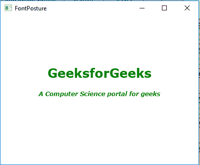

# JavaFX | font status 类

> 原文:[https://www.geeksforgeeks.org/javafx-fontposture-class/](https://www.geeksforgeeks.org/javafx-fontposture-class/)

font status 类是 JavaFX 的一部分。字体状态类指定字体是常规还是斜体。font status 类继承了*枚举类*。

**常用方法:**

| 方法 | 说明 |
| --- | --- |
| findByName（String n） | 按名称返回字体状态。 |
| valueOf(字符串 n) | 返回具有指定名称的字体状态。 |
| 值() | 返回一个包含字体状态类型所有元素的数组。 |

**Java 程序创建一个字体对象并设置一个指定的姿势并将其应用于一个文本:**在这个程序中，我们将创建两个文本对象并将一个字体姿势设置为*常规*，另一个设置为*斜体*。然后将文本设置为 textflow 并将此 TextFlow 添加到 VBox 并将 *vbox* 添加到场景中，并将场景添加到舞台中。另外，设置 textflow 的行距和文本对齐方式以及 vbox 的间距。调用 *show()* 功能显示最终结果。

```
// Java Program to create a font object and set
// a specified posture and  apply it to a text
import javafx.application.Application;
import javafx.scene.Scene;
import javafx.scene.control.*;
import javafx.scene.layout.*;
import javafx.stage.Stage;
import javafx.scene.layout.*;
import javafx.scene.paint.*;
import javafx.scene.text.*;
import javafx.geometry.*;
import javafx.scene.layout.*;
import javafx.scene.shape.*;

public class FontPosture_1 extends Application {

    // launch the application
    public void start(Stage stage)
    {

        try {

            // set title for the stage
            stage.setTitle("FontPosture");

            // create TextFlow
            TextFlow text_flow = new TextFlow();

            // create text
            Text text_1 = new Text("GeeksforGeeks\n");

            // set the text color
            text_1.setFill(Color.GREEN);

            // create a font
            Font font = Font.font("Verdana", FontWeight.EXTRA_BOLD,
                                          FontPosture.REGULAR, 25);

            // set font of the text
            text_1.setFont(font);

            // create text
            Text text_2 = new Text("A Computer Science portal for geeks\n");

            // set the text color
            text_2.setFill(Color.GREEN);

            // create a font
            Font font1 = Font.font("Verdana", FontWeight.EXTRA_BOLD,
                                            FontPosture.ITALIC, 12);

            // set font of the text
            text_2.setFont(font1);

            // set text
            text_flow.getChildren().add(text_1);
            text_flow.getChildren().add(text_2);

            // set line spacing
            text_flow.setLineSpacing(20.0f);

            // set text alignment
            text_flow.setTextAlignment(TextAlignment.CENTER);

            // create VBox
            VBox vbox = new VBox(text_flow);

            // set alignment of vbox
            vbox.setAlignment(Pos.CENTER);

            // create a scene
            Scene scene = new Scene(vbox, 400, 300);

            // set the scene
            stage.setScene(scene);

            stage.show();
        }

        catch (Exception e) {

            System.out.println(e.getMessage());
        }
    }

    // Main Method
    public static void main(String args[])
    {

        // launch the application
        launch(args);
    }
}
```

**输出:**



**注意:**上述程序可能无法在联机 IDE 中运行，请使用脱机编译器。

**参考:**[https://docs . Oracle . com/javase/8/JavaFX/API/JavaFX/scene/text/font status . html](https://docs.oracle.com/javase/8/javafx/api/javafx/scene/text/FontPosture.html)