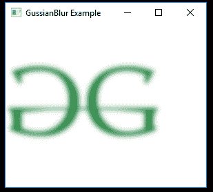
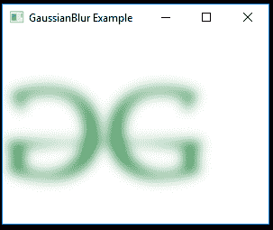

# JavaFx | gaussianbull 类

> 原文:[https://www.geeksforgeeks.org/javafx-gaussianblur-class/](https://www.geeksforgeeks.org/javafx-gaussianblur-class/)

GaussianBlur 是 JavaFX 的一部分。高斯卷积是使用高斯卷积核的模糊效果的实现，具有可配置的半径。

**类的构造函数:**

1.  **gaussianbull()**:创建 gaussianbull 的新对象。
2.  **高斯光束(双 r)** :以指定的半径创建高斯光束的新对象。

**常用方法:**

| 方法 | 说明 |
| --- | --- |
| 跟踪半径() | 返回属性半径的值。 |
| getInput() | 返回属性输入的值。 |
| setInput（Effect val） | 设置属性输入的值。 |
| setRadius(双精度值) | 设置属性半径的值。 |

下面的程序举例说明了 GaussianBlur 类的使用:

1.  **Java program to import an image and add GaussianBlur effect to it:** In this program a *FileInputStream* is created and an image is taken as input from a file. Image named *image* is created using the input from the file input stream. From the image, an *image view object* is created and it is added to the *VBox*. The *VBox* is then added to the scene and the scene is added to the stage. A *GaussianBlur* effect is created with a specified level passed as parameters and the effect is set to the image view using *setEffect()* function.

    ```
    // Java program to import an image 
    // and add Gaussian Blur effect to it
    import javafx.application.Application;
    import javafx.scene.Scene;
    import javafx.scene.control.*;
    import javafx.scene.layout.*;
    import javafx.stage.Stage;
    import javafx.scene.image.*;
    import javafx.scene.effect.*;
    import java.io.*;
    import javafx.event.ActionEvent;
    import javafx.event.EventHandler;
    import javafx.scene.Group;

    public class gaussian_blur_1 extends Application {

        // launch the application
        public void start(Stage stage) throws Exception
        {

            // set title for the stage
            stage.setTitle("GussianBlur Example");

            // create a input stream
            FileInputStream input = new FileInputStream("D:\\GFG.png");

            // create a image
            Image image = new Image(input);

            // create a image View
            ImageView imageview = new ImageView(image);

            // create a gaussian blur effect
            GaussianBlur gaussian_blur = new GaussianBlur();

            // set effect
            imageview.setEffect(gaussian_blur);

            // create a VBox
            VBox vbox = new VBox(imageview);

            // create a scene
            Scene scene = new Scene(vbox, 200, 200);

            // set the scene
            stage.setScene(scene);

            stage.show();
        }

        // Main Method
        public static void main(String args[])
        {

            // launch the application
            launch(args);
        }
    }
    ```

    **输入图像:**

    [](https://media.geeksforgeeks.org/wp-content/uploads/GFG-14.png)

    **输出:**
    [](https://media.geeksforgeeks.org/wp-content/uploads/gussian_1.png)

2.  **Java program to import an image and add GaussianBlur effect to it with a specified radius:** In this program a *FileInputStream* is created and an image is taken as input from a file. Image named *image* is created using the input from file input stream. From the image, an *image view object* is created and it is added to the *VBox*. The VBox is then added to the scene and the scene is added to the stage. A GaussianBlur effect is created with a specified level passed as parameters and the effect is set to the image view using *setEffect()* function. The radius of the *GaussianBlur* is specified using the *setRadius()* function.

    ```
    // Java program to import an image and
    // add Gaussian Blur effect to it with
    // a specified radius
    import javafx.application.Application;
    import javafx.scene.Scene;
    import javafx.scene.control.*;
    import javafx.scene.layout.*;
    import javafx.stage.Stage;
    import javafx.scene.image.*;
    import javafx.scene.effect.*;
    import java.io.*;
    import javafx.event.ActionEvent;
    import javafx.event.EventHandler;
    import javafx.scene.Group;

    public class gaussian_blur_2 extends Application {

        // launch the application
        public void start(Stage stage) throws Exception
        {

            // set title for the stage
            stage.setTitle("GaussianBlur Example");

            // create a input stream
            FileInputStream input = new FileInputStream("D:\\GFG.png");

            // create a image
            Image image = new Image(input);

            // create a image View
            ImageView imageview = new ImageView(image);

            // create a gaussian blur effect
            GaussianBlur gaussian_blur = new GaussianBlur();

            // set radius for gaussian blur
            gaussian_blur.setRadius(20.0f);

            // set effect
            imageview.setEffect(gaussian_blur);

            // create a VBox
            VBox vbox = new VBox(imageview);

            // create a scene
            Scene scene = new Scene(vbox, 200, 200);

            // set the scene
            stage.setScene(scene);

            stage.show();
        }

        // Main Method
        public static void main(String args[])
        {

            // launch the application
            launch(args);
        }
    }
    ```

    **输入图像:**

    [](https://media.geeksforgeeks.org/wp-content/uploads/GFG-14.png)

    **输出:**
    [](https://media.geeksforgeeks.org/wp-content/uploads/gussian_2.png)

**注意:**上述程序可能无法在在线 IDE 中运行。请使用离线编译器。

**参考:**[https://docs . Oracle . com/javase/8/JavaFX/API/JavaFX/scene/effect/gaussianbulr . html](https://docs.oracle.com/javase/8/javafx/api/javafx/scene/effect/GaussianBlur.html)