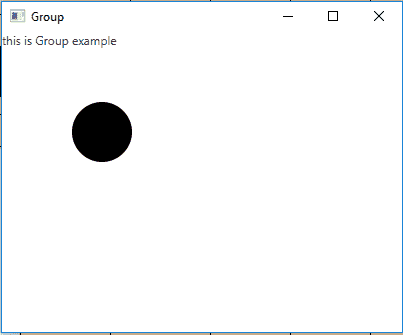
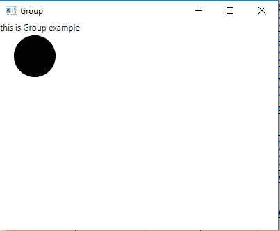

# JavaFX |组类

> 原文:[https://www.geeksforgeeks.org/javafx-group-class/](https://www.geeksforgeeks.org/javafx-group-class/)

Group 类是 JavaFX 的一部分。组包含节点的数量。组将采用其子代的集体边界，并且不能直接调整大小。组类继承父类。

**该类的构造函数:**

1.  **组()**:构建一个新的组。
2.  **组(集合<node>子代)</node>** :构造一个具有指定节点的新组。
3.  **组(节点… c)** :用指定的节点构建一个新的组。

**常用方法:**

| 方法 | 说明 |
| --- | --- |
| getChildren() | 返回组的子代。 |
| isAutoSizeChildren() | 获取属性 autoSizeChildren 的值。 |
| 明八(双宽) | 返回用于布局计算的节点最小高度。 |
| 最小宽度(双倍高度) | 返回用于布局计算的节点最小宽度。 |
| 预高(双倍宽) | 组将首选高度简单地定义为其布局边界的高度。 |
| 预宽度(双倍高度) | 组将首选宽度简单地定义为其布局边界的宽度。 |
| setautosizeren(boolean v) | 设置属性 autoSizeChildren 的值。 |

以下程序说明了组类的使用:

1.  **Java Program to create a Group and add it to the stage:** In this program we are creating a Label named *label*, and a Circle named *circle*. Now create a Group name *group* and add the label and circle to it by using the *getChildren().add()* function. Create a scene and add the group to the scene. Add the scene to the stage and display the stage to view the final results.

    ```
    // Java Program to create a Group
    // and add it to the stage
    import javafx.application.Application;
    import javafx.scene.Scene;
    import javafx.scene.control.*;
    import javafx.scene.layout.*;
    import javafx.stage.Stage;
    import javafx.event.ActionEvent;
    import javafx.event.EventHandler;
    import javafx.scene.canvas.*;
    import javafx.scene.web.*;
    import javafx.scene.Group;
    import javafx.scene.shape.*;

    public class Group_1 extends Application {

        // launch the application
        public void start(Stage stage)
        {

            try {

                // set title for the stage
                stage.setTitle("Group");

                // create a Group
                Group group = new Group();

                // create a label
                Label label = new Label("this is Group example");

                // add label to group
                group.getChildren().add(label);

                // circle
                Circle c = new Circle(100, 100, 30);

                // add Circle to Group
                group.getChildren().add(c);

                // create a scene
                Scene scene = new Scene(group, 400, 300);

                // set the scene
                stage.setScene(scene);

                stage.show();
            }

            catch (Exception e) {

                System.out.println(e.getMessage());
            }
        }

        // Main Method
        public static void main(String args[])
        {

            // launch the application
            launch(args);
        }
    }
    ```

    **输出:**

    

2.  **Java Program to create a Group, set auto resize to true and add it to the stage:** In this program we are creating a Label named *label* and a Circle named *circle*. Then we will create a Group name *group* and add the label and circle to it by using the *getChildren().add()* function. Set the auto size children to true using the *setAutoSize()* function. Create a scene and add the group to the scene. Add the scene to the stage and display the stage to view the final results.

    ```
    // Java Program to create a Group,
    // set auto resize to true
    // and add it to the stage
    import javafx.application.Application;
    import javafx.scene.Scene;
    import javafx.scene.control.*;
    import javafx.scene.layout.*;
    import javafx.stage.Stage;
    import javafx.event.ActionEvent;
    import javafx.event.EventHandler;
    import javafx.scene.canvas.*;
    import javafx.scene.web.*;
    import javafx.scene.Group;
    import javafx.scene.shape.*;

    public class Group_2 extends Application {

        // launch the application
        public void start(Stage stage)
        {

            try {

                // set title for the stage
                stage.setTitle("Group");

                // create a Group
                Group group = new Group();

                // create a label
                Label label = new Label("this is Group example");

                // add label to group
                group.getChildren().add(label);

                // circle
                Circle c = new Circle(50, 50, 30);

                // set auto resize
                group.setAutoSizeChildren(true);

                // add Circle to Group
                group.getChildren().add(c);

                // create a scene
                Scene scene = new Scene(group, 400, 300);

                // set the scene
                stage.setScene(scene);

                stage.show();
            }

            catch (Exception e) {

                System.out.println(e.getMessage());
            }
        }

        // Main Method
        public static void main(String args[])
        {

            // launch the application
            launch(args);
        }
    }
    ```

    **输出:**
    

**注意:**上述程序可能无法在在线 IDE 中运行。请使用离线编译器。

**参考:**[https://docs . Oracle . com/javase/8/JavaFX/API/JavaFX/scene/group . html](https://docs.oracle.com/javase/8/javafx/api/javafx/scene/Group.html)