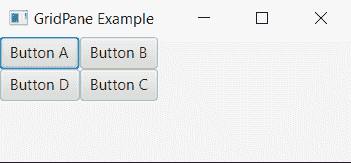
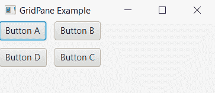

# JavaFX |如何设置 GridPane 节点之间的填充

> 原文:[https://www . geeksforgeeks . org/JavaFX-如何设置 gridpane 的节点间填充/](https://www.geeksforgeeks.org/javafx-how-to-set-padding-between-nodes-of-a-gridpane/)

在大多数情况下，我们期待看到对象被组织和很好地排列，尤其是当我们在使用它们时想要效率
的时候。在 JavaFX GridPane 的对象节点的情况下，总是需要使这些对象看起来智能和有组织。

**示例:**让我们看看 GridPane 上的这四个按钮

```
// Java Program to show the four 
// buttons on the GridPane
import javafx.application.Application;
import javafx.scene.Scene;
import javafx.scene.control.Button;
import javafx.scene.layout.GridPane;
import javafx.stage.Stage;

public class GridpaneExamplePadding extends Application {

    public void start(Stage primaryStage)
    {
        primaryStage.setTitle("GridPane Example");

        // creating buttons
        Button button1 = new Button("Button A");
        Button button2 = new Button("Button B");
        Button button3 = new Button("Button C");
        Button button4 = new Button("Button D");

        // creating Gridpane object
        GridPane gridPane = new GridPane();

        // adding buttons to the Gridpane
        gridPane.add(button1, 0, 0);
        gridPane.add(button2, 1, 0);
        gridPane.add(button3, 1, 1);
        gridPane.add(button4, 0, 1);

        // Adding Gridpane to the scene 
        // and showing the primary stage
        Scene scene = new Scene(gridPane, 200, 100);
        primaryStage.setScene(scene);
        primaryStage.show();
    }

    // main to run our javaFx application
    public static void main(String[] args)
    {
        Application.launch(args);
    }
}
```

**输出:**

[](https://media.geeksforgeeks.org/wp-content/uploads/20190531134756/gridpanebuttonexample.png)

您可能需要在按钮之间添加一些间距，以使事情看起来更好。

```
Adding space between columns of the Gridpane:
gridpane.setHgap(5) // set gap in pixels 

Adding space between rows of the Gridpane:
gridpane.setVgap(5) // set gap in pixels 

```

```
// Java program to add some spacing 
// between the buttons of the GridPane
import javafx.application.Application;
import javafx.scene.Scene;
import javafx.scene.control.Button;
import javafx.scene.layout.GridPane;
import javafx.stage.Stage;

public class GridpaneExamplePadding extends Application {

    public void start(Stage primaryStage)
    {
        primaryStage.setTitle("GridPane Example");

        // creating buttons
        Button button1 = new Button("Button A");
        Button button2 = new Button("Button B");
        Button button3 = new Button("Button C");
        Button button4 = new Button("Button D");

        // creating Gridpane object
        GridPane gridPane = new GridPane();

        // adding buttons to the Gridpane
        gridPane.add(button1, 0, 0);
        gridPane.add(button2, 1, 0);
        gridPane.add(button3, 1, 1);
        gridPane.add(button4, 0, 1);

        // spacing the buttons
        gridPane.setHgap(10);
        gridPane.setVgap(10);

        // Adding Gridpane to the scene
        // and showing the primary stage
        Scene scene = new Scene(gridPane, 200, 100);
        primaryStage.setScene(scene);
        primaryStage.show();
    }

    // main to run our javaFx application
    public static void main(String[] args)
    {
        Application.launch(args);
    }
}
```

**输出:**

[](https://media.geeksforgeeks.org/wp-content/uploads/20190531134757/gridpanebuttonspaceexample.png)