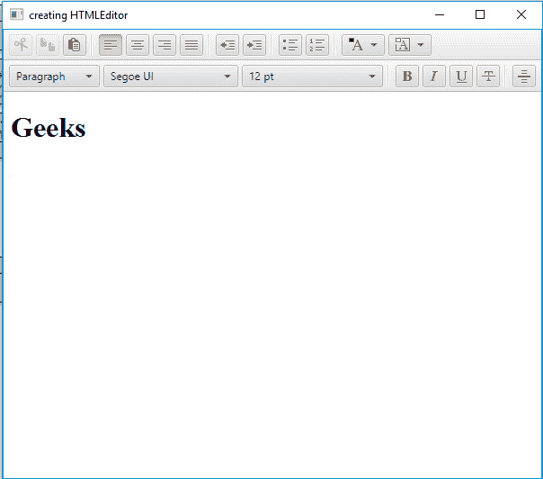

# JavaFX | HTMLEditor 类

> 原文:[https://www.geeksforgeeks.org/javafx-htmleditor-class/](https://www.geeksforgeeks.org/javafx-htmleditor-class/)

HTMLEditor 类是 JavaFX 的一部分。HTML 编辑器允许用户编辑现有的 HTML 文本，也可以对文本应用样式。底层数据模型是 HTML，但用户看不到它。

**该类的构造函数:**

*   **HTMLEditor()** :创建 HTMLEditor 的新对象。

**常用方法:**

| 方法 | 说明 |
| --- | --- |
| getHtmlText() | 返回编辑器的 HTML 内容。 |
| 打印(打印机作业 j) | 使用给定的打印机作业打印编辑器的内容。 |
| setHtmlText(字符串 h) | 设置编辑器的 HTML 文本。 |

下面的程序说明了 HTMLEditor 类的使用:

1.  **Java program to create a HTMLEditor and add to the stage:** In this program we will create a HTMLEditor named *htmleditor*. We will also create a TilePane named *tilepane*,and then add the htmleditor to the tilepane using the *getChildren().add()* function. We will create a scene and add tilepane to it. We will add the scene to the stage using the *setScene()* function and display the stage using the *show()* function to display the final results.

    ```
    // Java program to create a html editor
    // and add to the stage
    import javafx.application.Application;
    import javafx.scene.Scene;
    import javafx.scene.layout.*;
    import javafx.stage.Stage;
    import javafx.scene.web.HTMLEditor;

    public class Editor_1 extends Application {

        // launch the application
        public void start(Stage stage)
        {

            // set title for the stage
            stage.setTitle("Creating HTMLEditor");

            // create a tile pane
            TilePane tilepane = new TilePane();

            // HTML editor
            HTMLEditor htmleditor = new HTMLEditor();

            // add html editor
            tilepane.getChildren().add(htmleditor);

            // create a scene
            Scene scene = new Scene(tilepane, 600, 500);

            // set the scene
            stage.setScene(scene);

            stage.show();
        }

        // Main Method
        public static void main(String args[])
        {

            // launch the application
            launch(args);
        }
    }
    ```

    **输出:**

    <video class="wp-video-shortcode" id="video-222381-1" width="640" height="360" preload="metadata" controls=""><source type="video/mp4" src="https://media.geeksforgeeks.org/wp-content/uploads/Editor_1.mp4?_=1">[https://media.geeksforgeeks.org/wp-content/uploads/Editor_1.mp4](https://media.geeksforgeeks.org/wp-content/uploads/Editor_1.mp4)</video>
2.  **Java program to create a HTMLEditor and set initial HTML text to it and add to the stage:** In this program we will create a HTMLEditor named *htmleditor*. We will set the initial HTML text using *setHtmlText()* function. We will also create a TilePane named *tilepane*, we will add the htmleditor to the tilepane using the *getChildren().add()* function. We will create a scene and add tilepane to it. We will add the scene to the stage using the *setScene()* function and display the stage using the *show()* function to display the final results.

    ```
    // Java program to create a html editor 
    // and set initial HTML text to it and 
    // add to the stage
    import javafx.application.Application;
    import javafx.scene.Scene;
    import javafx.scene.layout.*;
    import javafx.stage.Stage;
    import javafx.scene.web.HTMLEditor;

    public class Editor_2 extends Application {

        // launch the application
        public void start(Stage stage)
        {

            // set title for the stage
            stage.setTitle("creating HTMLEditor");

            // HTML text
            String text = "<html><body><h1>Geeks</h1></body></html>";

            // create a tile pane
            TilePane tilepane = new TilePane();

            // HTML editor
            HTMLEditor htmleditor = new HTMLEditor();

            // set html text
            htmleditor.setHtmlText(text);

            // add html editor
            tilepane.getChildren().add(htmleditor);

            // create a scene
            Scene scene = new Scene(tilepane, 600, 500);

            // set the scene
            stage.setScene(scene);

            stage.show();
        }

        // Main Method
        public static void main(String args[])
        {

            // launch the application
            launch(args);
        }
    }
    ```

    **输出:**
    [](https://media.geeksforgeeks.org/wp-content/uploads/111-9.png)

**注意:**上述程序可能无法在在线 IDE 中运行。请使用离线编译器。

**参考:**[https://docs . Oracle . com/javase/8/JavaFX/API/JavaFX/scene/web/htmleditor . html](https://docs.oracle.com/javase/8/javafx/api/javafx/scene/web/HTMLEditor.html)