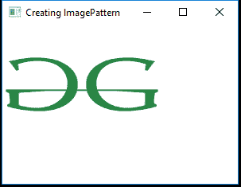
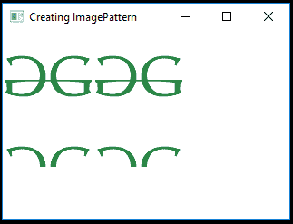

# JavaFX | ImagePattern 类

> 原文:[https://www.geeksforgeeks.org/javafx-imagepattern-class/](https://www.geeksforgeeks.org/javafx-imagepattern-class/)

ImagePattern 是 JavaFX 的一部分。此类用于用图像图案填充形状。用户可以指定锚定矩形，其定义图像相对于形状左上角的位置、宽度和高度。如果形状超出了定位矩形，图像将被平铺。

**类的构造函数:**

1.  **ImagePattern(Image i)** :用指定的图像创建 ImagePattern 的新实例。
2.  **ImagePattern(Image i，double x，double y，double width，double height，boolean prop)** :创建具有指定 x，y 坐标、定义的宽度和高度以及是否成比例的图像。

**常用方法:**

| 方法 | 说明 |
| --- | --- |
| getHeight（） | 返回图像图案的高度。 |
| getWidth（） | 返回图像图案的宽度。 |
| getImage() | 返回图像模式的图像。 |
| getX（） | 返回定位矩形的 X 原点。 |
| 盖蒂（） | 返回定位矩形的 Y 原点。 |
| 异戊二烯() | 返回油漆是否完全不透明。 |
| isProportional() | 返回开始和结束位置是否完全成比例。 |

以下程序说明了图像模式类的使用:

1.  **Java Program to create a ImagePattern from a image and apply it to the rectangle:** In this program we will create a ImagePattern named *image_pattern* from a image. Import the image using a FileInputStream. Add this image_pattern to the rectangle using the *setFill()* function. Create a VBox and add the rectangle to the *vbox*. Add the *vbox* to the scene and add the scene to the stage. Call the *show()* function to display the results.

    ```java
    // Java Program to create a ImagePattern from
    // a image and apply it to the rectangle
    import javafx.application.Application;
    import javafx.scene.Scene;
    import javafx.scene.control.*;
    import javafx.scene.layout.*;
    import javafx.event.ActionEvent;
    import javafx.event.EventHandler;
    import javafx.scene.control.Label;
    import javafx.stage.Stage;
    import javafx.scene.image.*;
    import java.io.*;
    import javafx.scene.paint.*;
    import javafx.scene.shape.*;

    public class ImagePattern_1 extends Application {

        // launch the application
        public void start(Stage s) throws Exception
        {

            // set title for the stage
            s.setTitle("Creating ImagePattern");

            // create a input stream
            FileInputStream input = new FileInputStream("D:\\GFG.png");

            // create a image
            Image image = new Image(input);

            // create ImagePattern
            ImagePattern image_pattern = new ImagePattern(image);

            // create a Rectangle
            Rectangle rect = new Rectangle(100, 100, 200, 150);

            // set fill for rectangle
            rect.setFill(image_pattern);

            // create a VBox
            VBox vbox = new VBox(rect);

            // create a scene
            Scene sc = new Scene(vbox, 200, 200);

            // set the scene
            s.setScene(sc);

            s.show();
        }

        public static void main(String args[])
        {

            // launch the application
            launch(args);
        }
    }
    ```

    **输入图像:**

    [](https://media.geeksforgeeks.org/wp-content/uploads/GFG-16.png)

    **输出:**

    [](https://media.geeksforgeeks.org/wp-content/uploads/Image_1.png)

2.  **Java Program to create an ImagePattern form an image, set the x, y coordinate, its height and width, and whether it is proportional or not and apply it to the rectangle:** In this program we will create an ImagePattern named *image_pattern* from an image. Import the image using a FileInputStream. Specify the x, y coordinates of the anchor rectangle, its height, width and whether it is proportional or not bypassing the values as arguments of the constructor of ImagePattern. Add this image_pattern to the rectangle using the *setFill()* function. Create a VBox and add the rectangle to *vbox*. Add the vbox to the scene and add the scene to the stage. Call the *show()* function to display the results.

    ```java
    // Java Program to create an ImagePattern form an image, 
    // set the x, y coordinate, its height and width, and 
    // whether it is proportional or not and apply it to
    // the rectangle
    import javafx.application.Application;
    import javafx.scene.Scene;
    import javafx.scene.control.*;
    import javafx.scene.layout.*;
    import javafx.event.ActionEvent;
    import javafx.event.EventHandler;
    import javafx.scene.control.Label;
    import javafx.stage.Stage;
    import javafx.scene.image.*;
    import java.io.*;
    import javafx.scene.paint.*;
    import javafx.scene.shape.*;

    public class ImagePattern_2 extends Application {

        // launch the application
        public void start(Stage s) throws Exception
        {

            // set title for the stage
            s.setTitle("Creating ImagePattern");

            // create a input stream
            FileInputStream input = new FileInputStream("D:\\GFG.png");

            // create a image
            Image image = new Image(input);

            // create ImagePattern
            ImagePattern image_pattern = new ImagePattern(image, 100, 100,
                                                         100, 100, false);

            // create a Rectangle
            Rectangle rect = new Rectangle(100, 100, 200, 150);

            // set fill for rectangle
            rect.setFill(image_pattern);

            // create a VBox
            VBox vbox = new VBox(rect);

            // create a scene
            Scene sc = new Scene(vbox, 200, 200);

            // set the scene
            s.setScene(sc);

            s.show();
        }

        // Main Method
        public static void main(String args[])
        {

            // launch the application
            launch(args);
        }
    }
    ```

    **输入图像:**

    [](https://media.geeksforgeeks.org/wp-content/uploads/GFG-16.png)

    **输出:**

    [](https://media.geeksforgeeks.org/wp-content/uploads/Image_2.png)

**注意:**上述程序可能无法在联机 IDE 中运行，请使用脱机编译器。

**参考:**[https://docs . Oracle . com/javase/8/JavaFX/API/JavaFX/scene/paint/imagepattern . html](https://docs.oracle.com/javase/8/javafx/api/javafx/scene/paint/ImagePattern.html)