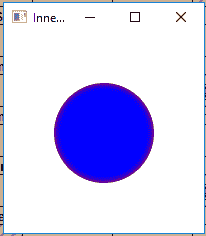
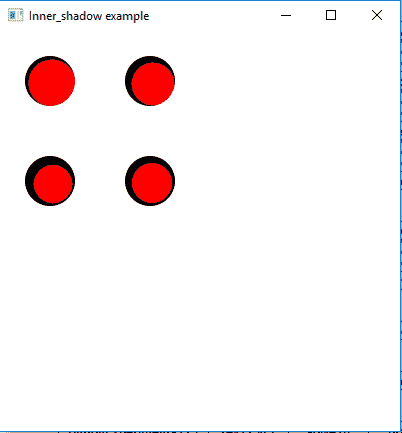

# JavaFX |内阴影类

> 原文:[https://www.geeksforgeeks.org/javafx-innershadow-class/](https://www.geeksforgeeks.org/javafx-innershadow-class/)

InnerShadow 类是 JavaFX 的一部分。InnerShadow 类创建一个高级效果，以给定的指定半径、偏移、扼流、颜色和模糊类型在对象的边缘内部呈现阴影。InnerShadow 类继承了 Effect 类。
**类的构造函数:**

1.  **内阴影()**:创建一个新的内阴影对象。
2.  **内阴影(模糊类型、模糊类型、颜色、双半径、双扼流、双偏移、双偏移)**:用指定的模糊类型、颜色、半径、扼流和偏移创建一个新的内阴影对象。
3.  **内阴影(双 r，颜色 c)** :用指定的半径和颜色创建一个新的内阴影对象。
4.  **内阴影(双半径、双偏移量、双偏移量、颜色)**:用指定的半径、偏移量和颜色创建一个新的内阴影对象。

**常用方法:**

<figure class="table">

| 方法 | 说明 |
| --- | --- |
| getBlurType() | 返回效果的模糊类型。 |
| 设置模糊类型(模糊类型 v) | 设置效果的模糊类型。 |
| getChoke() | 返回属性 choke 的值。 |
| setchoke(双 d) | 设置属性 choke 的值。 |
| setColor(颜色 v) | 设置效果的颜色。 |
| 获得颜色 （） | 返回效果的颜色。 |
| 设置输入(效果五) | 设置属性输入的值。 |
| getInput() | 返回属性输入的值。 |
| setoffsetx(双 v) | 设置效果的偏移值。 |
| setffsety(double v) | 设置效果的偏移值。 |
| getOffsetX() | 设置效果的偏移值 |
| getoffsection() | 设置效果的偏移值。 |
| setRadius(双 v) | 设置效果的半径值。 |
| 跟踪半径() | 设置效果的半径值。 |

</figure>

下面的程序说明了 InnerShadow 类的使用:

1.  **Java 程序创建一个圆并添加 InnerShadow 效果:**在这个程序中我们将创建一个名为*圆*的圆，并创建一个具有指定半径和颜色的 InnerShadow 效果 *Inner_shadow* 。使用 *setEffect()* 功能将 InnerShadow 效果添加到圆中，圆将被添加到组中。使用 *setTranslateX()* 和 *setTranslateY()* 功能将圆圈平移到舞台中的特定位置。组将被添加到场景中，场景将被添加到舞台中。

## Java 语言(一种计算机语言，尤用于创建网站)

```java
// Java program to create a Circle
// and add InnerShadow effect to it
import javafx.application.Application;
import javafx.scene.Scene;
import javafx.scene.control.*;
import javafx.scene.layout.*;
import javafx.stage.Stage;
import javafx.scene.image.*;
import javafx.scene.effect.*;
import java.io.*;
import javafx.scene.shape.Circle;
import javafx.scene.paint.Color;
import javafx.scene.Group;

public class Inner_shadow_1 extends Application {

    // launch the application
    public void start(Stage stage) throws Exception
    {

        // set title for the stage
        stage.setTitle("Inner_shadow example");

        // create a circle
        Circle circle = new Circle(50.0f, 50.0f, 50.0f);

        // set fill for circle
        circle.setFill(Color.BLUE);

        // translate to a position
        circle.setTranslateX(50.0f);
        circle.setTranslateY(50.0f);

        // create a sepia_tone effect
        InnerShadow sepia_tone = new InnerShadow(10, Color.RED);

        // set effect
        circle.setEffect(sepia_tone);

        // create a Group
        Group group = new Group(circle);

        // create a scene
        Scene scene = new Scene(group, 200, 200);

        // set the scene
        stage.setScene(scene);

        stage.show();
    }

    // Main Method
    public static void main(String args[])
    {

        // launch the application
        launch(args);
    }
}
```

1.  **输出:**



1.  **Java 程序创建四个圆并添加 InnerShadow 效果，它们具有不同的模糊类型和不同的扼流、偏置、偏置和半径值:**在本程序中，我们将创建名为*圆*、*圆 1* 、*圆 2* 、*圆 3* 的圆以及名为 *Inner_shadow1* 、 *Inner_shadow2* 、*的 InnerShadow 效果使用*设置效果()*功能将内阴影效果添加到圆圈中，圆圈将被添加到组中。使用 *setTranslateX()* 和 *setTranslateY()* 功能，圆圈将被转换到舞台中的特定位置。组将被添加到场景中，场景将被添加到舞台中。* 

## Java 语言(一种计算机语言，尤用于创建网站)

```java
// Java program to create four Circles and add
// InnerShadow effect to it which are of different
// blur types and different values of choke,
// offsetX, offsetY and radius
import javafx.application.Application;
import javafx.scene.Scene;
import javafx.scene.control.*;
import javafx.scene.layout.*;
import javafx.stage.Stage;
import javafx.scene.image.*;
import javafx.scene.effect.*;
import java.io.*;
import javafx.scene.shape.Circle;
import javafx.scene.paint.Color;
import javafx.scene.Group;

public class Inner_shadow_2 extends Application {

    // launch the application
    public void start(Stage stage) throws Exception
    {

        // set title for the stage
        stage.setTitle("Inner_shadow example");

        // create a circle
        Circle circle = new Circle(0.0f, 0.0f, 25.0f, Color.RED);
        Circle circle1 = new Circle(0.0f, 0.0f, 25.0f, Color.RED);
        Circle circle2 = new Circle(0.0f, 0.0f, 25.0f, Color.RED);
        Circle circle3 = new Circle(0.0f, 0.0f, 25.0f, Color.RED);

        // translate to a position
        circle.setTranslateX(50.0f);
        circle.setTranslateY(50.0f);

        // translate to a position
        circle1.setTranslateX(150.0f);
        circle1.setTranslateY(50.0f);

        // translate to a position
        circle2.setTranslateX(50.0f);
        circle2.setTranslateY(150.0f);

        // translate to a position
        circle3.setTranslateX(150.0f);
        circle3.setTranslateY(150.0f);

        // create Inner_shadow effect
        InnerShadow Inner_shadow1 = new InnerShadow(BlurType.values()[0],
                                       Color.BLACK, 5, 3.0f, 2.0f, 2.0f);

        InnerShadow Inner_shadow2 = new InnerShadow(BlurType.values()[1],
                                       Color.BLACK, 5, 3.0f, 3.0f, 3.0f);

        InnerShadow Inner_shadow3 = new InnerShadow(BlurType.values()[2],
                                       Color.BLACK, 5, 4.0f, 3.0f, 3.0f);

        InnerShadow Inner_shadow4 = new InnerShadow(BlurType.values()[3],
                                       Color.BLACK, 5, 4.0f, 2.0f, 2.0f);

        // set effect
        circle.setEffect(Inner_shadow1);
        circle1.setEffect(Inner_shadow2);
        circle2.setEffect(Inner_shadow3);
        circle3.setEffect(Inner_shadow4);

        // create a Group
        Group group = new Group(circle, circle1,
                               circle2, circle3);

        // create a scene
        Scene scene = new Scene(group, 400, 400);

        // set the scene
        stage.setScene(scene);

        stage.show();
    }

    // Main Method
    public static void main(String args[])
    {

        // launch the application
        launch(args);
    }
}
```

1.  **输出:**



**注意:**上述程序可能无法在在线 IDE 中运行。请使用离线编译器。
**参考:**[https://docs . Oracle . com/javase/8/JavaFX/API/JavaFX/scene/effect/innershadow . html](https://docs.oracle.com/javase/8/javafx/api/javafx/scene/effect/InnerShadow.html)