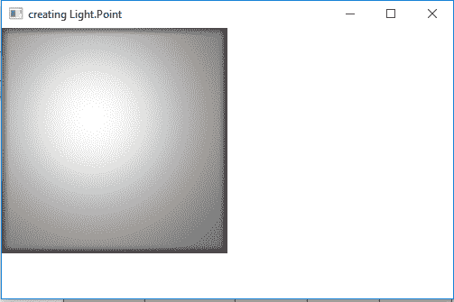
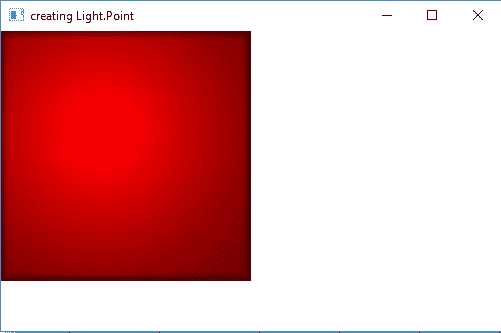

# JavaFX | Light。点类

> 原文:[https://www.geeksforgeeks.org/javafx-light-point-class/](https://www.geeksforgeeks.org/javafx-light-point-class/)

光。点类是 JavaFX 的一部分。光。点类表示三维空间中的点光源。光。点类扩展了光类。

**类的构造函数:**

1.  **点()**:用默认值创建一个新的点光源对象。
2.  **点(双 x，双 y，双 z，颜色)**:用 x，y，z 和颜色值创建一个新的点光源对象。

**常用方法:**

| 方法 | 说明 |
| --- | --- |
| getX（） | 返回 x 的值。 |
| 盖蒂（） | 返回 y 的值。 |
| getZ() | 返回 z 的值。 |
| setX(双 v) | 设置 x 的值。 |
| setY(双 v) | 设置 y 的值。 |
| setZ(双 v) | 设置 z 的值。 |
| 获得颜色 （） | 返回光的颜色。 |
| setColor(颜色 v) | 设置灯光的颜色。 |

下面的程序说明了光点分类的使用:

1.  **Java Program to create a Point light and add it to a rectangle:** In this program we will create a Rectangle named *rectangle* with specified height and width. We will also create a Light.Point object named *light*. We will set the x, y, z values using *setX()*, *setY()* and *setZ()* function. Now create a lighting object and add the light object to lighting using *setLight()* function. We will set the Lighting effect to the Rectangle and add it to the scene and add the scene to the stage and call the show function to display the results.

    ```
    // Java Program to create a Point light 
    // and add it to a rectangle
    import javafx.application.Application;
    import javafx.scene.Scene;
    import javafx.scene.shape.Rectangle;
    import javafx.scene.control.*;
    import javafx.stage.Stage;
    import javafx.scene.Group;
    import javafx.scene.effect.Light.*;
    import javafx.scene.effect.*;
    import javafx.scene.paint.Color;

    public class Point_1 extends Application {

        // launch the application
        public void start(Stage stage)
        {

            // set title for the stage
            stage.setTitle("creating Light.Point");

            // create point Light object
            Light.Point light = new Light.Point();

            // set coordinates
            light.setX(100);
            light.setY(100);
            light.setZ(100);

            // create a lighting
            Lighting lighting = new Lighting();

            // set Light of lighting
            lighting.setLight(light);

            // create a rectangle
            Rectangle rect = new Rectangle(250, 250);

            // set fill
            rect.setFill(Color.WHITE);

            // set effect
            rect.setEffect(lighting);

            // create a Group
            Group group = new Group(rect);

            // create a scene
            Scene scene = new Scene(group, 500, 300);

            // set the scene
            stage.setScene(scene);

            stage.show();
        }

        // Main Method
        public static void main(String args[])
        {

            // launch the application
            launch(args);
        }
    }
    ```

    **输出:**

    

2.  **Java Program to create a Point light and add it to a rectangle and set the color of the light to red:** In this program we will create a Rectangle named *rectangle* with specified height and width. We will also create a Light.Point object named *light*. Now pass the x, y, z and the color values as parameters of the constructor. We will create a lighting object and add the light object to lighting using *setLight()* function. We will set the Lighting effect to the Rectangle and add it to the scene and add the scene to the stage and call the show function to display the results.

    ```
    // Java Program to create a Point light and add it to
    // a rectangle and set the color of the light to red
    import javafx.application.Application;
    import javafx.scene.Scene;
    import javafx.scene.shape.Rectangle;
    import javafx.scene.control.*;
    import javafx.stage.Stage;
    import javafx.scene.Group;
    import javafx.scene.effect.Light.*;
    import javafx.scene.effect.*;
    import javafx.scene.paint.Color;

    public class Point_2 extends Application {

        // launch the application
        public void start(Stage stage)
        {

            // set title for the stage
            stage.setTitle("creating Light.Point");

            // create point Light object
            Light.Point light = new Light.Point(100, 100, 
                                         100, Color.RED);

            // create a lighting
            Lighting lighting = new Lighting();

            // set Light of lighting
            lighting.setLight(light);

            // create a rectangle
            Rectangle rect = new Rectangle(250, 250);

            // set fill
            rect.setFill(Color.WHITE);

            // set effect
            rect.setEffect(lighting);

            // create a Group
            Group group = new Group(rect);

            // create a scene
            Scene scene = new Scene(group, 500, 300);

            // set the scene
            stage.setScene(scene);

            stage.show();
        }

        // Main Method
        public static void main(String args[])
        {

            // launch the application
            launch(args);
        }
    }
    ```

    **输出:**

    

**注意:**上述程序可能无法在在线 IDE 中运行。请使用离线编译器。

**参考:**[https://docs . Oracle . com/javase/8/JavaFX/API/JavaFX/场景/效果/Light。Point.html](https://docs.oracle.com/javase/8/javafx/api/javafx/scene/effect/Light.Point.html)